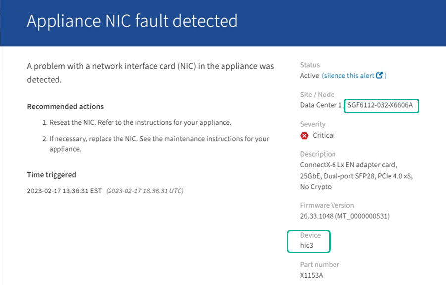

= 
:allow-uri-read: 

.Avant de commencer
* Vous disposez du numéro de série du dispositif de stockage sur lequel le composant doit être remplacé.
* Vous êtes connecté au Grid Manager à l'aide d'un https://docs.netapp.com/us-en/storagegrid-118/admin/web-browser-requirements.html["navigateur web pris en charge"^].

.Description de la tâche
Utilisez cette procédure pour identifier l'appareil dont le matériel est défectueux et lequel des composants matériels remplaçables ne fonctionne pas correctement. Les composants susceptibles d'être identifiés en vue d'un remplacement peuvent être les suivants :

* Blocs d'alimentation
* Ventilateurs
* Disques SSD
* Cartes d'interface réseau (NIC)
* Pile CMOS

.Étapes
. Identifiez le composant défectueux et le nom de l'appliance dans laquelle il est installé.
+
.. Dans Grid Manager, sélectionnez *ALERTES* > *Current*.
+
La page alertes s'affiche.

.. Sélectionnez l'alerte pour afficher les détails de l'alerte.
+

NOTE: Sélectionnez l'alerte, et non l'en-tête d'un groupe d'alertes.

.. Notez le nom du nœud et l'étiquette d'identification unique du composant qui a échoué.
+

. Identifiez le châssis avec le composant qui doit être remplacé.
+
.. Dans Grid Manager, sélectionnez *NODES*.
.. Dans le tableau de la page nœuds, sélectionnez le nom du nœud de stockage de l'appliance avec le composant défaillant.
.. Sélectionnez l'onglet *matériel*.
+
Vérifiez le *numéro de série du contrôleur de calcul* dans la section appareil StorageGRID. Vérifiez si le numéro de série correspond au numéro de série du dispositif de stockage sur lequel vous remplacez le composant. Si le numéro de série correspond, vous avez trouvé l'appareil approprié.

+
*** Si la section StorageGRID Appliance du Gestionnaire de grille ne s'affiche pas, le nœud sélectionné n'est pas une appliance StorageGRID. Sélectionnez un nœud différent dans l'arborescence.
*** Si les numéros de série ne correspondent pas, sélectionnez un autre nœud dans l'arborescence.

. Après avoir localisé le nœud sur lequel le composant doit être remplacé, notez l'adresse IP du contrôleur BMC de l'appliance indiquée dans la section appareil StorageGRID.
+
Pour vous aider à localiser l'appliance dans le centre de données, vous pouvez utiliser l'adresse IP du contrôleur BMC pour allumer le voyant d'identification de l'appliance.

