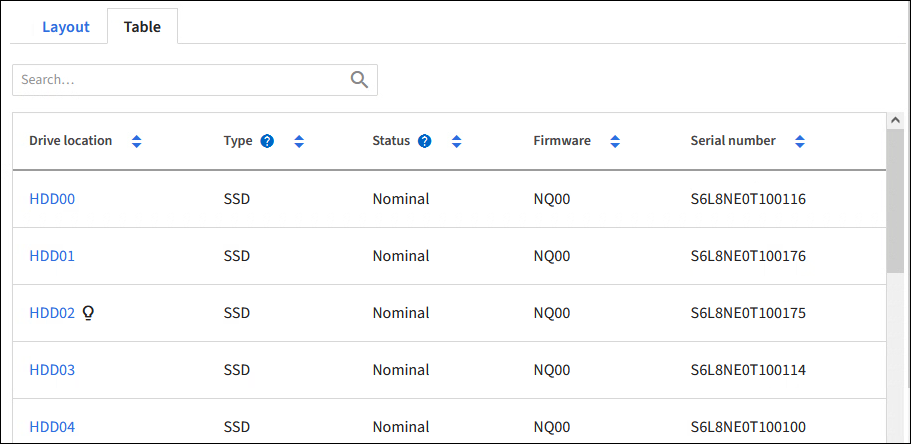

= Utilisez l'onglet gérer les lecteurs (SG110, SG1100, SGF6112 et SG6160)
:allow-uri-read: 
:icons: font
:imagesdir: ../media/

[role="lead"]
Vous pouvez utiliser l'onglet gérer les lecteurs dans le Gestionnaire de grille pour effectuer des tâches de dépannage et de maintenance sur les lecteurs pour les appliances qui prennent en charge cette fonctionnalité.

.Avant de commencer
Vous êtes connecté au Gestionnaire de grille à l'aide d'un https://docs.netapp.com/us-en/storagegrid/admin/web-browser-requirements.html["navigateur web pris en charge"^].

.Description de la tâche
Si votre appareil prend en charge cette fonction et que l' https://docs.netapp.com/us-en/storagegrid/admin/admin-group-permissions.html["Administrateur de l'appliance de stockage ou autorisation d'accès racine"^], un onglet gérer les lecteurs s'affiche sur la page de détails de l'appareil.

NOTE: Pour StorageGRID 11.8, l'onglet gérer les disques est pris en charge uniquement pour l'appliance SGF6112.

L'onglet gérer les lecteurs contient les vues suivantes :

Mise en page:: Disposition des disques de stockage des données dans l'appliance. Sélectionnez un lecteur pour afficher les détails du lecteur.
+
--
image:../media/manage_drives_tab.png["Onglet gérer les lecteurs vue disposition"]

--
Tableau:: Répertorie les informations relatives à chaque lecteur. Sélectionnez un lecteur pour afficher les détails du lecteur.
+
--

--
Détails du disque:: Récapitulatif pour chaque disque. Sélectionnez le bouton de tâche approprié, comme décrit dans les étapes ci-dessous.
+
--
image:../media/manage_drives_tab_details.png["Onglet gérer les lecteurs Détails des lecteurs"]

--

== Allumer ou éteindre le centreur lumineux

Pour localiser physiquement un lecteur dans l'appliance :

. Dans le Gestionnaire de grille, sélectionnez *NODES* > *_data Center_*.
. Sélectionnez *_appliance Storage node_* > *Manage Drives* > *Layout* > *_drive_*.
+
Le panneau des détails du lecteur s'affiche.

. Sélectionnez *Activer le centreur lumineux*.
+
** Une icône d'ampoule image:../media/icon_drive-light-bulb.png["ampoule de feu de route"]s'affiche pour le lecteur.
** Un voyant orange clignote sur le disque physique.

. Lorsque vous souhaitez éteindre la lumière du localisateur, sélectionnez *Désactiver la lumière du localisateur*.

== [[logiquement-replace-drive]]remplace logiquement le disque

Si un lecteur de l'appliance de stockage doit être reconstruit ou réinitialisé :

. Dans le Gestionnaire de grille, sélectionnez *NODES* > *_data Center_*.
. Sélectionnez *_appliance Storage node_* > *Manage Drives* > *Layout* > *_drive_*.
+
Le panneau des détails du lecteur s'affiche.

. Sélectionnez *logiquement replace*.
+
Sur le panneau de détails du lecteur, l'état du lecteur indique _reconstruction_. La reconstruction d'un disque peut prendre jusqu'à 5 minutes.

== Disque défaillant

Pour le dépannage, vous pouvez « faire échouer » manuellement un disque que vous soupçonnez défectueux. Le système fonctionnera alors sans ce lecteur.

. Dans le Gestionnaire de grille, sélectionnez *NODES* > *_data Center_*.
. Sélectionnez *_appliance Storage node_* > *Manage Drives* > *Layout* > *_drive_*.
+
Le panneau des détails du lecteur s'affiche.

. Sélectionnez *Fail Drive*.

Après la panne d'un lecteur, vous devez le remplacer physiquement ou <<logically-replace-drive,remplacez logiquement le lecteur>>.
