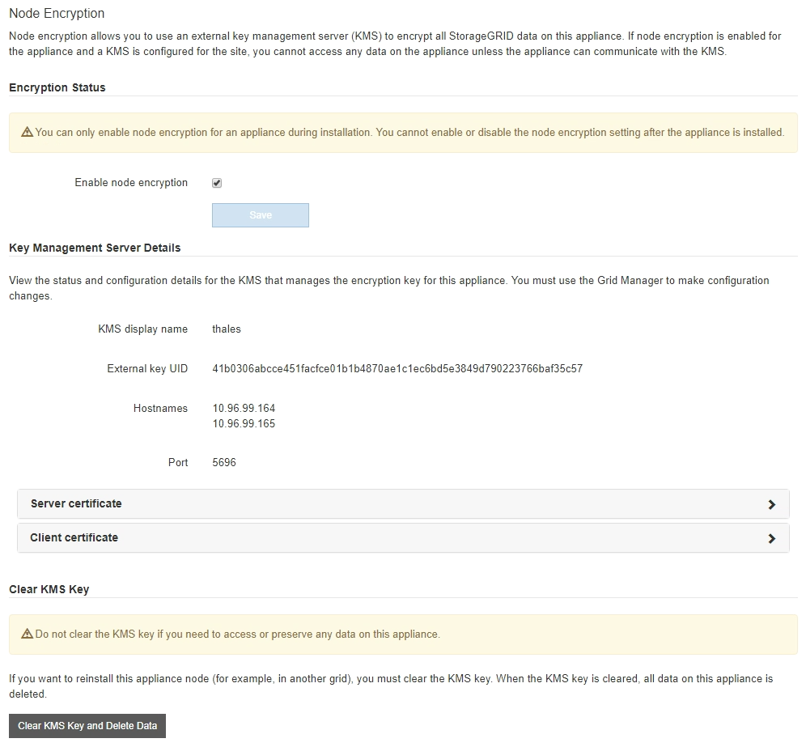

= Surveillez le chiffrement des nœuds en mode de maintenance
:allow-uri-read: 
:icons: font
:imagesdir: ../media/

[role="lead"]
Si vous avez activé le chiffrement des nœuds pour l'appliance lors de l'installation, vous pouvez surveiller l'état du chiffrement des nœuds de chaque nœud d'appliance, notamment les informations détaillées sur l'état de chiffrement des nœuds et le serveur de gestion des clés (KMS).

Voir https://docs.netapp.com/us-en/storagegrid-118/admin/kms-configuring.html["Configurer les serveurs de gestion des clés"^] Pour plus d'informations sur l'implémentation de KMS pour les appliances StorageGRID,

.Avant de commencer
* Vous avez activé le cryptage de nœud pour l'appliance pendant l'installation. Une fois l'appliance installée, vous ne pouvez pas activer le chiffrement des nœuds.
* Vous avez link:../commonhardware/placing-appliance-into-maintenance-mode.html["placez l'appareil en mode maintenance"].

.Étapes
. Dans le programme d'installation de l'appliance StorageGRID, sélectionnez *configurer le matériel* > *cryptage de nœud*.
+

+
La page Node Encryption comprend trois sections :

+
** L'état du chiffrement indique si le chiffrement de nœud est activé ou désactivé pour l'appliance.
** Détails du serveur de gestion des clés affiche des informations sur le KMS utilisé pour crypter l'appliance. Vous pouvez développer les sections de certificat du serveur et du client pour afficher les détails et l'état du certificat.
+
*** Pour résoudre les problèmes avec les certificats eux-mêmes, tels que le renouvellement des certificats expirés, consultez le https://docs.netapp.com/us-en/storagegrid-118/admin/kms-configuring.html["Instructions de configuration de KMS"^].
*** En cas de problèmes inattendus lors de la connexion aux hôtes KMS, vérifiez que le système link:../commonhardware/checking-dns-server-configuration.html["Les serveurs DNS sont corrects"] et ça link:../installconfig/configuring-network-links.html["la mise en réseau de l'appliance est correctement configurée"].
*** Si vous ne parvenez pas à résoudre les problèmes liés à votre certificat, contactez le support technique.

** Clear KMS Key désactive le chiffrement des nœuds pour l'appliance, supprime l'association entre l'appliance et le serveur de gestion des clés qui a été configuré pour le site StorageGRID et supprime toutes les données de l'appliance. Vous devez <<Effacez la configuration du serveur de gestion des clés,Effacez la clé KMS>> Avant de pouvoir installer l'appliance sur un autre système StorageGRID.
+

CAUTION: L'effacement de la configuration KMS supprime les données de l'appliance, ce qui les rend définitivement inaccessibles. Ces données ne peuvent pas être récupérées.

. Une fois que vous avez terminé de vérifier l'état du chiffrement de nœud, redémarrez le nœud. Dans le programme d'installation de l'appliance StorageGRID, sélectionnez *Avancé* > *redémarrer le contrôleur*, puis sélectionnez l'une des options suivantes :
+
** Sélectionnez *Reboot dans StorageGRID* pour redémarrer le contrôleur avec le noeud qui rejoint la grille. Sélectionnez cette option si vous avez terminé de travailler en mode maintenance et que vous êtes prêt à rétablir le fonctionnement normal du nœud.
** Sélectionnez *redémarrer en mode maintenance* pour redémarrer le contrôleur avec le nœud restant en mode de maintenance. (Cette option n'est disponible que lorsque le contrôleur est en mode de maintenance.) Sélectionnez cette option si des opérations de maintenance supplémentaires doivent être effectuées sur le nœud avant de rejoindre la grille.
+
image::../media/reboot_controller_from_maintenance_mode.png[Redémarrez le contrôleur en mode de maintenance]

+
L'appliance peut redémarrer et rejoindre la grille en 20 minutes. Pour confirmer que le redémarrage est terminé et que le nœud a rejoint la grille, retournez à la grille Manager. La page *NODES* doit afficher un état normal (icône de coche verte image:../media/icon_alert_green_checkmark.png["coche verte"] à gauche du nom du nœud) pour le nœud de l'appliance, indiquant qu'aucune alerte n'est active et que le nœud est connecté à la grille.

+
image::../media/nodes_menu.png[Le nœud d'appliance a rejoint la grille]

== Effacez la configuration du serveur de gestion des clés

L'effacement de la configuration du serveur de gestion des clés (KMS) désactive le cryptage des nœuds sur votre appliance. Une fois la configuration KMS effacée, les données de votre appliance sont définitivement supprimées et ne sont plus accessibles. Ces données ne peuvent pas être récupérées.

.Avant de commencer
Si vous devez conserver les données sur l'appliance, vous devez effectuer une procédure de déclassement d'un nœud ou cloner le nœud avant d'effacer la configuration du KMS.

CAUTION: Lorsque le KMS est effacé, les données de l'appliance seront définitivement supprimées et ne sont plus accessibles. Ces données ne peuvent pas être récupérées.

https://docs.netapp.com/us-en/storagegrid-118/maintain/grid-node-decommissioning.html["Mise hors service du nœud"^] Pour déplacer toutes les données qu'il contient vers d'autres nœuds de StorageGRID.

.Description de la tâche
L'effacement de la configuration KMS de l'appliance désactive le cryptage des nœuds, supprimant ainsi l'association entre le nœud de l'appliance et la configuration KMS pour le site StorageGRID. Les données de l'appliance sont ensuite supprimées et l'appliance reste en état préinstallation. Ce processus ne peut pas être inversé.

Vous devez effacer la configuration KMS :

* Avant de pouvoir installer l'appliance dans un autre système StorageGRID, qui n'utilise pas de KMS ou qui utilise un KMS différent.
+

CAUTION: N'effacez pas la configuration KMS si vous prévoyez de réinstaller un nœud d'appliance dans un système StorageGRID qui utilise la même clé KMS.

* Avant de pouvoir récupérer et réinstaller un nœud où la configuration KMS était perdue et où la clé KMS n'est pas récupérable.
* Avant de retourner tout appareil déjà utilisé sur votre site.
* Après la désaffectation d'une appliance qui avait activé le chiffrement de nœud.

CAUTION: Désaffectez l'appliance avant d'effacer KMS pour déplacer ses données vers d'autres nœuds de votre système StorageGRID. L'effacement de KMS avant la mise hors service de l'appareil entraînera une perte de données et pourrait rendre l'appareil inutilisable.

.Étapes
. Ouvrez un navigateur et entrez l'une des adresses IP du contrôleur de calcul de l'appliance.
+
`*https://_Controller_IP_:8443*`

+
`_Controller_IP_` Est l'adresse IP du contrôleur de calcul (pas le contrôleur de stockage) sur l'un des trois réseaux StorageGRID.

+
La page d'accueil du programme d'installation de l'appliance StorageGRID s'affiche.

. Sélectionnez *configurer le matériel* > *cryptage de nœud*.
+

CAUTION: Si la configuration KMS est effacée, les données de l'appliance seront définitivement supprimées. Ces données ne peuvent pas être récupérées.

. En bas de la fenêtre, sélectionnez *Effacer la clé KMS et Supprimer les données*.
. Si vous êtes sûr de vouloir effacer la configuration KMS, tapez `*clear*` Dans la boîte de dialogue d'avertissement et sélectionnez *Effacer la clé KMS et Supprimer les données*.
+
La clé de chiffrement KMS et toutes les données sont supprimées du nœud, et l'appliance redémarre. Cette opération peut prendre jusqu'à 20 minutes.

. Ouvrez un navigateur et entrez l'une des adresses IP du contrôleur de calcul de l'appliance. +
`*https://_Controller_IP_:8443*`
+
`_Controller_IP_` Est l'adresse IP du contrôleur de calcul (pas le contrôleur de stockage) sur l'un des trois réseaux StorageGRID.

+
La page d'accueil du programme d'installation de l'appliance StorageGRID s'affiche.

. Sélectionnez *configurer le matériel* > *cryptage de nœud*.
. Vérifiez que le chiffrement de nœud est désactivé et que les informations de clé et de certificat dans *Key Management Server Details* et le contrôle *clear KMS Key et Delete Data* sont supprimées de la fenêtre.
+
Le chiffrement de nœud ne peut pas être réactivé sur l'appliance tant qu'il n'a pas été réinstallé dans une grille.

.Une fois que vous avez terminé
Après le redémarrage de l'appliance et après avoir vérifié que KMS a été effacé et que l'appliance est dans un état de pré-installation, vous pouvez physiquement retirer l'appliance de votre système StorageGRID. Voir la https://docs.netapp.com/us-en/storagegrid-118/maintain/preparing-appliance-for-reinstallation-platform-replacement-only.html["instructions de préparation de l'appareil pour la réinstallation"^].
