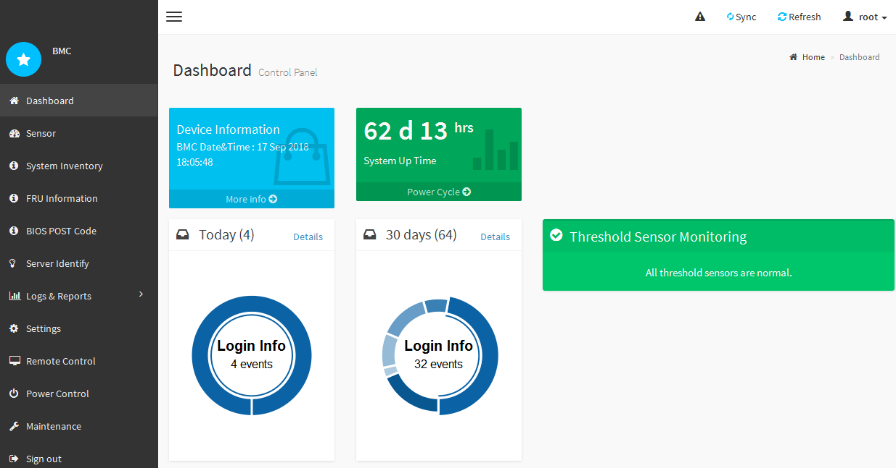

= Accéder à l'interface BMC
:allow-uri-read: 
:icons: font
:imagesdir: ../media/

[role="lead"]
Vous pouvez accéder à l'interface du contrôleur BMC à l'aide de l'adresse IP DHCP ou statique du port de gestion du contrôleur BMC sur les modèles d'appliance suivants :

* SG100
* SG1000
* SG6000
* SG6100

.Avant de commencer
* Le client de gestion utilise un https://docs.netapp.com/us-en/storagegrid-118/admin/web-browser-requirements.html["navigateur web pris en charge"^].
* Le port de gestion BMC de l'appliance est connecté au réseau de gestion que vous prévoyez d'utiliser.
+
[role="tabbed-block"]
====
.SG100
--
image::../media/sg100_bmc_management_port.png[Port de gestion du contrôleur BMC SG100]

--
.SG1000
--
image::../media/sg1000_bmc_management_port.png[Port de gestion BMC SG1000]

--
.SG6000
--
image::../media/sg6000_cn_bmc_management_port.gif[Port de gestion BMC du contrôleur SG6000-CN]

--
.SG6100
--
image::../media/sgf6112_cn_bmc_management_port.png[Port de gestion BMC SGF6112]

--
====

.Étapes
. Entrez l'URL de l'interface BMC : +
`*https://_BMC_Port_IP_*`
+
Pour `_BMC_Port_IP_`, Utilisez l'adresse DHCP ou l'adresse IP statique pour le port de gestion BMC.

+
La page de connexion BMC s'affiche.

+

NOTE: Si vous n'avez pas encore configuré `BMC_Port_IP`, suivez les instructions de la section link:configuring-bmc-interface.html["Configurer l'interface BMC"].  Si vous ne pouvez pas suivre cette procédure en raison d'un problème matériel et si vous n'avez pas encore configuré d'adresse IP BMC, vous pourrez peut-être continuer à accéder au contrôleur BMC. Par défaut, le contrôleur BMC obtient une adresse IP à l'aide de DHCP. Si le protocole DHCP est activé sur le réseau BMC, votre administrateur réseau peut fournir l'adresse IP attribuée au contrôleur BMC MAC, qui est imprimée sur l'étiquette située à l'avant de l'appliance. Si DHCP n'est pas activé sur le réseau BMC, le BMC ne répond pas au bout de quelques minutes et se attribue l'IP statique par défaut `192.168.0.120`. Vous devrez peut-être connecter votre ordinateur portable directement au port BMC et modifier le paramètre réseau pour attribuer à votre ordinateur portable une adresse IP telle que `192.168.0.200/24`, afin de naviguer jusqu'à `192.168.0.120`.

. Entrez le nom d'utilisateur et le mot de passe admin ou root, en utilisant le mot de passe que vous avez défini link:changing-root-password-for-bmc-interface.html["mot de passe par défaut modifié"]:
+

NOTE: L'utilisateur par défaut dépend de la date d'installation de l'appliance StorageGRID. L'utilisateur par défaut est *admin* pour les nouvelles installations et *root* pour les anciennes installations.

. Sélectionnez *se connecter*.
+

. Vous pouvez également créer d'autres utilisateurs en sélectionnant *Paramètres* > *gestion des utilisateurs* et en cliquant sur tout utilisateur « désactivé ».
+

NOTE: Lorsque les utilisateurs se connectant pour la première fois, ils peuvent être invités à modifier leur mot de passe pour une sécurité accrue.

