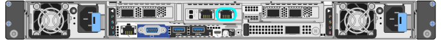

= Accédez au programme d'installation de l'appliance StorageGRID
:allow-uri-read: 
:icons: font
:imagesdir: ../media/

[role="lead"]
Vous devez accéder au programme d'installation de l'appliance StorageGRID pour vérifier la version du programme d'installation et configurer les connexions entre l'appliance et les trois réseaux StorageGRID : le réseau Grid, le réseau d'administration (facultatif) et le réseau client (facultatif).

.Avant de commencer
* Vous utilisez n'importe quel client de gestion pouvant vous connecter au réseau d'administration StorageGRID ou vous disposez d'un ordinateur portable de service.
* Le client ou l'ordinateur portable de service a un https://docs.netapp.com/us-en/storagegrid/admin/web-browser-requirements.html["navigateur web pris en charge"^].
* L'appliance de services ou le contrôleur de l'appliance de stockage est connecté à tous les réseaux StorageGRID que vous souhaitez utiliser.
* Vous connaissez l'adresse IP, la passerelle et le sous-réseau de l'appliance de services ou du contrôleur d'appliance de stockage sur ces réseaux.
* Vous avez configuré les commutateurs réseau que vous prévoyez d'utiliser.

.Description de la tâche
Pour accéder initialement au programme d'installation de l'appliance StorageGRID, vous pouvez utiliser l'adresse IP attribuée par DHCP pour le port réseau d'administration sur l'appliance de services ou le contrôleur de l'appliance de stockage (en supposant qu'il est connecté au réseau d'administration). vous pouvez également connecter un ordinateur portable de service directement à l'appliance de services ou au contrôleur de l'appliance de stockage.

.Étapes
. Si possible, utilisez l'adresse DHCP du port Admin Network sur l'appliance de services ou le contrôleur de l'appliance de stockage. Le port réseau d'administration est mis en surbrillance dans la figure suivante. (Utilisez l'adresse IP sur le réseau Grid si le réseau Admin n'est pas connecté.)
+
[role="tabbed-block"]
====
.SG100
--
image::../media/sg100_admin_network_port.png[Port réseau Admin sur le SG100]

--
.SG110
--
image::../media/sg6100_admin_network_port.png[Port réseau d'administration sur le SG110]

--
.SG1000
--
image::../media/sg1000_admin_network_port.png[Port réseau Admin sur le SG1000]

--
.SG1100
--
image::../media/sg1100_admin_network_port.png[Port réseau d'administration sur le SG1100]

--
.E5700SG
--
Pour le modèle E5700SG, vous pouvez effectuer l'une des opérations suivantes :

** Regardez l'affichage à sept segments sur le contrôleur E5700SG. Si les ports 1 et 10/25-GbE 2 et 4 du contrôleur E5700SG sont connectés à des réseaux avec des serveurs DHCP, le contrôleur tente d'obtenir des adresses IP attribuées de manière dynamique lors de la mise sous tension du boîtier. Une fois le processus de mise sous tension terminé, l'affichage à sept segments indique *HO*, suivi d'une séquence répétée de deux nombres.
+
[listing]
----
HO -- IP address for Admin Network -- IP address for Grid Network HO
----
+
Dans l'ordre :

+
*** Le premier jeu de chiffres est l'adresse DHCP du nœud de stockage de l'appliance sur le réseau Admin, s'il est connecté. Cette adresse IP est attribuée au port de gestion 1 du contrôleur E5700SG.
*** Le second jeu de chiffres correspond à l'adresse DHCP du nœud de stockage de l'appliance sur le réseau Grid. Cette adresse IP est attribuée aux ports 10/25-GbE 2 et 4 lorsque vous mettez l'appliance sous tension pour la première fois.
+

NOTE: Si une adresse IP n'a pas pu être attribuée à l'aide de DHCP, 0.0.0.0 s'affiche.

--
.SG5800
--
image::../media/sg5800_admin_network_port.png[Admin Port réseau sur le contrôleur SG5800]

--
.SG6000-CN
--
image::../media/sg6000_cn_admin_network_port.png[Port Admin Network du contrôleur SG6000-CN]

--
.SG6100-CN
--
image::../media/sg6100_cn_admin_network_port.png[Port Admin Network du contrôleur SG6000-CN]

--
.SGF6112
--
image::../media/sg6100_admin_network_port.png[Port réseau d'administration sur le SGF6112]

--
====
+
.. Demandez à votre administrateur réseau l'adresse DHCP de l'appliance sur le réseau d'administration.
.. Dans le client, saisissez cette URL pour le programme d'installation de l'appliance StorageGRID : +
`*https://_Appliance_IP_:8443*`
+
Pour `_Appliance_IP_`, Utilisez l'adresse DHCP (utilisez l'adresse IP du réseau d'administration si vous l'avez).

.. Si vous êtes invité à recevoir une alerte de sécurité, affichez et installez le certificat à l'aide de l'assistant d'installation du navigateur.
+
L'alerte n'apparaît pas la prochaine fois que vous accédez à cette URL.

+
La page d'accueil du programme d'installation de l'appliance StorageGRID s'affiche. Les informations et les messages affichés lorsque vous accédez pour la première fois à cette page dépendent de la manière dont votre appareil est actuellement connecté aux réseaux StorageGRID. Des messages d'erreur peuvent s'afficher et seront résolus dans les étapes suivantes.

+
image::../media/appliance_installer_home_5700_5600.png[Capture d'écran de la partie supérieure de la page d'accueil du programme d'installation de l'appliance StorageGRID]

. Si vous ne parvenez pas à obtenir une adresse IP à l'aide de DHCP, vous pouvez utiliser une connexion lien-local.
+
[role="tabbed-block"]
====
.SG100
--
Connectez un ordinateur portable de service directement au port RJ-45 le plus à droite de l'appareil de services à l'aide d'un câble Ethernet.

image::../media/sg100_link_local_port.png[Liaison SG100 - connexion locale]

--
.SG110
--
Connectez un ordinateur portable de service directement au port RJ-45 le plus à droite de l'appareil, à l'aide d'un câble Ethernet.

image::../media/sg6100_link_local_port.png[Connexion lien-local SG110]

--
.SG1000
--
Connectez un ordinateur portable de service directement au port RJ-45 le plus à droite de l'appareil de services à l'aide d'un câble Ethernet.

image::../media/sg1000_link_local_port.png[Liaison SG1000 - connexion locale]

--
.SG1100
--
Connectez un ordinateur portable de service directement au port RJ-45 le plus à droite de l'appareil, à l'aide d'un câble Ethernet.

image::../media/sg1100_link_local_port.png[Connexion lien-local SG1100]

--
.E5700SG
--
Connectez l'ordinateur portable de service au port de gestion 2 du contrôleur E5700SG à l'aide d'un câble Ethernet.

image::../media/e5700sg_mgmt_port_2.gif[Emplacement du port de gestion 2 sur le contrôleur E5700SG]

--
.SG5800
--
Connectez l'ordinateur portable de maintenance au port de gestion 1 du contrôleur SG5800 à l'aide d'un câble Ethernet.

image::../media/sg5800_mgmt_port.png[Emplacement du port de gestion 1 sur le contrôleur SG5800]

--
.SG6000-CN
--
Connectez un ordinateur portable de service directement au port RJ-45 le plus à droite du contrôleur SG6000-CN, à l'aide d'un câble Ethernet.

image::../media/sg6000_cn_link_local_port.png[Emplacement du port de gestion pour SG6000-CN]

--
.SG6100-CN
--
Connectez un ordinateur portable de service directement au port RJ-45 le plus à droite du contrôleur SG6100-CN, à l'aide d'un câble Ethernet.

--
.SGF6112
--
Connectez un ordinateur portable de service directement au port RJ-45 le plus à droite de l'appareil, à l'aide d'un câble Ethernet.

image::../media/sg6100_link_local_port.png[Connexion lien-local SGF6112]

--
====
+
.. Ouvrez un navigateur Web sur l'ordinateur portable de service.
.. Entrez l'URL suivante pour le programme d'installation de l'appliance StorageGRID : +
`*\https://169.254.0.1:8443*`
+
La page d'accueil du programme d'installation de l'appliance StorageGRID s'affiche. Les informations et les messages affichés lorsque vous accédez pour la première fois à cette page dépendent de la manière dont votre appareil est actuellement connecté aux réseaux StorageGRID. Des messages d'erreur peuvent s'afficher et seront résolus dans les étapes suivantes.

+

NOTE: Si vous ne pouvez pas accéder à la page d'accueil via une connexion lien-local, configurez l'adresse IP de l'ordinateur portable de service en tant que `169.254.0.2`, et réessayez.

.Une fois que vous avez terminé
Après avoir accédé au programme d'installation de l'appliance StorageGRID :

* Vérifiez que la version du programme d'installation de l'appliance StorageGRID installée sur l'appliance correspond à la version logicielle installée sur votre système StorageGRID. Mettez à niveau le programme d'installation de l'appliance StorageGRID, si nécessaire.
+
link:verifying-and-upgrading-storagegrid-appliance-installer-version.html["Vérifiez et mettez à niveau la version du programme d'installation de l'appliance StorageGRID"]

* Vérifiez tous les messages affichés sur la page d'accueil du programme d'installation de l'appliance StorageGRID et configurez la configuration du lien et la configuration IP, selon les besoins.
+
image::../media/appliance_installer_home_services_appliance.png[Accueil du programme d'installation de l'appareil]

