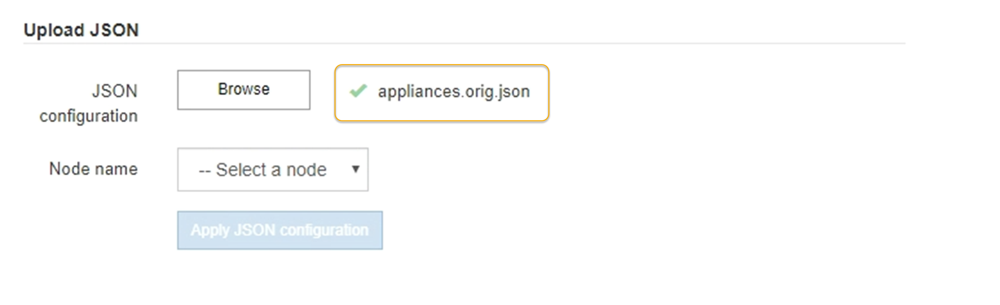

= Automatisez l'installation et la configuration de l'appliance
:allow-uri-read: 
:icons: font
:imagesdir: ../media/

[role="lead"]
L'automatisation de l'installation et de la configuration peut être utile pour déployer plusieurs instances StorageGRID ou une instance StorageGRID complexe et de grande taille.

Automatisez l'installation et la configuration de vos appliances StorageGRID à l'aide des outils NetApp StorageGRID. Une fois que vous avez installé et configuré les appliances, vous pouvez le faire link:automating-configuration-of-storagegrid.html["Automatisez la configuration de l'ensemble du système StorageGRID"].

Vous pouvez automatiser la configuration des éléments suivants :

* Réseau Grid, réseau d'administration et adresses IP du réseau client
* Interface BMC
* Liens réseau
+
** Mode de liaison du port
** Mode de liaison réseau
** Vitesse de liaison

== Options d'automatisation

Pour automatiser l'installation et la configuration de l'appliance, utilisez une ou plusieurs des options suivantes :

* Générez un fichier JSON contenant les détails de la configuration. Collaborez avec votre consultant en services professionnels NetApp pour utiliser le link:https://configbuilder.netapp.com/index.aspx["Outil NetApp ConfigBuilder"^] pour effectuer ces étapes :
+
.. Consultez les services professionnels NetApp pour obtenir un numéro de commande.
.. Téléchargez le manuel depuis ConfigBuilder.
.. Consultez les services professionnels pour terminer le manuel.
.. Téléchargez le manuel à l'aide de ConfigBuilder.
.. Utilisez ConfigBuilder pour générer un fichier JSON.
.. Consultez les services professionnels pour télécharger le fichier JSON vers l'appliance.
+
Voir <<automate-with-appliance-installer,Automatisation à l'aide du programme d'installation de l'appliance>>.

+

NOTE: Vous pouvez utiliser le même fichier JSON pour configurer plusieurs appliances.

+
La configuration de l'appliance à l'aide d'un fichier JSON téléchargé est souvent plus efficace que d'effectuer la configuration manuellement, en particulier si vous devez configurer de nombreux nœuds. L'exécution manuelle de la configuration nécessite l'utilisation de plusieurs pages dans le programme d'installation de l'appliance StorageGRID et l'application du fichier de configuration pour chaque nœud un par un.

* Si vous êtes un utilisateur avancé, vous pouvez utiliser les scripts StorageGRID Python suivants pour installer et configurer votre système :
+
** `configure-sga.py`: Automatisez l'installation et la configuration de vos appareils. Voir <<automate-with-configure-sga-py-script,Automatisez l'installation et la configuration de l'appliance à l'aide du script configure-sga.py>>.
** `configure-storagegrid.py`: Configurer les autres composants de l'ensemble du système StorageGRID (la « grille »). Voir link:automating-configuration-of-storagegrid.html["Automatisez la configuration de StorageGRID"].

+

NOTE: Vous pouvez utiliser directement les scripts Python d'automatisation StorageGRID, ou utiliser ces scripts en tant qu'exemples de l'utilisation de l'API REST d'installation de StorageGRID dans les outils de déploiement et de configuration que vous développez vous-même. Voir les instructions pour https://docs.netapp.com/us-en/storagegrid/maintain/downloading-and-extracting-storagegrid-installation-files.html["Téléchargement et extraction des fichiers d'installation de StorageGRID"^].

== Automatisez la configuration de l'appliance avec le programme d'installation de l'appliance StorageGRID

Une fois que vous avez généré un fichier JSON, vous pouvez automatiser la configuration d'une ou plusieurs appliances en utilisant le programme d'installation de l'appliance StorageGRID pour télécharger le fichier JSON.

.Avant de commencer
* L'appliance a été installée dans un rack, connectée à vos réseaux et sous tension.
* Vous avez <<automation-options,Généré le fichier JSON>> En collaboration avec votre consultant en services professionnels NetApp.
* Votre appareil contient la dernière version du micrologiciel compatible avec StorageGRID 11.5 ou une version ultérieure.
* Vous êtes connecté au programme d'installation de l'appliance StorageGRID sur l'appliance que vous configurez à l'aide d'un https://docs.netapp.com/us-en/storagegrid/admin/web-browser-requirements.html["navigateur web pris en charge"^].

.Étapes
. Dans le programme d'installation de l'appareil StorageGRID, sélectionnez *Avancé* > *mettre à jour la configuration de l'appareil*. La page mise à jour de la configuration de l'appliance s'affiche.
. Recherchez et sélectionnez le fichier JSON avec la configuration que vous souhaitez télécharger.
+
Le fichier est téléchargé et validé. Une fois le processus de validation terminé, le nom du fichier s'affiche à côté d'une coche verte.

+

NOTE: Vous risquez de perdre la connexion à l'appliance si la configuration du fichier JSON inclut des sections pour `link_config`, `networks`, ou les deux. Si vous n'êtes pas reconnecté dans un délai d'une minute, saisissez à nouveau l'URL de l'appliance en utilisant l'une des autres adresses IP attribuées à l'appliance.

+

+
La liste déroulante *Nom de nœud* contient les noms de nœud de niveau supérieur définis dans le fichier JSON.

+

NOTE: Si le fichier n'est pas valide, le nom du fichier s'affiche en rouge et un message d'erreur s'affiche dans une bannière jaune. Le fichier non valide n'est pas appliqué à l'appliance. ConfigBuilder vérifie que vous disposez d'un fichier JSON valide.

. Sélectionnez un noeud dans la liste déroulante *Nom de noeud*.
+
Le bouton *Apply JSON configuration* est activé.

. Sélectionnez *appliquer la configuration JSON*.
+
La configuration est appliquée au nœud sélectionné.

== Automatisez l'installation et la configuration de l'appliance à l'aide du script configure-sga.py

Si vous êtes un utilisateur avancé, vous pouvez utiliser le `configure-sga.py` Script permettant d'automatiser la plupart des tâches d'installation et de configuration des nœuds d'appliance StorageGRID, notamment l'installation et la configuration d'un nœud d'administration principal. Ce script peut être utile si vous avez un grand nombre d'appliances à configurer.

Vous pouvez également utiliser le script pour générer un fichier JSON qui contient les informations de configuration de l'appliance. Vous pouvez télécharger le fichier JSON vers le programme d'installation de l'appliance StorageGRID pour configurer tous les nœuds d'appliance en même temps. Vous pouvez également modifier le fichier JSON, puis le télécharger pour appliquer une nouvelle configuration à un ou plusieurs dispositifs.

NOTE: Cette procédure s'adresse aux utilisateurs expérimentés ayant de l'expérience dans l'utilisation d'interfaces de ligne de commande. C'est également possible <<automate-with-appliance-installer,Utilisez le programme d'installation de l'appliance StorageGRID pour automatiser la configuration>>.

.Avant de commencer
* L'appliance a été installée dans un rack, connectée à vos réseaux et sous tension.
* Vous avez <<automation-options,Généré le fichier JSON>> En collaboration avec votre consultant en services professionnels NetApp.
* Votre appareil contient la dernière version du micrologiciel compatible avec StorageGRID 11.5 ou une version ultérieure.
* Vous avez configuré l'adresse IP du réseau d'administration de l'appliance.
* Vous avez téléchargé le `configure-sga.py` fichier. Le fichier est inclus dans l'archive d'installation ou vous pouvez y accéder en cliquant sur *aide* > *script d'installation de l'appliance* dans le programme d'installation de l'appliance StorageGRID.

.Étapes
. Connectez-vous à la machine Linux que vous utilisez pour exécuter le script Python.
. Pour obtenir de l'aide générale sur la syntaxe du script et pour afficher la liste des paramètres disponibles, entrez les informations suivantes :
+
[listing]
----
./configure-sga.py --help
----
+
Le `configure-sga.py` script utilise cinq sous-commandes :

+
** `advanced` Pour les interactions avancées avec l'appliance StorageGRID, notamment la configuration BMC, et la création d'un fichier JSON contenant la configuration actuelle de l'appliance
** `configure` Pour configurer le mode RAID, le nom du nœud et les paramètres réseau
** `install` Pour démarrer une installation StorageGRID
** `monitor` Pour contrôler une installation StorageGRID
** `reboot` pour redémarrer l'appliance
+
Si vous entrez une sous-commande (avancé, configurez, installez, surveillez ou redémarrez), suivie de l'argument `--help` option vous obtenez un autre texte d'aide fournissant plus de détails sur les options disponibles dans cette sous-commande : +
`./configure-sga.py _subcommand_ --help`

+
Si vous le souhaitez <<back-up-appliance-config,Sauvegardez la configuration de l'appliance dans un fichier JSON>>, assurez-vous que les noms de nœuds respectent les exigences suivantes :

+
*** Chaque nom de nœud est unique si vous souhaitez configurer automatiquement tous les nœuds d'appliance à l'aide d'un fichier JSON.
*** Doit être un nom d'hôte valide contenant au moins 1 et 32 caractères.
*** Peut utiliser des lettres, des chiffres et des tirets.
*** Impossible de commencer ou de terminer par un tiret.
*** Ne peut pas contenir uniquement des chiffres.

. Pour appliquer la configuration du fichier JSON à l'appliance, entrez la commande suivante, où `_SGA-INSTALL-IP_` L'adresse IP du réseau d'administration de l'appliance, `_json-file-name_` Est le nom du fichier JSON, et `_node-name-inside-json-file_` est le nom du nœud sur lequel la configuration est appliquée : +
`./configure-sga.py advanced --restore-file _json-file-name_ --restore-node _node-name-inside-json-file_ _SGA-INSTALL-IP_`
. Pour vérifier la configuration actuelle du nœud de l'appliance, entrez l'emplacement suivant `_SGA-INSTALL-IP_` Adresse IP du réseau d'administration de l'appliance : +
`./configure-sga.py configure _SGA-INSTALL-IP_`
+
Les résultats indiquent les informations IP actuelles de l'appliance, y compris l'adresse IP du noeud d'administration principal et les informations sur les réseaux Admin, Grid et client.

+
[listing]
----
Connecting to +https://10.224.2.30:8443+ (Checking version and connectivity.)
2021/02/25 16:25:11: Performing GET on /api/versions... Received 200
2021/02/25 16:25:11: Performing GET on /api/v2/system-info... Received 200
2021/02/25 16:25:11: Performing GET on /api/v2/admin-connection... Received 200
2021/02/25 16:25:11: Performing GET on /api/v2/link-config... Received 200
2021/02/25 16:25:11: Performing GET on /api/v2/networks... Received 200
2021/02/25 16:25:11: Performing GET on /api/v2/system-config... Received 200

  StorageGRID Appliance
    Name:        LAB-SGA-2-30
    Node type:   storage

  StorageGRID primary Admin Node
    IP:        172.16.1.170
    State:     unknown
    Message:   Initializing...
    Version:   Unknown

  Network Link Configuration
    Link Status
          Link      State      Speed (Gbps)
          ----      -----      -----
          1         Up         10
          2         Up         10
          3         Up         10
          4         Up         10
          5         Up         1
          6         Down       N/A

    Link Settings
        Port bond mode:      FIXED
        Link speed:          10GBE

        Grid Network:        ENABLED
            Bonding mode:    active-backup
            VLAN:            novlan
            MAC Addresses:   00:a0:98:59:8e:8a  00:a0:98:59:8e:82

        Admin Network:       ENABLED
            Bonding mode:    no-bond
            MAC Addresses:   00:80:e5:29:70:f4

        Client Network:      ENABLED
            Bonding mode:    active-backup
            VLAN:            novlan
            MAC Addresses:   00:a0:98:59:8e:89  00:a0:98:59:8e:81

  Grid Network
    CIDR:      172.16.2.30/21 (Static)
    MAC:       00:A0:98:59:8E:8A
    Gateway:   172.16.0.1
    Subnets:   172.17.0.0/21
               172.18.0.0/21
               192.168.0.0/21
    MTU:       1500

  Admin Network
    CIDR:      10.224.2.30/21 (Static)
    MAC:       00:80:E5:29:70:F4
    Gateway:   10.224.0.1
    Subnets:   10.0.0.0/8
               172.19.0.0/16
               172.21.0.0/16
    MTU:       1500

  Client Network
    CIDR:      47.47.2.30/21 (Static)
    MAC:       00:A0:98:59:8E:89
    Gateway:   47.47.0.1
    MTU:       2000

##############################################################
#####   If you are satisfied with this configuration,    #####
##### execute the script with the "install" sub-command. #####
##############################################################
----
. Si vous devez modifier l'une des valeurs de la configuration actuelle, utilisez le `configure` sous-commande pour les mettre à jour. Par exemple, si vous souhaitez modifier l'adresse IP utilisée par l'appliance pour la connexion au nœud d'administration principal à `172.16.2.99`, saisissez les informations suivantes :
+
`./configure-sga.py configure --admin-ip 172.16.2.99 _SGA-INSTALL-IP_`

. [[back-up-appliance-config]] si vous souhaitez sauvegarder la configuration de l'appliance dans un fichier JSON, utilisez les options avancées et `backup-file` sous-commandes. Par exemple, si vous souhaitez sauvegarder la configuration d'une appliance avec une adresse IP `_SGA-INSTALL-IP_` à un fichier nommé `appliance-SG1000.json`, entrez les informations suivantes : +
`./configure-sga.py advanced --backup-file appliance-SG1000.json _SGA-INSTALL-IP_`
+
Le fichier JSON contenant les informations de configuration est écrit dans le chemin du fichier de sortie spécifié, dans ce cas le chemin relatif du fichier `appliance-SG1000.json`.

+

CAUTION: Vérifiez que le nom de nœud supérieur dans le fichier JSON généré correspond au nom de l'appliance. N'apportez aucune modification à ce fichier à moins d'être un utilisateur expérimenté et d'avoir une compréhension approfondie des API StorageGRID.

. Lorsque vous êtes satisfait de la configuration de l'appliance, utilisez le `install` et `monitor` sous-commandes pour installer l'appliance : +
`./configure-sga.py install --monitor _SGA-INSTALL-IP_` +
`./configure-sga.py monitor --monitor-storagegrid-install _SGA-INSTALL-IP_`
. Si vous souhaitez redémarrer l'appareil, entrez les valeurs suivantes : +
`./configure-sga.py reboot _SGA-INSTALL-IP_`

