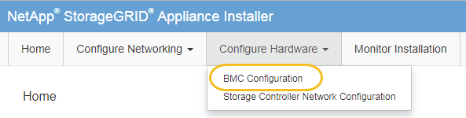

= Modifier le mot de passe admin ou root de l'interface BMC
:allow-uri-read: 
:icons: font
:imagesdir: ../media/

[role="lead"]
Pour des raisons de sécurité, vous devez modifier le mot de passe de l'administrateur ou de l'utilisateur root du contrôleur BMC.

.Avant de commencer
Le client de gestion utilise un https://docs.netapp.com/us-en/storagegrid/admin/web-browser-requirements.html["navigateur web pris en charge"^].

.Description de la tâche
Lorsque vous installez l'appliance pour la première fois, le contrôleur BMC utilise un mot de passe par défaut pour l'administrateur ou l'utilisateur root. Vous devez modifier le mot de passe de l'administrateur ou de l'utilisateur root pour sécuriser votre système.

L'utilisateur par défaut dépend de la date d'installation de l'appliance StorageGRID. L'utilisateur par défaut est *admin* pour les nouvelles installations et *root* pour les anciennes installations.

.Étapes
. Depuis le client, entrez l'URL du programme d'installation de l'appliance StorageGRID :
+
`*https://_Appliance_IP_:8443*`

+
Pour `_Appliance_IP_`, Utilisez l'adresse IP du serveur sur tout réseau StorageGRID.

+
La page d'accueil du programme d'installation de l'appliance StorageGRID s'affiche.

. Sélectionnez *configurer le matériel* > *BMC Configuration*.
+

+
La page Configuration du contrôleur de gestion de la carte mère s'affiche.

. Entrez un nouveau mot de passe pour le compte admin ou root dans les deux champs prévus à cet effet.
. Sélectionnez *Enregistrer*.

