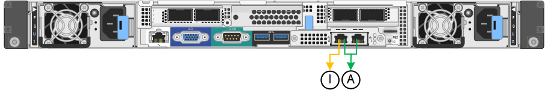

= Configurer les liaisons réseau
:allow-uri-read: 
:icons: font
:imagesdir: ../media/

[role="lead"]
Vous pouvez configurer des liaisons réseau pour les ports utilisés pour connecter l'appliance au réseau Grid, au réseau client et au réseau Admin. Vous pouvez définir la vitesse de liaison ainsi que les modes de port et de liaison réseau.

TIP: Si vous utilisez ConfigBuilder pour générer un fichier JSON, vous pouvez configurer automatiquement les liens réseau. Voir link:automating-appliance-installation-and-configuration.html["Automatisez l'installation et la configuration de l'appliance"].

.Avant de commencer
* Vous avez link:obtaining-additional-equipment-and-tools.html["obtenu l'équipement supplémentaire"] requis pour votre type de câble et votre vitesse de liaison.
* Vous avez installé les émetteurs-récepteurs appropriés dans les ports, en fonction de la vitesse de liaison que vous prévoyez d'utiliser.
* Vous avez connecté les ports réseau à des commutateurs qui prennent en charge la vitesse choisie.

Si vous prévoyez d'utiliser le mode de liaison de port d'agrégat, le mode de liaison réseau LACP ou le balisage VLAN :

* Vous avez connecté les ports réseau de l'appliance à des commutateurs capables de prendre en charge VLAN et LACP.
* Si plusieurs commutateurs participent au lien LACP, les commutateurs prennent en charge les groupes d'agrégation de liens multi-châssis (MLAG), ou un équivalent.
* Vous comprenez comment configurer les commutateurs pour utiliser VLAN, LACP et MLAG ou équivalent.
* Vous connaissez la balise VLAN unique à utiliser pour chaque réseau. Cette balise VLAN sera ajoutée à chaque paquet réseau pour s'assurer que le trafic réseau est acheminé vers le réseau approprié.

.Description de la tâche
Vous ne devez configurer les paramètres de la page Configuration des liens que si vous souhaitez utiliser un paramètre autre que celui par défaut.

NOTE: La politique de hachage de transmission LACP est layer2+3.

Les figures et les tableaux résument les options pour le mode de liaison du port et le mode de liaison du réseau pour chaque appliance. Pour plus d'informations, reportez-vous aux sections suivantes :

* link:gathering-installation-information-sg100-and-sg1000.html#port-bond-modes["Modes de liaison de port (SG1000 et SG100)"]
* link:gathering-installation-information-sg110-and-sg1100.html#port-bond-modes["Modes de liaison de port (SG1100 et SG110)"]
* link:gathering-installation-information-sg5700.html#port-bond-modes["Modes de liaison du port (E5700SG)"]
* link:gathering-installation-information-sg6000.html#port-bond-modes["Modes de liaison de port (SG6000-CN)"]
* link:gathering-installation-information-sg6100.html#port-bond-modes["Modes de liaison de port (SGF6112)"]

[role="tabbed-block"]
====
.SG100 et SG1000
--
Mode de liaison port fixe (par défaut)::
+
--
Les figures montrent comment les quatre ports réseau du SG1000 ou du SG100 sont liés en mode de liaison port fixe (configuration par défaut).

SG1000 :

image::../media/sg1000_fixed_port.png[Mode de liaison de port fixe SG1000]

SG100 :

image::../media/sg100_fixed_port_draft.png[Mode de liaison de port fixe SG100]

[cols="1a,3a"]
|===
| Légende | Quels ports sont liés 

 a| 
C
 a| 
Les ports 1 et 3 sont liés ensemble pour le réseau client, si ce réseau est utilisé.

 a| 
G
 a| 
Les ports 2 et 4 sont liés ensemble pour le réseau de grille.

|===
Le tableau récapitule les options de configuration des quatre ports réseau. Vous ne devez configurer les paramètres de la page Configuration des liens que si vous souhaitez utiliser un paramètre autre que celui par défaut.

[cols="1a,2a,2a"]
|===
| Mode de liaison réseau | Réseau client désactivé (par défaut) | Réseau client activé 

 a| 
Sauvegarde active/active (par défaut)
 a| 
* Les ports 2 et 4 utilisent une liaison de sauvegarde active pour le réseau Grid.
* Les ports 1 et 3 ne sont pas utilisés.
* Une balise VLAN est facultative.

 a| 
* Les ports 2 et 4 utilisent une liaison de sauvegarde active pour le réseau Grid.
* Les ports 1 et 3 utilisent une liaison de sauvegarde active pour le réseau client.
* Les balises VLAN peuvent être spécifiées pour les deux réseaux pour le confort de l'administrateur réseau.

 a| 
LACP (802.3ad)
 a| 
* Les ports 2 et 4 utilisent une liaison LACP pour le réseau Grid.
* Les ports 1 et 3 ne sont pas utilisés.
* Une balise VLAN est facultative.

 a| 
* Les ports 2 et 4 utilisent une liaison LACP pour le réseau Grid.
* Les ports 1 et 3 utilisent une liaison LACP pour le réseau client.
* Les balises VLAN peuvent être spécifiées pour les deux réseaux pour le confort de l'administrateur réseau.

|===
--
Mode de liaison du port agrégé::
+
--
Ces figures montrent comment les quatre ports réseau sont liés en mode agrégation port bond.

SG1000 :

image::../media/sg1000_aggregate_ports.png[Mode de liaison de port agrégé SG1000]

SG100 :

image::../media/sg100_aggregate_ports.png[Mode de liaison de port agrégé SG100]

[cols="1a,3a"]
|===
| Légende | Quels ports sont liés 

 a| 
1
 a| 
Les quatre ports sont regroupés en une seule liaison LACP, ce qui permet d'utiliser tous les ports pour le trafic Grid Network et client Network.

|===
Le tableau récapitule les options de configuration des quatre ports réseau. Vous ne devez configurer les paramètres de la page Configuration des liens que si vous souhaitez utiliser un paramètre autre que celui par défaut.

[cols="1a,2a,2a"]
|===
| Mode de liaison réseau | Réseau client désactivé (par défaut) | Réseau client activé 

 a| 
LACP (802.3ad) uniquement
 a| 
* Les ports 1-4 utilisent une liaison LACP unique pour le réseau Grid.
* Une balise VLAN unique identifie les paquets réseau Grid.

 a| 
* Les ports 1-4 utilisent une liaison LACP unique pour le réseau Grid et le réseau client.
* Deux balises VLAN permettent de isoler les paquets réseau Grid des paquets réseau client.

|===
--
Mode de liaison réseau Active-Backup pour les ports de gestion::
+
--
Ces figures montrent comment les deux ports de gestion 1 GbE des dispositifs sont liés en mode liaison réseau Active-Backup pour le réseau d'administration.

SG1000 :

SG100 :

image::../media/sg100_bonded_management_ports.png[Ports réseau d'administration solidés SG100]

--

--
.SG110 et SG1100
--
Mode de liaison port fixe (par défaut)::
+
--
Les figures montrent comment les quatre ports réseau du SG1100 ou du SG110 sont liés en mode de liaison port fixe (configuration par défaut).

SG1100 :

image::../media/sg1100_fixed_port.png[SG1100 mode de liaison de port fixe]

SG110 :

image::../media/sgf6112_fixed_port.png[SG110 mode de liaison de port fixe]

[cols="1a,3a"]
|===
| Légende | Quels ports sont liés 

 a| 
C
 a| 
Les ports 1 et 3 sont liés ensemble pour le réseau client, si ce réseau est utilisé.

 a| 
G
 a| 
Les ports 2 et 4 sont liés ensemble pour le réseau de grille.

|===
Le tableau récapitule les options de configuration des quatre ports réseau. Vous ne devez configurer les paramètres de la page Configuration des liens que si vous souhaitez utiliser un paramètre autre que celui par défaut.

[cols="1a,2a,2a"]
|===
| Mode de liaison réseau | Réseau client désactivé (par défaut) | Réseau client activé 

 a| 
Sauvegarde active/active (par défaut)
 a| 
* Les ports 2 et 4 utilisent une liaison de sauvegarde active pour le réseau Grid.
* Les ports 1 et 3 ne sont pas utilisés.
* Une balise VLAN est facultative.

 a| 
* Les ports 2 et 4 utilisent une liaison de sauvegarde active pour le réseau Grid.
* Les ports 1 et 3 utilisent une liaison de sauvegarde active pour le réseau client.
* Les balises VLAN peuvent être spécifiées pour les deux réseaux pour le confort de l'administrateur réseau.

 a| 
LACP (802.3ad)
 a| 
* Les ports 2 et 4 utilisent une liaison LACP pour le réseau Grid.
* Les ports 1 et 3 ne sont pas utilisés.
* Une balise VLAN est facultative.

 a| 
* Les ports 2 et 4 utilisent une liaison LACP pour le réseau Grid.
* Les ports 1 et 3 utilisent une liaison LACP pour le réseau client.
* Les balises VLAN peuvent être spécifiées pour les deux réseaux pour le confort de l'administrateur réseau.

|===
--
Mode de liaison du port agrégé::
+
--
Ces figures montrent comment les quatre ports réseau sont liés en mode agrégation port bond.

SG1100 :

image::../media/sg1100_aggregate_ports.png[Mode agrégation de liaisons de port SG1100]

SG110 :

image::../media/sgf6112_aggregate_ports.png[SG110 mode de liaison de port agrégé]

[cols="1a,3a"]
|===
| Légende | Quels ports sont liés 

 a| 
1
 a| 
Les quatre ports sont regroupés en une seule liaison LACP, ce qui permet d'utiliser tous les ports pour le trafic Grid Network et client Network.

|===
Le tableau récapitule les options de configuration des ports réseau. Vous ne devez configurer les paramètres de la page Configuration des liens que si vous souhaitez utiliser un paramètre autre que celui par défaut.

[cols="1a,2a,2a"]
|===
| Mode de liaison réseau | Réseau client désactivé (par défaut) | Réseau client activé 

 a| 
LACP (802.3ad) uniquement
 a| 
* Les ports 1-4 utilisent une liaison LACP unique pour le réseau Grid.
* Une balise VLAN unique identifie les paquets réseau Grid.

 a| 
* Les ports 1-4 utilisent une liaison LACP unique pour le réseau Grid et le réseau client.
* Deux balises VLAN permettent de isoler les paquets réseau Grid des paquets réseau client.

|===
--
Mode de liaison réseau Active-Backup pour les ports de gestion::
+
--
Ces figures montrent comment les deux ports de gestion 1 GbE des dispositifs sont liés en mode liaison réseau Active-Backup pour le réseau d'administration.

SG1100 :

image::../media/sg1100_bonded_management_ports.png[Ports réseau d'administration mis en liaison avec le SG1100]

SG110 :

image::../media/sgf6112_bonded_management_ports.png[Ports réseau d'administration mis en liaison SG110]

--

--
.SG5700
--
Mode de liaison port fixe (par défaut)::
+
--
Cette figure montre comment les quatre ports 10/25 GbE sont liés en mode de liaison de port fixe (configuration par défaut).

image::../media/e5700sg_fixed_port.gif[Illustration montrant comment les ports 10/25 GbE du contrôleur E5700SG sont liés en mode fixe]

[cols="1a,3a"]
|===
| Légende | Quels ports sont liés 

 a| 
C
 a| 
Les ports 1 et 3 sont liés ensemble pour le réseau client, si ce réseau est utilisé.

 a| 
G
 a| 
Les ports 2 et 4 sont liés ensemble pour le réseau de grille.

|===
Le tableau récapitule les options de configuration des quatre ports 10/25-GbE. Vous ne devez configurer les paramètres de la page Configuration des liens que si vous souhaitez utiliser un paramètre autre que celui par défaut.

[cols="1a,2a,2a"]
|===
| Mode de liaison réseau | Réseau client désactivé (par défaut) | Réseau client activé 

 a| 
Sauvegarde active/active (par défaut)
 a| 
* Les ports 2 et 4 utilisent une liaison de sauvegarde active pour le réseau Grid.
* Les ports 1 et 3 ne sont pas utilisés.
* Une balise VLAN est facultative.

 a| 
* Les ports 2 et 4 utilisent une liaison de sauvegarde active pour le réseau Grid.
* Les ports 1 et 3 utilisent une liaison de sauvegarde active pour le réseau client.
* Les balises VLAN peuvent être spécifiées pour les deux réseaux pour le confort de l'administrateur réseau.

 a| 
LACP (802.3ad)
 a| 
* Les ports 2 et 4 utilisent une liaison LACP pour le réseau Grid.
* Les ports 1 et 3 ne sont pas utilisés.
* Une balise VLAN est facultative.

 a| 
* Les ports 2 et 4 utilisent une liaison LACP pour le réseau Grid.
* Les ports 1 et 3 utilisent une liaison LACP pour le réseau client.
* Les balises VLAN peuvent être spécifiées pour les deux réseaux pour le confort de l'administrateur réseau.

|===
--
Mode de liaison du port agrégé::
+
--
Cette figure montre comment les quatre ports 10/25 GbE sont liés en mode de liaison de port agrégé.

image::../media/e5700sg_aggregate_port.gif[Image montrant comment les ports 10/25 GbE du contrôleur E5700SG sont liés en mode agrégé]

[cols="1a,3a"]
|===
| Légende | Quels ports sont liés 

 a| 
1
 a| 
Les quatre ports sont regroupés en une seule liaison LACP, ce qui permet d'utiliser tous les ports pour le trafic Grid Network et client Network.

|===
Le tableau récapitule les options de configuration des quatre ports 10/25-GbE. Vous ne devez configurer les paramètres de la page Configuration des liens que si vous souhaitez utiliser un paramètre autre que celui par défaut.

[cols="1a,2a,2a"]
|===
| Mode de liaison réseau | Réseau client désactivé (par défaut) | Réseau client activé 

 a| 
LACP (802.3ad) uniquement
 a| 
* Les ports 1-4 utilisent une liaison LACP unique pour le réseau Grid.
* Une balise VLAN unique identifie les paquets réseau Grid.

 a| 
* Les ports 1-4 utilisent une liaison LACP unique pour le réseau Grid et le réseau client.
* Deux balises VLAN permettent de isoler les paquets réseau Grid des paquets réseau client.

|===
--
Mode de liaison réseau Active-Backup pour les ports de gestion::
+
--
Cette figure montre comment les deux ports de gestion 1 GbE du contrôleur E5700SG sont liés en mode de liaison réseau Active-Backup pour le réseau d'administration.

image::../media/e5700sg_bonded_management_ports.gif[Ports de gestion par liaison du système E5700SG]

--

--
.SG6000
--
Mode de liaison port fixe (par défaut)::
+
--
Cette figure montre comment les quatre ports réseau sont liés en mode de liaison port fixe (configuration par défaut)

image::../media/sg6000_cn_fixed_port.gif[Illustration montrant comment les ports réseau du contrôleur SG6000-CN sont liés en mode fixe]

[cols="1a,3a"]
|===
| Légende | Quels ports sont liés 

 a| 
C
 a| 
Les ports 1 et 3 sont liés ensemble pour le réseau client, si ce réseau est utilisé.

 a| 
G
 a| 
Les ports 2 et 4 sont liés ensemble pour le réseau de grille.

|===
Le tableau récapitule les options de configuration des ports réseau. Vous ne devez configurer les paramètres de la page Configuration des liens que si vous souhaitez utiliser un paramètre autre que celui par défaut.

[cols="1a,3a,3a"]
|===
| Mode de liaison réseau | Réseau client désactivé (par défaut) | Réseau client activé 

 a| 
Sauvegarde active/active (par défaut)
 a| 
* Les ports 2 et 4 utilisent une liaison de sauvegarde active pour le réseau Grid.
* Les ports 1 et 3 ne sont pas utilisés.
* Une balise VLAN est facultative.

 a| 
* Les ports 2 et 4 utilisent une liaison de sauvegarde active pour le réseau Grid.
* Les ports 1 et 3 utilisent une liaison de sauvegarde active pour le réseau client.
* Les balises VLAN peuvent être spécifiées pour les deux réseaux pour le confort de l'administrateur réseau.

 a| 
LACP (802.3ad)
 a| 
* Les ports 2 et 4 utilisent une liaison LACP pour le réseau Grid.
* Les ports 1 et 3 ne sont pas utilisés.
* Une balise VLAN est facultative.

 a| 
* Les ports 2 et 4 utilisent une liaison LACP pour le réseau Grid.
* Les ports 1 et 3 utilisent une liaison LACP pour le réseau client.
* Les balises VLAN peuvent être spécifiées pour les deux réseaux pour le confort de l'administrateur réseau.

|===
--
Mode de liaison du port agrégé::
+
--
Cette figure montre comment les quatre ports réseau sont liés en mode de liaison de port agrégé.

image::../media/sg6000_cn_aggregate_port.gif[Illustration montrant comment les ports réseau du contrôleur SG6000-CN sont liés en mode agrégé]

[cols="1a,3a"]
|===
| Légende | Quels ports sont liés 

 a| 
1
 a| 
Les quatre ports sont regroupés en une seule liaison LACP, ce qui permet d'utiliser tous les ports pour le trafic Grid Network et client Network.

|===
Le tableau récapitule les options de configuration des ports réseau. Vous ne devez configurer les paramètres de la page Configuration des liens que si vous souhaitez utiliser un paramètre autre que celui par défaut.

[cols="1a,3a,3a"]
|===
| Mode de liaison réseau | Réseau client désactivé (par défaut) | Réseau client activé 

 a| 
LACP (802.3ad) uniquement
 a| 
* Les ports 1-4 utilisent une liaison LACP unique pour le réseau Grid.
* Une balise VLAN unique identifie les paquets réseau Grid.

 a| 
* Les ports 1-4 utilisent une liaison LACP unique pour le réseau Grid et le réseau client.
* Deux balises VLAN permettent de isoler les paquets réseau Grid des paquets réseau client.

|===
--
Mode de liaison réseau Active-Backup pour les ports de gestion::
+
--
Cette figure montre comment les deux ports de gestion 1 GbE du contrôleur SG6000-CN sont liés en mode de liaison réseau Active-Backup pour le réseau Admin.

image::../media/sg6000_cn_bonded_managemente_ports.png[Ports réseau d'administration Bonded]

--

--
.SGF6112
--
Mode de liaison port fixe (par défaut)::
+
--
La figure montre comment les quatre ports réseau sont liés en mode de liaison port fixe (configuration par défaut).

image::../media/sgf6112_fixed_port.png[SGF6112 mode liaison port fixe]

[cols="1a,3a"]
|===
| Légende | Quels ports sont liés 

 a| 
C
 a| 
Les ports 1 et 3 sont liés ensemble pour le réseau client, si ce réseau est utilisé.

 a| 
G
 a| 
Les ports 2 et 4 sont liés ensemble pour le réseau de grille.

|===
Le tableau récapitule les options de configuration des ports réseau. Vous ne devez configurer les paramètres de la page Configuration des liens que si vous souhaitez utiliser un paramètre autre que celui par défaut.

[cols="1a,2a,2a"]
|===
| Mode de liaison réseau | Réseau client désactivé (par défaut) | Réseau client activé 

 a| 
Sauvegarde active/active (par défaut)
 a| 
* Les ports 2 et 4 utilisent une liaison de sauvegarde active pour le réseau Grid.
* Les ports 1 et 3 ne sont pas utilisés.
* Une balise VLAN est facultative.

 a| 
* Les ports 2 et 4 utilisent une liaison de sauvegarde active pour le réseau Grid.
* Les ports 1 et 3 utilisent une liaison de sauvegarde active pour le réseau client.
* Les balises VLAN peuvent être spécifiées pour les deux réseaux pour le confort de l'administrateur réseau.

 a| 
LACP (802.3ad)
 a| 
* Les ports 2 et 4 utilisent une liaison LACP pour le réseau Grid.
* Les ports 1 et 3 ne sont pas utilisés.
* Une balise VLAN est facultative.

 a| 
* Les ports 2 et 4 utilisent une liaison LACP pour le réseau Grid.
* Les ports 1 et 3 utilisent une liaison LACP pour le réseau client.
* Les balises VLAN peuvent être spécifiées pour les deux réseaux pour le confort de l'administrateur réseau.

|===
--
Mode de liaison du port agrégé::
+
--
La figure montre comment les quatre ports réseau sont liés en mode agrégation de liens de port.

image::../media/sgf6112_aggregate_ports.png[SGF6112 mode de liaison de port agrégé]

[cols="1a,3a"]
|===
| Légende | Quels ports sont liés 

 a| 
1
 a| 
Les quatre ports sont regroupés en une seule liaison LACP, ce qui permet d'utiliser tous les ports pour le trafic Grid Network et client Network.

|===
Le tableau récapitule les options de configuration des ports réseau. Vous ne devez configurer les paramètres de la page Configuration des liens que si vous souhaitez utiliser un paramètre autre que celui par défaut.

[cols="1a,2a,2a"]
|===
| Mode de liaison réseau | Réseau client désactivé (par défaut) | Réseau client activé 

 a| 
LACP (802.3ad) uniquement
 a| 
* Les ports 1-4 utilisent une liaison LACP unique pour le réseau Grid.
* Une balise VLAN unique identifie les paquets réseau Grid.

 a| 
* Les ports 1-4 utilisent une liaison LACP unique pour le réseau Grid et le réseau client.
* Deux balises VLAN permettent de isoler les paquets réseau Grid des paquets réseau client.

|===
--
Mode de liaison réseau Active-Backup pour les ports de gestion::
+
--
Cette figure montre comment les deux ports de gestion 1 GbE du SGF6112 sont liés en mode liaison réseau Active-Backup pour le réseau d'administration.

image::../media/sgf6112_bonded_management_ports.png[Ports réseau d'administration mis en liaison SGF6112]

--

--
====
.Étapes
. Dans la barre de menus du programme d'installation de l'appliance StorageGRID, cliquez sur *configurer réseau* > *Configuration lien*.
+
La page Configuration de la liaison réseau affiche un schéma de votre appliance avec le réseau et les ports de gestion numérotés.

+
Le tableau État de la liaison répertorie l'état de la liaison, la vitesse de la liaison et les autres statistiques des ports numérotés.

+
La première fois que vous accédez à cette page :

+
** *Vitesse de liaison* est définie sur *Auto*.
** *Le mode de liaison de port* est défini sur *fixe*.
** *Le mode de liaison réseau* est défini sur *Active-Backup* pour le réseau de grille.
** Le *réseau d'administration* est activé et le mode de liaison réseau est défini sur *indépendant*.
** Le *réseau client* est désactivé.

. Sélectionnez la vitesse de liaison des ports réseau dans la liste déroulante *Link Speed*.
+
Les commutateurs réseau que vous utilisez pour le réseau Grid et le réseau client doivent également prendre en charge et être configurés pour cette vitesse. Vous devez utiliser les adaptateurs ou émetteurs-récepteurs appropriés pour la vitesse de liaison configurée. Utilisez la vitesse de liaison automatique lorsque cela est possible car cette option négocie à la fois la vitesse de liaison et le mode de correction d'erreur de marche avant (FEC) avec le partenaire de liaison.

+
Si vous prévoyez d'utiliser la vitesse de liaison 25 GbE pour les ports réseau SG6000 ou SG5700 :

+
** Utilisez les émetteurs-récepteurs SFP28 et les câbles TwinAx SFP28 ou les câbles optiques.
** Pour l'appliance SG5700, sélectionnez *25GbE* dans la liste déroulante *vitesse de liaison*.
** Pour le SG6000, sélectionnez *Auto* dans la liste déroulante *vitesse de liaison*.

. Activez ou désactivez les réseaux StorageGRID que vous souhaitez utiliser.
+
Le réseau Grid est requis. Vous ne pouvez pas désactiver ce réseau.

+
.. Si le serveur n'est pas connecté au réseau d'administration, décochez la case *Activer le réseau* pour le réseau d'administration.
.. Si le serveur est connecté au réseau client, cochez la case *Activer le réseau* pour le réseau client.
+
Les paramètres réseau du client pour les ports de carte réseau de données sont maintenant affichés.

. Reportez-vous au tableau et configurez le mode de liaison de port et le mode de liaison réseau.
+
Cet exemple montre :

+
** *Agrégat* et *LACP* sélectionnés pour la grille et les réseaux clients. Vous devez spécifier une balise VLAN unique pour chaque réseau. Vous pouvez sélectionner des valeurs comprises entre 0 et 4095.
** *Sauvegarde active* sélectionnée pour le réseau d'administration.
+
image::../media/sg1000_network_link_configuration_aggregate.png[Agrégat de configuration de Network Link]

. Lorsque vous êtes satisfait de vos sélections, cliquez sur *Enregistrer*.
+

NOTE: Vous risquez de perdre votre connexion si vous avez apporté des modifications au réseau ou au lien auquel vous êtes connecté. Si vous n'êtes pas reconnecté dans un délai d'une minute, saisissez à nouveau l'URL du programme d'installation de l'appliance StorageGRID à l'aide de l'une des autres adresses IP attribuées à l'appliance : +
`*https://_appliance_IP_:8443*`

