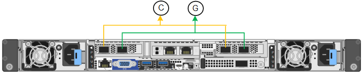

= Collecte d'informations réseau (SG6100)
:allow-uri-read: 
:icons: font
:imagesdir: ../media/

[role="lead"]
À l'aide des tableaux suivants, notez les informations requises pour chaque réseau que vous connectez à l'appliance. Ces valeurs sont nécessaires pour installer et configurer le matériel.

TIP: Au lieu d'utiliser les tableaux, utilisez le manuel fourni avec ConfigBuilder. Le manuel ConfigBuilder vous permet de télécharger les informations système et de générer un fichier JSON pour effectuer automatiquement certaines étapes de configuration dans le programme d'installation de l'appliance StorageGRID. Voir link:automating-appliance-installation-and-configuration.html["Automatisez l'installation et la configuration de l'appliance"].

== Vérifiez la version de StorageGRID

Avant d'installer une appliance SGF6112 ou SG6160, vérifiez que votre système StorageGRID utilise la version requise du logiciel StorageGRID.

[cols="1a,2a"]
|===
| Appliance | Version StorageGRID requise 

 a| 
SGF6112
 a| 
11.7 ou version ultérieure (dernier correctif recommandé)

 a| 
SG6160
 a| 
11.8 ou version ultérieure (dernier correctif recommandé)

|===

== Connectez-vous à SANtricity System Manager

Vous connectez les deux contrôleurs de stockage de l'appliance SG6160 au réseau de gestion que vous utiliserez pour SANtricity System Manager. Le contrôleur A se trouve en haut et le contrôleur B en bas.

[cols="2a,1a,1a"]
|===
| Informations nécessaires | Valeur pour le contrôleur A | Valeur pour le contrôleur B 

 a| 
Port de commutateur Ethernet que vous allez connecter au port de gestion 1 (nommé P1 sur le contrôleur)
 a| 
 a| 

 a| 
Adresse MAC pour le port de gestion 1 (imprimée sur une étiquette près du port P1)
 a| 
 a| 

 a| 
Adresse IP attribuée par DHCP pour le port de gestion 1, si disponible après la mise sous tension

*Remarque :* si le réseau auquel vous vous connectez au contrôleur de stockage comporte un serveur DHCP, l'administrateur réseau peut utiliser l'adresse MAC pour déterminer l'adresse IP attribuée par le serveur DHCP.
 a| 
 a| 

 a| 
Adresse IP statique que vous prévoyez d'utiliser pour l'appliance sur le réseau de gestion
 a| 
Pour IPv4 :

* Adresse IPv4 :
* Masque de sous-réseau :
* Passerelle :

Pour IPv6 :

* Adresse IPv6 :
* Adresse IP routable :
* Adresse IP du routeur du contrôleur de stockage :

 a| 
Pour IPv4 :

* Adresse IPv4 :
* Masque de sous-réseau :
* Passerelle :

Pour IPv6 :

* Adresse IPv6 :
* Adresse IP routable :
* Adresse IP du routeur du contrôleur de stockage :

 a| 
Format d'adresse IP
 a| 
Choisir une option :

* IPv4
* IPv6

 a| 
Choisir une option :

* IPv4
* IPv6

 a| 
Vitesse et mode duplex

*Remarque :* vous devez vous assurer que le commutateur Ethernet du réseau de gestion SANtricity System Manager est défini sur négociation automatique.
 a| 
Doit être :

* Négociation automatique (par défaut)

 a| 
Doit être :

* Négociation automatique (par défaut)

|===

== Ports d'administration et de maintenance

Le réseau d'administration pour StorageGRID est un réseau facultatif, utilisé pour l'administration et la maintenance du système. L'appliance se connecte au réseau d'administration via les ports 1/10-GbE suivants de l'appliance.

Ports RJ-45 sur l'appliance SGF6112 :

image::../media/sg6100_rj_45_ports_circled.png[Ports RJ-45 SGF6112]

Ports RJ-45 sur le contrôleur SG6100-CN :

image::../media/sg6100_cn_rj_45_ports_circled.png[PORTS RJ-45 SG6100-CN]

[cols="2a,1a"]
|===
| Informations nécessaires | Votre valeur 

 a| 
Réseau admin activé
 a| 
Choisir une option :

* Non
* Oui (par défaut)

 a| 
Mode de liaison réseau
 a| 
Choisir une option :

* Indépendant (par défaut)
* Sauvegarde active-Backup

 a| 
Port de commutateur pour le port gauche entouré dans le schéma (port actif par défaut pour le mode de liaison réseau indépendante)
 a| 

 a| 
Port de commutateur pour le port droit entouré dans le diagramme (mode de liaison réseau Active-Backup uniquement)
 a| 

 a| 
Adresse IP attribuée par DHCP pour le port réseau d'administration, si disponible après la mise sous tension

*Remarque :* Contactez votre administrateur réseau pour obtenir l'adresse IP attribuée par DHCP au port réseau Admin.
 a| 
* Adresse IPv4 (CIDR) :
* Passerelle :

 a| 
Adresse IP statique que vous envisagez d'utiliser pour le nœud d'appliance sur le réseau d'administration

*Remarque :* si votre réseau n'a pas de passerelle, spécifiez la même adresse IPv4 statique pour la passerelle.
 a| 
* Adresse IPv4 (CIDR) :
* Passerelle :

 a| 
Sous-réseaux du réseau d'administration (CIDR)
 a| 

|===

== Ports réseau

Les quatre ports réseau de l'appliance se connectent au réseau StorageGRID Grid et au réseau client en option.

[cols="2a,1a"]
|===
| Informations nécessaires | Votre valeur 

 a| 
Vitesse de liaison
 a| 
Choisir une option :

* Auto (par défaut)
* 10 GbE
* 25 GbE
* 100 GbE (SG6160 uniquement)

 a| 
Mode de liaison du port
 a| 
Choisir une option :

* Fixe (par défaut)
* Agrégat

 a| 
Port de commutation pour le port 1 (réseau client pour mode fixe)
 a| 

 a| 
Port de commutation pour le port 2 (réseau grille pour mode fixe)
 a| 

 a| 
Port de commutation pour le port 3 (réseau client pour mode fixe)
 a| 

 a| 
Port de commutation pour le port 4 (réseau Grid pour mode fixe)
 a| 

|===

== Ports réseau de la grille

Le réseau Grid Network pour StorageGRID est un réseau requis, utilisé pour l'ensemble du trafic StorageGRID interne. L'appliance se connecte au réseau Grid à l'aide des quatre ports réseau.

[cols="2a,1a"]
|===
| Informations nécessaires | Votre valeur 

 a| 
Mode de liaison réseau
 a| 
Choisir une option :

* Sauvegarde active/active (par défaut)
* LACP (802.3ad)

 a| 
Balisage VLAN activé
 a| 
Choisir une option :

* Non (par défaut)
* Oui.

 a| 
Balise VLAN (si le balisage VLAN est activé)
 a| 
Entrez une valeur comprise entre 0 et 4095 :

 a| 
Adresse IP attribuée par DHCP pour le réseau Grid, si disponible après la mise sous tension
 a| 
* Adresse IPv4 (CIDR) :
* Passerelle :

 a| 
Adresse IP statique que vous prévoyez d'utiliser pour le nœud de l'appliance sur le réseau Grid

*Remarque :* si votre réseau n'a pas de passerelle, spécifiez la même adresse IPv4 statique pour la passerelle.
 a| 
* Adresse IPv4 (CIDR) :
* Passerelle :

 a| 
Sous-réseaux du réseau de grille (CIDR)
 a| 

 a| 
Réglage de l'unité de transmission maximale (MTU) (facultatif). Vous pouvez utiliser la valeur par défaut 1500 ou définir la valeur MTU sur une valeur adaptée aux trames jumbo, par exemple 9000.
 a| 

|===

== Ports réseau client

Le réseau client pour StorageGRID est un réseau facultatif, généralement utilisé pour fournir l'accès du protocole client à la grille. Le serveur se connecte au réseau client à l'aide des quatre ports réseau.

[cols="2a,1a"]
|===
| Informations nécessaires | Votre valeur 

 a| 
Réseau client activé
 a| 
Choisir une option :

* Non (par défaut)
* Oui.

 a| 
Mode de liaison réseau
 a| 
Choisir une option :

* Sauvegarde active/active (par défaut)
* LACP (802.3ad)

 a| 
Balisage VLAN activé
 a| 
Choisir une option :

* Non (par défaut)
* Oui.

 a| 
Balise VLAN (si le balisage VLAN est activé)
 a| 
Entrez une valeur comprise entre 0 et 4095 :

 a| 
Adresse IP attribuée par DHCP pour le réseau client, si disponible après la mise sous tension
 a| 
* Adresse IPv4 (CIDR) :
* Passerelle :

 a| 
Adresse IP statique que vous prévoyez d'utiliser pour le nœud de l'appliance sur le réseau client

*Remarque :* si le réseau client est activé, la route par défaut du serveur utilise la passerelle indiquée ici.
 a| 
* Adresse IPv4 (CIDR) :
* Passerelle :

|===

== Ports réseau de gestion BMC

Vous pouvez accéder à l'interface BMC sur l'appliance à l'aide du port de gestion 1 GbE entouré dans le schéma. Ce port prend en charge la gestion à distance du matériel du contrôleur via Ethernet en utilisant la norme IPMI (Intelligent Platform Management interface).

NOTE: Vous pouvez activer ou désactiver l'accès IPMI à distance pour tous les dispositifs contenant un contrôleur BMC. L'interface IPMI distante permet à toute personne disposant d'un compte BMC et d'un mot de passe d'accéder à votre matériel de bas niveau à vos appliances StorageGRID. Si vous n'avez pas besoin d'un accès IPMI à distance au contrôleur BMC, désactivez cette option à l'aide de l'une des méthodes suivantes : +
Dans Grid Manager, accédez à *CONFIGURATION* > *sécurité* > *Paramètres de sécurité* > *appareils* et décochez la case *Activer l'accès IPMI distant*. +
Dans l'API de gestion de grille, utilisez le terminal privé : `PUT /private/bmc`.

Les figures suivantes montrent le port de gestion BMC sur les SGF6112 et SG6100-CN.

_SGF6112_

image::../media/sgf6112_cn_bmc_management_port.png[Port de gestion SGF6112]

_SG6100-CN_

image::../media/sg6100_cn_bmc_management_port.png[Port de gestion SG6100-CN]

[cols="2a,1a"]
|===
| Informations nécessaires | Votre valeur 

 a| 
Port de commutateur Ethernet vous vous connectez au port de gestion du contrôleur BMC (encerclé dans le diagramme)
 a| 

 a| 
Adresse IP attribuée par DHCP pour le réseau de gestion BMC, si disponible après la mise sous tension
 a| 
* Adresse IPv4 (CIDR) :
* Passerelle :

 a| 
Adresse IP statique que vous prévoyez d'utiliser pour le port de gestion BMC
 a| 
* Adresse IPv4 (CIDR) :
* Passerelle :

|===

== Modes de liaison de port

Quand link:configuring-network-links.html["configuration des liens réseau"] Pour l'appliance SGF6112, vous pouvez utiliser la liaison de port pour les ports qui se connectent au réseau Grid et au réseau client en option, ainsi que les ports de gestion 1/10-GbE qui se connectent au réseau Admin en option. La liaison de ports contribue à protéger vos données en fournissant des chemins redondants entre les réseaux StorageGRID et l'appliance.

=== Modes de liaison réseau

Les ports réseau de l'appliance prennent en charge le mode de liaison de port fixe ou le mode de liaison de port agrégé pour les connexions réseau Grid et réseau client.

==== Mode de liaison de port fixe

Le mode de liaison de port fixe est la configuration par défaut des ports réseau.

_SGF6112:_

image::../media/sgf6112_fixed_port.png[SGF6112 mode liaison port fixe]

_SG6100-CN:_

[cols="1a,3a"]
|===
| Légende | Quels ports sont liés 

 a| 
C
 a| 
Les ports 1 et 3 sont liés ensemble pour le réseau client, si ce réseau est utilisé.

 a| 
G
 a| 
Les ports 2 et 4 sont liés ensemble pour le réseau de grille.

|===
Lors de l'utilisation du mode de liaison de port fixe, les ports peuvent être liés en mode de sauvegarde active ou en mode de protocole de contrôle d'agrégation de liens (LACP 802.3ad).

* En mode de sauvegarde active (valeur par défaut), un seul port est actif à la fois. Si le port actif tombe en panne, son port de sauvegarde fournit automatiquement une connexion de basculement. Le port 4 fournit un chemin de sauvegarde pour le port 2 (réseau Grid) et le port 3 fournit un chemin de sauvegarde pour le port 1 (réseau client).
* En mode LACP, chaque paire de ports forme un canal logique entre l'appliance et le réseau, ce qui permet un débit plus élevé. En cas de défaillance d'un port, l'autre port continue de fournir le canal. Le débit est réduit, mais la connectivité n'est pas affectée.

NOTE: Si vous n'avez pas besoin de connexions redondantes, vous ne pouvez utiliser qu'un seul port pour chaque réseau. Cependant, n'oubliez pas que l'alerte *liaison de l'appliance de stockage en panne* peut être déclenchée dans le Gestionnaire de grille après l'installation de StorageGRID, indiquant qu'un câble est débranché. Vous pouvez désactiver cette règle d'alerte en toute sécurité.

==== Mode de liaison du port agrégé

Le mode de liaison de port agrégé augmente considérablement le débit de chaque réseau StorageGRID et fournit des chemins de basculement supplémentaires.

_SGF6112:_

image::../media/sgf6112_aggregate_ports.png[SGF6112 mode de liaison du port agrégé]

_SG6100-CN:_

image::../media/sg6100_cn_aggregate_ports.png[SG6100-CN mode agrégation port bond]

[cols="1a,3a"]
|===
| Légende | Quels ports sont liés 

 a| 
1
 a| 
Tous les ports connectés sont regroupés en une seule liaison LACP, ce qui permet d'utiliser tous les ports pour le trafic Grid Network et client Network.

|===
Si vous prévoyez d'utiliser le mode de liaison du port agrégé :

* Vous devez utiliser le mode lien réseau LACP.
* Vous devez spécifier une balise VLAN unique pour chaque réseau. Cette balise VLAN sera ajoutée à chaque paquet réseau pour s'assurer que le trafic réseau est acheminé vers le réseau approprié.
* Les ports doivent être connectés aux switchs capables de prendre en charge VLAN et LACP. Si plusieurs commutateurs participent au lien LACP, les switchs doivent prendre en charge les groupes d'agrégation de liens multi-châssis (MLAG), ou un équivalent.
* Vous savez comment configurer les commutateurs pour utiliser VLAN, LACP et MLAG, ou équivalent.

Si vous ne souhaitez pas utiliser les quatre ports, vous pouvez utiliser un, deux ou trois ports. L'utilisation de plusieurs ports permet d'optimiser la possibilité qu'une certaine connectivité réseau reste disponible en cas de défaillance de l'un des ports.

NOTE: Si vous choisissez d'utiliser moins de quatre ports réseau, sachez qu'une alerte *Services Appliance LINK Down* peut être déclenchée dans Grid Manager après l'installation du nœud de l'appliance, ce qui indique qu'un câble est débranché. Vous pouvez désactiver cette règle d'alerte en toute sécurité pour l'alerte déclenchée.

=== Modes de liaison réseau pour les ports de gestion

Pour les deux ports de gestion 1/10-GbE, vous pouvez choisir le mode de liaison réseau indépendant ou le mode de liaison réseau Active-Backup pour vous connecter au réseau d'administration facultatif.

_SGF6112:_

image::../media/sgf6112_bonded_management_ports.png[Ports de gestion réseau SGF6112]

_SG6100-CN:_

image::../media/sg6100_cn_bonded_management_ports.png[SG6100-CN ports de gestion de réseau]

[cols="1a,3a"]
|===
| Légende | Mode de liaison réseau 

 a| 
A
 a| 
Mode de sauvegarde active/active. Les deux ports de gestion sont liés à un port de gestion logique connecté au réseau d'administration.

 a| 
JE
 a| 
Mode indépendant. Le port de gauche est connecté au réseau Admin. Le port de droite est disponible pour les connexions locales temporaires (adresse IP 169.254.0.1).

|===
En mode indépendant, seul le port de gestion de gauche est connecté au réseau Admin. Ce mode ne fournit pas de chemin redondant. Le port de gestion sur la droite est déconnecté et disponible pour les connexions locales temporaires (utilise l'adresse IP 169.254.0.1).

En mode sauvegarde active, les deux ports de gestion sont connectés au réseau Admin. Un seul port est actif à la fois. Si le port actif tombe en panne, son port de sauvegarde fournit automatiquement une connexion de basculement. Le fait de lier ces deux ports physiques à un port de gestion logique fournit un chemin redondant au réseau Admin.

NOTE: Si vous devez établir une connexion locale temporaire à l'appliance lorsque les ports de gestion 1/10-GbE sont configurés pour le mode Active-Backup, débranchez les câbles des deux ports de gestion, branchez votre câble temporaire dans le port de gestion situé à droite et accédez au dispositif à l'aide de l'adresse IP 169.254.0.1.

.Informations associées
* link:cabling-appliance.html["Appareil câblé"]
* link:setting-ip-configuration.html["Configurez les adresses IP StorageGRID"]

