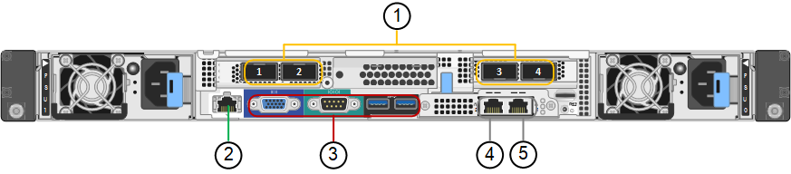

= Appareils SG100 et SG1000: Présentation
:allow-uri-read: 
:icons: font
:imagesdir: ../media/

[role="lead"]
Le dispositif des services StorageGRID SG100 et l'appliance des services SG1000 peuvent fonctionner en tant que nœud de passerelle et en tant que nœud d'administration pour fournir des services d'équilibrage de charge haute disponibilité dans un système StorageGRID. Les deux appliances peuvent fonctionner en tant que nœuds de passerelle et de nœud d'administration (principal ou non primaire) à la fois.

== Caractéristiques de l'appareil

Les deux modèles de l'appareil de services offrent les fonctionnalités suivantes :

* Le nœud de passerelle ou le nœud d'administration fonctionne pour un système StorageGRID.
* Le programme d'installation de l'appliance StorageGRID simplifie le déploiement et la configuration des nœuds.
* Une fois déployé, peut accéder au logiciel StorageGRID à partir d'un nœud d'administration existant ou d'un logiciel téléchargé vers un disque local. Pour simplifier davantage le processus de déploiement, une version récente du logiciel est préchargée sur l'appareil pendant la fabrication.
* Contrôleur de gestion de la carte mère (BMC) pour le contrôle et le diagnostic de certaines pièces du matériel de l'appliance.
* Possibilité de se connecter aux trois réseaux StorageGRID, y compris le réseau Grid, le réseau d'administration et le réseau client :
+
** Le SG100 prend en charge jusqu'à quatre connexions 10 ou 25 GbE au réseau Grid et au réseau client.
** Le SG1000 prend en charge jusqu'à quatre connexions 10, 25, 40 ou 100 GbE au réseau Grid et au réseau client.

== Schémas SG100 et SG1000

Cette figure montre l'avant du SG100 et du SG1000 avec le cadre retiré. À partir de l'avant, les deux appareils sont identiques, à l'exception du nom du produit sur le cadre.

image::../media/sg1000_front_with_ssds.png[Avant avec SSD SG100 et SG1000]

Les deux disques SSD (Solid-State Drives), indiqués par le contour orange, sont utilisés pour stocker le système d'exploitation StorageGRID et sont mis en miroir avec RAID 1 pour la redondance. Lorsque l'appliance de services SG100 ou SG1000 est configurée en tant que nœud d'administration, ces disques peuvent être utilisés pour stocker les journaux d'audit, les metrics et les tables de base de données.

Les emplacements de lecteur restants sont vides.

== Connecteurs SG100

Cette figure montre les connecteurs à l'arrière du SG100.

image::../media/sg100_rear_connectors.png[Connecteurs arrière SG100]

[cols="1a,2a,2a,2a"]
|===
| Légende | Port | Type | Utiliser 

 a| 
1
 a| 
Ports réseau 1-4
 a| 
10/25-GbE, selon le type d'émetteur-récepteur SFP ou câble (les modules SFP28 et SFP+ sont pris en charge), la vitesse du switch et la vitesse de liaison configurée
 a| 
Connectez-vous au réseau Grid et au réseau client pour StorageGRID.

 a| 
2
 a| 
Port de gestion BMC
 a| 
1 GbE (RJ-45)
 a| 
Se connecte au contrôleur de gestion de la carte de base de l'appliance.

 a| 
3
 a| 
Ports de diagnostic et de support
 a| 
* VGA
* Série, 115200 8-N-1
* USB

 a| 
Réservé au support technique.

 a| 
4
 a| 
Port réseau d'administration 1
 a| 
1 GbE (RJ-45)
 a| 
Connectez l'appliance au réseau d'administration pour StorageGRID.

 a| 
5
 a| 
Port réseau d'administration 2
 a| 
1 GbE (RJ-45)
 a| 
Options :

* Lien avec le port de gestion 1 pour une connexion redondante au réseau d'administration pour StorageGRID.
* Laisser déconnecté et disponible pour l'accès local temporaire (IP 169.254.0.1).
* Lors de l'installation, utilisez le port 2 pour la configuration IP si les adresses IP attribuées par DHCP ne sont pas disponibles.

|===

== Connecteurs SG1000

Cette figure montre les connecteurs à l'arrière du SG1000.

[cols="1a,2a,2a,2a"]
|===
| Légende | Port | Type | Utiliser 

 a| 
1
 a| 
Ports réseau 1-4
 a| 
10/25/40/100-GbE, selon le type de câble ou d'émetteur-récepteur, la vitesse du commutateur et la vitesse de liaison configurée. Les protocoles QSFP28 et QSFP+ (40 GbE) sont pris en charge en natif et les émetteurs-récepteurs SFP28/SFP+ peuvent être utilisés avec un QSA (vendu séparément) pour utiliser des vitesses 10 GbE.
 a| 
Connectez-vous au réseau Grid et au réseau client pour StorageGRID.

 a| 
2
 a| 
Port de gestion BMC
 a| 
1 GbE (RJ-45)
 a| 
Se connecte au contrôleur de gestion de la carte de base de l'appliance.

 a| 
3
 a| 
Ports de diagnostic et de support
 a| 
* VGA
* Série, 115200 8-N-1
* USB

 a| 
Réservé au support technique.

 a| 
4
 a| 
Port réseau d'administration 1
 a| 
1 GbE (RJ-45)
 a| 
Connectez l'appliance au réseau d'administration pour StorageGRID.

 a| 
5
 a| 
Port réseau d'administration 2
 a| 
1 GbE (RJ-45)
 a| 
Options :

* Lien avec le port de gestion 1 pour une connexion redondante au réseau d'administration pour StorageGRID.
* Laisser déconnecté et disponible pour l'accès local temporaire (IP 169.254.0.1).
* Lors de l'installation, utilisez le port 2 pour la configuration IP si les adresses IP attribuées par DHCP ne sont pas disponibles.

|===

== Applications SG100 et SG1000

Vous pouvez configurer les appliances de services StorageGRID de différentes façons pour fournir des services de passerelle ainsi que la redondance de certains services d'administration de grille.

Les appliances peuvent être déployées de plusieurs manières :

* Ajouter à une nouvelle grille ou à une grille existante en tant que nœud de passerelle
* Ajoutez à une nouvelle grille en tant que nœud d'administration principal ou non primaire, ou à une grille existante en tant que nœud d'administration non primaire
* Fonctionnement en tant que nœud passerelle et nœud d'administration (principal ou non primaire) en même temps

L'appliance facilite l'utilisation de groupes haute disponibilité (HA) et d'un équilibrage intelligent de la charge pour les connexions de chemin d'accès aux données S3 ou Swift.

Les exemples suivants décrivent comment optimiser les capacités de l'appliance :

* Utilisez deux appareils SG100 ou SG1000 pour fournir des services de passerelle en les configurant en tant que nœuds de passerelle.
+

NOTE: Ne déployez pas les appliances de services SG100 et SG1000 sur le même site. Cela peut entraîner des performances imprévisibles.

* Utilisez deux appareils SG100 ou SG1000 pour assurer la redondance de certains services d'administration de réseau. Pour ce faire, configurez chaque appliance en tant que nœuds d'administration.
* Utilisez deux appareils SG100 ou deux SG1000 pour fournir des services d'équilibrage de charge et de mise en forme du trafic hautement disponibles accessibles via une ou plusieurs adresses IP virtuelles. Pour ce faire, les appliances sont configurés comme des combinaisons de nœuds d'administration ou de nœuds de passerelle et vous ajoutez les deux nœuds au même groupe haute disponibilité.
+

NOTE: Si vous utilisez des nœuds d'administration et des nœuds de passerelle dans le même groupe haute disponibilité, le port Admin nœud seul ne basculera pas. Reportez-vous aux instructions pour https://docs.netapp.com/us-en/storagegrid-118/admin/configure-high-availability-group.html["Configuration des groupes haute disponibilité"^].

Lorsqu'il est utilisé avec des appliances de stockage StorageGRID, les appliances de services SG100 et SG1000 permettent de déployer des grilles d'appliance uniquement, sans dépendance vis-à-vis des hyperviseurs externes ou du matériel de calcul.
