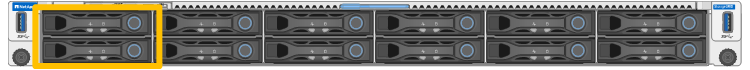
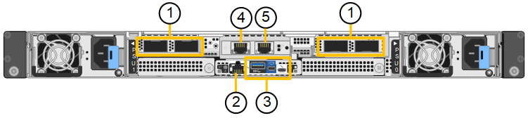

= Appareils StorageGRID SG120 et SG1200
:allow-uri-read: 
:icons: font
:imagesdir: ../media/

[role="lead"]
Les appliances de services StorageGRID SG120 et SG1200 peuvent fonctionner comme nœud de passerelle et comme nœud d'administration afin de fournir des services d'équilibrage de charge à haute disponibilité dans un système StorageGRID. Les deux appliances peuvent fonctionner simultanément comme nœuds de passerelle et nœuds d'administration (principal ou non principal).

== Caractéristiques de l'appareil

Les appareils SG120 et SG1200 offrent les fonctionnalités suivantes :

* Le nœud de passerelle ou le nœud d'administration fonctionne pour un système StorageGRID.
* Le programme d'installation de l'appliance StorageGRID simplifie le déploiement et la configuration des nœuds.
* Une fois déployé, peut accéder au logiciel StorageGRID à partir d'un nœud d'administration existant ou d'un logiciel téléchargé vers un disque local. Pour simplifier davantage le processus de déploiement, une version récente du logiciel est préchargée sur l'appareil pendant la fabrication.
* Contrôleur de gestion de la carte mère (BMC) pour le contrôle et le diagnostic de certaines pièces du matériel de l'appliance.
* Possibilité de se connecter aux trois réseaux StorageGRID, y compris le réseau Grid, le réseau d'administration et le réseau client :
+
** Le SG120 prend en charge jusqu'à quatre connexions 10 ou 25 GbE au réseau Grid et au réseau client.
** Le SG1200 prend en charge jusqu'à quatre connexions 10-, 25-, 40-, 100-GbE au réseau Grid et au réseau client (ou jusqu'à quatre connexions 200GbE avec carte réseau 200GbE en option).

== Schémas SG120 et SG1200

Cette figure montre la face avant des modèles SG120 et SG1200, panneau retiré. De face, les deux appareils sont identiques, à l'exception du nom du produit sur le panneau.

Les deux disques SSD, délimités en orange, sont utilisés pour stocker le système d'exploitation StorageGRID et sont mis en miroir à l'aide de RAID 1 pour la redondance. Lorsque l'appliance de services SG120 ou SG1200 est configurée comme nœud d'administration, ces disques peuvent être utilisés pour stocker les journaux d'audit, les métriques et les tables de base de données. Les autres emplacements de disque sont vides.

Cette figure illustre l'emplacement de l'alimentation et des voyants d'identification à l'arrière des modèles SG120 et SG1200. Des voyants supplémentaires d'état et d'activité sont présents sur les ports de l'appliance. Ces voyants peuvent varier selon le modèle d'appliance.

image::../media/sg120_sg1200_rear_leds.png[LED arrière SG120 et SG1200]

[cols="1a,2a,3a"]
|===
| Légende | LED | État 

 a| 
1
 a| 
Voyant d'alimentation
 a| 
* Vert, fixe : l'appareil est sous tension, le bouton d'alimentation est sous tension.
* Vert, clignotant : l'appareil est sous tension, le bouton d'alimentation est hors tension.
* Éteint : l'appareil n'est pas alimenté.
* Orange : panne de l'alimentation.

 a| 
2
 a| 
Identifier la LED
 a| 
* Bleu clignotant : identifie l'appliance dans l'armoire ou le rack.
* Bleu, fixe : identifie l'appliance dans l'armoire ou le rack.
* Éteint : L'appareil n'est pas visuellement identifiable dans l'armoire ou le rack.

|===

== Connecteurs SG120

Cette figure montre l'arrière du SG120, y compris les ports, les ventilateurs et les alimentations.

image::../media/sg120_rear_connectors.png[Connecteurs arrière SG120]

[cols="1a,2a,2a,2a"]
|===
| Légende | Port | Type | Utiliser 

 a| 
1
 a| 
Ports réseau 1-4
 a| 
10/25-GbE, selon le type d'émetteur-récepteur SFP ou câble (les modules SFP28 et SFP+ sont pris en charge), la vitesse du switch et la vitesse de liaison configurée
 a| 
Connectez-vous au réseau Grid et au réseau client pour StorageGRID.

 a| 
2
 a| 
Port de gestion BMC
 a| 
1 GbE (RJ-45)
 a| 
Se connecte au contrôleur de gestion de la carte de base de l'appliance.

 a| 
3
 a| 
Ports de diagnostic et de support
 a| 
* Mini DisplayPort
* Port USB 3.0
* Port console micro-USB

 a| 
Réservé au support technique.

 a| 
4
 a| 
Port réseau d'administration 1
 a| 
1/10-GbE (RJ-45)
 a| 
Connectez l'appliance au réseau d'administration pour StorageGRID.

 a| 
5
 a| 
Port réseau d'administration 2
 a| 
1/10-GbE (RJ-45)
 a| 
Options :

* Lien avec le port de gestion 1 pour une connexion redondante au réseau d'administration pour StorageGRID.
* Laisser déconnecté et disponible pour l'accès local temporaire (IP 169.254.0.1).
* Lors de l'installation, utilisez le port 2 pour la configuration IP si les adresses IP attribuées par DHCP ne sont pas disponibles.

|===

== Connecteurs SG1200

Cette figure montre les connecteurs situés à l'arrière du SG1200.

[cols="1a,2a,2a,2a"]
|===
| Légende | Port | Type | Utiliser 

 a| 
1
 a| 
Ports réseau 1-4
 a| 
10/25/40/100/200-GbE, en fonction du type de câble ou d'émetteur-récepteur, de la vitesse du commutateur et de la vitesse de liaison configurée.

Les modules QSFP56 (jusqu'à 200GbE/port), QSFP28 (jusqu'à 100GbE/port) et QSFP+ (40GbE) sont pris en charge nativement (les vitesses 200GbE nécessitent l'option NIC 200GbE). Des émetteurs-récepteurs SFP+ (10GbE) ou SFP28 (25GbE) peuvent être utilisés avec un QSA (vendu séparément).
 a| 
Connectez-vous au réseau Grid et au réseau client pour StorageGRID.

 a| 
2
 a| 
Port de gestion BMC
 a| 
1 GbE (RJ-45)
 a| 
Se connecte au contrôleur de gestion de la carte de base de l'appliance.

 a| 
3
 a| 
Ports de diagnostic et de support
 a| 
* Mini DisplayPort
* Port USB 3.0
* Port console micro-USB

 a| 
Réservé au support technique.

 a| 
4
 a| 
Port réseau d'administration 1
 a| 
1/10-GbE (RJ-45)
 a| 
Connectez l'appliance au réseau d'administration pour StorageGRID.

 a| 
5
 a| 
Port réseau d'administration 2
 a| 
1/10-GbE (RJ-45)
 a| 
Options :

* Lien avec le port de gestion 1 pour une connexion redondante au réseau d'administration pour StorageGRID.
* Laisser déconnecté et disponible pour l'accès local temporaire (IP 169.254.0.1).
* Lors de l'installation, utilisez le port 2 pour la configuration IP si les adresses IP attribuées par DHCP ne sont pas disponibles.

|===

== Applications SG120 et SG1200

Vous pouvez configurer les appliances de services StorageGRID de la manière suivante afin de fournir des services de passerelle ainsi qu'une redondance de certains services d'administration de la grille.

* Ajouter à une nouvelle grille ou à une grille existante en tant que nœud de passerelle
* Ajoutez à une nouvelle grille en tant que nœud d'administration principal ou non primaire, ou à une grille existante en tant que nœud d'administration non primaire
* Fonctionnement en tant que nœud passerelle et nœud d'administration (principal ou non primaire) en même temps

L'appliance facilite l'utilisation de groupes haute disponibilité (HA) et d'un équilibrage intelligent de la charge pour les connexions de chemin d'accès aux données S3 ou Swift.

Les exemples suivants décrivent comment optimiser les capacités de l'appliance :

* Utilisez deux appliances SG120 ou deux SG1200 pour fournir des services de passerelle en les configurant comme nœuds de passerelle.
+

IMPORTANT: L'utilisation conjointe d'appliances de services aux performances différentes sur un même site, comme un SG110 ou un SG120 avec un SG1100 ou un SG1200, peut entraîner des résultats imprévisibles et incohérents lors de l'utilisation de plusieurs nœuds dans un groupe haute disponibilité ou lors de la répartition de la charge client entre plusieurs appliances de services

* Utilisez deux appliances SG120 ou deux appliances SG1200 pour assurer la redondance de certains services d'administration du grid. Pour ce faire, configurez chaque appliance en tant que nœud d'administration.
* Utilisez deux appliances SG120 ou deux appliances SG1200 pour fournir des services de répartition de charge et de gestion du trafic à haute disponibilité, accessibles via une ou plusieurs adresses IP virtuelles. Pour ce faire, configurez les appliances comme nœuds d'administration ou nœuds passerelle, puis ajoutez les deux nœuds au même groupe haute disponibilité.
+

IMPORTANT: Si vous utilisez un port réservé au nœud d'administration et des nœuds de passerelle dans le même groupe haute disponibilité, le port réservé au nœud d'administration ne basculera pas. Consultez les instructions pour https://docs.netapp.com/us-en/storagegrid/admin/configure-high-availability-group.html["Configuration des groupes haute disponibilité"^].

Utilisés avec les appliances de stockage StorageGRID, les appliances de services SG120 et SG1200 permettent le déploiement de grilles composées uniquement d'appliances, sans dépendance vis-à-vis d'hyperviseurs externes ou de matériel de calcul.
