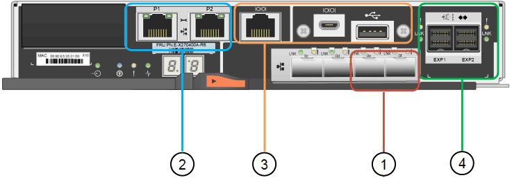

= Appliances SG5700 : présentation
:allow-uri-read: 
:icons: font
:imagesdir: ../media/

[role="lead"]
L'appliance SG5700 StorageGRID est une plateforme de calcul et de stockage intégrée qui fonctionne comme un nœud de stockage dans un grid StorageGRID. L'appliance peut être utilisée dans un environnement de grid hybride qui combine des nœuds de stockage d'appliance et des nœuds de stockage virtuels (basés sur logiciel).

L'appliance StorageGRID SG5700 Series présente plusieurs caractéristiques :

* Intégrez les éléments de stockage et de calcul d'un nœud de stockage StorageGRID.
* Incluez le programme d'installation de l'appliance StorageGRID pour simplifier le déploiement et la configuration des nœuds de stockage.
* Inclut E-Series SANtricity System Manager pour la gestion et le contrôle du matériel.
* Prenez en charge jusqu'à quatre connexions 10 GbE ou 25 GbE avec le réseau Grid et le réseau client StorageGRID.
* Prise en charge des disques Full Disk Encryption (FDE) ou FIPS Lorsque ces disques sont utilisés avec la fonction de sécurité des disques dans SANtricity System Manager, l'accès non autorisé aux données n'est pas autorisé.

L'appliance SG5700 est disponible en quatre modèles : SG5712 et 101X, SG5760 et 101X. Il n'y a pas de spécifications ni de différences fonctionnelles entre le SG5712 et le 101X, à l'exception de l'emplacement des ports d'interconnexion sur le contrôleur de stockage. De même, il n'existe aucune différence de spécifications ou de fonctionnement entre les modèles SG5760 et SG5760X, sauf pour l'emplacement des ports d'interconnexion sur le contrôleur de stockage.

== Composants de SG5700

Les modèles SG5700 comprennent les composants suivants :

[role="tabbed-block"]
====
.SG5712
--
Contrôleur de calcul:: Contrôleur E5700SG
Contrôleur de stockage:: Contrôleur E2800A
Châssis:: Boîtier E-Series DE212C, boîtier de deux unités de rack (2U)
Disques:: 12 disques NL-SAS (3.5 pouces)
Alimentations et ventilateurs redondants:: Deux blocs d'alimentation

--
.LE X112X
--
Contrôleur de calcul:: Contrôleur E5700SG
Contrôleur de stockage:: Contrôleur E2800B
Châssis:: Boîtier E-Series DE212C, boîtier de deux unités de rack (2U)
Disques:: 12 disques NL-SAS (3.5 pouces)
Alimentations et ventilateurs redondants:: Deux blocs d'alimentation

--
.SG5760
--
Contrôleur de calcul:: Contrôleur E5700SG
Contrôleur de stockage:: Contrôleur E2800A
Châssis:: Boîtier E-Series DE460C, boîtier 4U
Disques:: 60 disques NL-SAS (3.5 pouces)
Alimentations et ventilateurs redondants:: Deux blocs d'alimentation et deux blocs d'alimentation

--
.LE MODÈLE DE LA SÉRIE XCOP60
--
Contrôleur de calcul:: Contrôleur E5700SG
Contrôleur de stockage:: Contrôleur E2800B
Châssis:: Boîtier E-Series DE460C, boîtier 4U
Disques:: 60 disques NL-SAS (3.5 pouces)
Alimentations et ventilateurs redondants:: Deux blocs d'alimentation et deux blocs d'alimentation

--
====
La capacité de stockage brute maximale disponible dans l'appliance StorageGRID est fixe, en fonction du nombre de disques de chaque armoire. Vous ne pouvez pas étendre le stockage disponible en ajoutant un tiroir comportant des disques supplémentaires.

== Diagrammes SG5700

=== SG5712 vues avant et arrière

Les figures illustrent l'avant et l'arrière du SG5712, un boîtier 2U pouvant contenir 12 disques.

image::../media/sg5712_front_and_back_views.gif[À l'avant et à l'arrière de l'appareil SG5712]

=== Composants SG5712

Le SG5712 comprend deux contrôleurs et deux blocs d'alimentation.

image::../media/sg5712_with_callouts.gif[Contrôleurs et blocs d'alimentation de l'appliance SG5712]

[cols="1a,3a"]
|===
| Légende | Description 

 a| 
1
 a| 
Contrôleur E2800A (contrôleur de stockage)

 a| 
2
 a| 
Contrôleur E5700SG (contrôleur de calcul)

 a| 
3
 a| 
Blocs d'alimentation

|===

=== SG5712X, vues avant et arrière

Les figures illustrent l'avant et l'arrière du SG5712X, un boîtier 2U pouvant contenir 12 disques.

image::../media/sg5712x_front_and_back_views.gif[À l'avant et à l'arrière de l'appareil X112X]

=== Composants SG5712X

Le modèle X112X est équipé de deux contrôleurs et de deux boîtiers de ventilateur d'alimentation.

image::../media/sg5712x_with_callouts.gif[Contrôleurs et blocs d'alimentation de l'appareil bicomposant le X112X]

[cols="1a,3a"]
|===
| Légende | Description 

 a| 
1
 a| 
Contrôleur E2800B (contrôleur de stockage)

 a| 
2
 a| 
Contrôleur E5700SG (contrôleur de calcul)

 a| 
3
 a| 
Blocs d'alimentation

|===

=== SG5760 : vues avant et arrière

La figure présente l'avant et l'arrière du modèle SG5760, un boîtier 4U contenant 60 disques dans 5 tiroirs.

image::../media/sg5760_front_and_back_views.gif[Avant et arrière de l'appliance SG5760]

=== Composants SG5760

Le SG5760 inclut deux contrôleurs, deux blocs de ventilation et deux blocs d'alimentation.

image::../media/sg5760_with_callouts.gif[Contrôleurs,fan canisters,and power canisters in SG5760 appliance]

[cols="1a,2a"]
|===
| Légende | Description 

 a| 
1
 a| 
Contrôleur E2800A (contrôleur de stockage)

 a| 
2
 a| 
Contrôleur E5700SG (contrôleur de calcul)

 a| 
3
 a| 
Cartouche de ventilateur (1 sur 2)

 a| 
4
 a| 
Boîtier de puissance (1 sur 2)

|===

=== SG5760X, vues avant et arrière

Les figures illustrent l'avant et l'arrière du modèle SG5760X, un boîtier 4U contenant 60 disques dans 5 tiroirs.

image::../media/sg5760x_front_and_back_views.gif[À l'avant et à l'arrière de l'appareil XCOP60X]

=== Composants SG5760X

Le SG5760X comprend deux contrôleurs, deux boîtiers pour ventilateurs et deux blocs d'alimentation.

image::../media/sg5760x_with_callouts.gif[Contrôleurs,fan canisters,and power canisters in SG5760X appliance]

[cols="1a,3a"]
|===
| Légende | Description 

 a| 
1
 a| 
Contrôleur E2800B (contrôleur de stockage)

 a| 
2
 a| 
Contrôleur E5700SG (contrôleur de calcul)

 a| 
3
 a| 
Cartouche de ventilateur (1 sur 2)

 a| 
4
 a| 
Boîtier de puissance (1 sur 2)

|===

== Contrôleurs SG5700

Les modèles SG5712 et SAP12X de 12 disques ainsi que SG5760 et S10X de 60 disques de l'appliance StorageGRID incluent un contrôleur de calcul E5700SG et un contrôleur de stockage E-Series E2800.

* Le SG5712 et SG5760 utilisent un contrôleur E2800A.
* Le modèle U112X et le modèle UB60X utilisent un contrôleur E2800B.

Les contrôleurs E2800A et E2800B sont identiques en termes de spécifications et de fonctions, sauf pour l'emplacement des ports d'interconnexion.

=== Contrôleur de calcul E5700SG

* Fonctionne comme serveur de calcul pour l'appliance.
* Inclut le programme d'installation de l'appliance StorageGRID.
+

NOTE: Le logiciel StorageGRID n'est pas préinstallé sur l'appliance. Lors du déploiement de l'appliance, il est possible d'accéder à ce logiciel à partir du nœud d'administration.

* Peut se connecter aux trois réseaux StorageGRID, y compris le réseau Grid, le réseau d'administration et le réseau client.
* Connexion au contrôleur E2800 et fonctionne comme initiateur.

==== Connecteurs E5700SG

image::../media/e5700sg_controller_with_callouts.gif[Connecteurs du contrôleur E5700SG]

[cols="1a,2a,2a,2a"]
|===
| Légende | Port | Type | Utiliser 

 a| 
1
 a| 
Ports d'interconnexion 1 et 2
 a| 
Fibre Channel (FC) de 16 Gbit/s, SFP optique
 a| 
Connectez le contrôleur E5700SG au contrôleur E2800.

 a| 
2
 a| 
Ports de diagnostic et de support
 a| 
* Port série RJ-45
* Port série micro USB
* Port USB

 a| 
Réservé au support technique.

 a| 
3
 a| 
Ports d'extension de disque
 a| 
12 Gb/s SAS
 a| 
Non utilisé.

 a| 
4
 a| 
Ports réseau 1-4
 a| 
10 GbE ou 25 GbE, selon le type d'émetteur-récepteur SFP, la vitesse du commutateur et la vitesse de liaison configurée
 a| 
Connectez-vous au réseau Grid et au réseau client pour StorageGRID.

 a| 
5
 a| 
Port de gestion 1
 a| 
Ethernet 1 Gbit (RJ-45)
 a| 
Connectez-vous au réseau d'administration pour StorageGRID.

 a| 
6
 a| 
Port de gestion 2
 a| 
Ethernet 1 Gbit (RJ-45)
 a| 
Options :

* Lien avec le port de gestion 1 pour une connexion redondante au réseau d'administration pour StorageGRID.
* Laissez sans fil et disponible pour l'accès local temporaire (IP 169.254.0.1).
* Lors de l'installation, utilisez le port 2 pour la configuration IP si les adresses IP attribuées par DHCP ne sont pas disponibles.

|===

=== Contrôleur de stockage E2800

Deux versions du contrôleur de stockage E2800 sont utilisées dans les appliances SG5700 : E2800A et E2800B. Le E2800A n'a pas de HIC et le E2800B est équipé d'une HIC à quatre ports. Les deux versions de contrôleur ont des spécifications et des fonctions identiques, à l'exception de l'emplacement des ports d'interconnexion.

Le contrôleur de stockage E2800 Series présente les caractéristiques suivantes :

* Fonctionne comme contrôleur de stockage pour l'appliance.
* Gère le stockage des données sur les disques.
* Fonctionne en tant que contrôleur E-Series standard en mode simplex.
* Inclut le logiciel SANtricity OS (firmware du contrôleur).
* Inclut SANtricity System Manager pour le matériel de l'appliance de surveillance, la gestion des alertes, la fonction AutoSupport et la sécurité des lecteurs.
* Se connecte au contrôleur E5700SG et fonctionne comme cible.

==== Connecteurs E2800A

image::../media/e2800_controller_with_callouts.gif[Connecteurs sur contrôleur E2800A]

==== Connecteurs E2800B

[cols="1a,2a,2a,2a"]
|===
| Légende | Port | Type | Utiliser 

 a| 
1
 a| 
Ports d'interconnexion 1 et 2
 a| 
SFP optique FC 16 Gbit/s
 a| 
Connectez le contrôleur E2800 au contrôleur E5700SG.

 a| 
2
 a| 
Ports de gestion 1 et 2
 a| 
Ethernet 1 Gbit (RJ-45)
 a| 
* Options du port 1 :
+
** Connectez-vous à un réseau de gestion pour activer l'accès TCP/IP direct à SANtricity System Manager
** Laissez le câble non câblé pour enregistrer un port de commutateur et une adresse IP.  Accédez au Gestionnaire système SANtricity à l'aide du Gestionnaire de grille ou du programme d'installation de l'appliance Storage Grid.

*Remarque* : certaines fonctionnalités SANtricity en option, telles que la synchronisation NTP pour des horodatages précis du journal, ne sont pas disponibles lorsque vous choisissez de laisser le port 1 sans fil.

*Remarque* : StorageGRID 11.5 ou supérieur et SANtricity 11.70 ou supérieur sont nécessaires lorsque vous quittez le port 1 sans fil.

* Le port 2 est réservé au support technique.

 a| 
3
 a| 
Ports de diagnostic et de support
 a| 
* Port série RJ-45
* Port série micro USB
* Port USB

 a| 
Réservé au support technique.

 a| 
4
 a| 
Ports d'extension de disque.
 a| 
12 Gb/s SAS
 a| 
Non utilisé.

|===
.Informations associées
http://mysupport.netapp.com/info/web/ECMP1658252.html["Site de documentation sur les systèmes NetApp E-Series"^]
