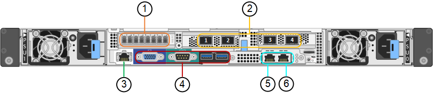

= Appliances SG6060 et SG6060X : présentation
:allow-uri-read: 
:icons: font
:imagesdir: ../media/

[role="lead"]
Les appliances StorageGRID SG6060 et SG6060X incluent un contrôleur de calcul et un tiroir de contrôleur de stockage contenant deux contrôleurs de stockage et 60 disques.

Des tiroirs d'extension de 60 disques peuvent également être ajoutés aux deux appliances. Il n'existe aucune différence de spécification ou de fonctionnalité entre les SG6060 et SG6060X, à l'exception de l'emplacement des ports d'interconnexion sur le contrôleur de stockage.

== SG6060 et SG6060X

Les appliances SG6060 et SG6060X comprennent les composants suivants :

Contrôleur de calcul:: Le contrôleur SG6000-CN est un serveur à une unité de rack (1U) qui comprend :
+
--
* 40 cœurs (80 threads)
* 192 GO DE RAM
* Jusqu'à 4 × 25 Gbit/s de bande passante Ethernet agrégée
* 4 interconnexion Fibre Channel (FC) 16 Gbit/s
* Le contrôleur de gestion de la carte mère (BMC) simplifie la gestion du matériel
* Blocs d'alimentation redondants

--
Tiroir contrôleur de stockage:: Le tiroir contrôleur E-Series E2860 (baie de stockage) est un tiroir 4U qui comprend :
+
--
* Deux contrôleurs E2800 Series (configuration duplex) pour une prise en charge du basculement du contrôleur de stockage
+
** Tandis que le SG6060 contient des contrôleurs de stockage E2800A
** Le SG6060X contient des contrôleurs de stockage E2800B

* Tiroir à cinq tiroirs pour accueillir soixante disques de 3.5 pouces (2 disques SSD ou SSD et 58 disques NL-SAS)
* Alimentations et ventilateurs redondants

--
Facultatif : tiroirs d'extension de stockage:: Chaque appliance SG6060 et SG6060X peut disposer d'une ou deux tiroirs d'extension pour un total de 180 disques (deux de ces disques sont réservés pour le cache de lecture E-Series).
+
--
*Remarque :* les tiroirs d'extension peuvent être installés lors du déploiement initial ou ajoutés ultérieurement.

Le boîtier E-Series DE460C est un tiroir 4U qui comprend :

* Deux modules d'entrée/sortie (IOM)
* Cinq tiroirs, chacun contenant 12 disques NL-SAS, pour un total de 60 disques
* Alimentations et ventilateurs redondants

--

== Diagrammes SG6060 et SG6060X

Les faces avant des SG6060 et SG6060X sont identiques.

=== Vue avant SG6060 ou SG6060X

Cette figure présente l'avant du SG6060 ou du SG6060X, qui inclut un contrôleur de calcul 1U et un tiroir 4U contenant deux contrôleurs de stockage et 60 disques dans cinq tiroirs disques.

image::../media/sg6060_front_view_with_and_without_bezels.gif[SG6060 vue de face]

[cols="1a,2a"]
|===
| Légende | Description 

 a| 
1
 a| 
Contrôleur de calcul SG6000-CN avec cadre avant

 a| 
2
 a| 
Tiroir contrôleur E2860 avec panneau avant (le tiroir d'extension en option apparaît identique)

 a| 
3
 a| 
Contrôleur de calcul SG6000-CN avec cadre avant retiré

 a| 
4
 a| 
Tiroir contrôleur E2860 avec panneau avant retiré (le tiroir d'extension en option apparaît identique)

|===
Cette figure montre l'emplacement de l'alimentation et identifie les LED à l'arrière du contrôleur de calcul SG6000-CN utilisé dans les SG6060 et SG6060X. Des LED d'état et d'activité supplémentaires se trouvent sur les ports de l'appliance. Ces voyants peuvent varier en fonction du modèle de l'appareil.

image::../media/q2023_rear_leds.png[LED arrière SG6000-CN]

[cols="1a,2a,3a"]
|===
| Légende | LED | État 

 a| 
1
 a| 
Voyant d'alimentation
 a| 
* Vert, fixe : l'appareil est sous tension, le bouton d'alimentation est sous tension.
* Vert, clignotant : l'appareil est sous tension, le bouton d'alimentation est hors tension.
* Éteint : l'appareil n'est pas alimenté.
* Orange : panne de l'alimentation.

 a| 
2
 a| 
Identifier la LED
 a| 
* Bleu clignotant : identifie l'appliance dans l'armoire ou le rack.
* Bleu, fixe : identifie l'appliance dans l'armoire ou le rack.
* Éteint : l'appareil n'est pas visuellement identifiable dans l'armoire ou le rack.

|===

=== Vue arrière SG6060

Cette figure illustre la arrière du SG6060, y compris des contrôleurs de calcul et de stockage, des ventilateurs et des blocs d'alimentation.

image::../media/sg6060_rear_view.gif[SG6060 : vue arrière]

[cols="1a,2a"]
|===
| Légende | Description 

 a| 
1
 a| 
Alimentation (1 sur 2) pour contrôleur de calcul SG6000-CN

 a| 
2
 a| 
Connecteurs pour contrôleur de calcul SG6000-CN

 a| 
3
 a| 
Ventilateur (1 sur 2) pour le tiroir contrôleur E2860

 a| 
4
 a| 
Contrôleur de stockage E-Series E2800A (1 sur 2) et connecteurs

 a| 
5
 a| 
Alimentation (1 sur 2) pour le tiroir contrôleur E2860

|===

=== Vue arrière du SG6060X

Cette figure illustre l'arrière du SG6060X.

image::../media/sg6060x_rear_view.gif[SG6060x vue arrière]

[cols="1a,2a"]
|===
| Légende | Description 

 a| 
1
 a| 
Alimentation (1 sur 2) pour contrôleur de calcul SG6000-CN

 a| 
2
 a| 
Connecteurs pour contrôleur de calcul SG6000-CN

 a| 
3
 a| 
Ventilateur (1 sur 2) pour le tiroir contrôleur E2860

 a| 
4
 a| 
Contrôleur de stockage E-Series E2800B (1 sur 2) et connecteurs

 a| 
5
 a| 
Alimentation (1 sur 2) pour le tiroir contrôleur E2860

|===

=== Tiroir d'extension

Cette figure illustre l'arrière du tiroir d'extension en option pour les SG6060 et SG6060X, notamment des modules d'entrée/sortie (IOM), des ventilateurs et des blocs d'alimentation. Chaque SG6060 peut être installé avec un ou deux tiroirs d'extension, qui peuvent être inclus dans l'installation initiale ou ajoutés ultérieurement.

image::../media/de460c_expansion_shelf_rear_view.gif[Tablette d'extension arrière]

[cols="1a,2a"]
|===
| Légende | Description 

 a| 
1
 a| 
Ventilateur (1 sur 2) pour le tiroir d'extension

 a| 
2
 a| 
Module d'E/S (1 sur 2) pour le tiroir d'extension

 a| 
3
 a| 
Bloc d'alimentation (1 sur 2) pour le tiroir d'extension

|===

== Contrôleurs SG6000

Chaque modèle de l'appliance StorageGRID SG6000 est doté d'un contrôleur de calcul SG6000-CN dans un boîtier 1U et de contrôleurs de stockage E-Series duplex dans un boîtier 2U ou 4U, selon le modèle. Consultez les schémas pour en savoir plus sur chaque type de contrôleur.

=== Contrôleur de calcul SG6000-CN

* Fournit des ressources de calcul pour l'appliance.
* Inclut le programme d'installation de l'appliance StorageGRID.
+

NOTE: Le logiciel StorageGRID n'est pas préinstallé sur l'appliance. Ce logiciel est extrait du noeud d'administration lorsque vous déployez l'appliance.

* Peut se connecter aux trois réseaux StorageGRID, y compris le réseau Grid, le réseau d'administration et le réseau client.
* Connexion aux contrôleurs de stockage E-Series et fonctionnement comme initiateur.

==== Connecteurs SG6000-CN

[cols="1a,2a,2a,3a"]
|===
| Légende | Port | Type | Utiliser 

 a| 
1
 a| 
Ports d'interconnexion 1-4
 a| 
Fibre Channel (FC) 16 Gbit/s avec optique intégrée
 a| 
Connectez le contrôleur SG6000-CN aux contrôleurs E2800 (deux connexions pour chaque système E2800).

 a| 
2
 a| 
Ports réseau 1-4
 a| 
10 GbE ou 25 GbE, selon le type d'émetteur-récepteur SFP ou câble, la vitesse du commutateur et la vitesse de liaison configurée
 a| 
Connectez-vous au réseau Grid et au réseau client pour StorageGRID.

 a| 
3
 a| 
Port de gestion BMC
 a| 
1 GbE (RJ-45)
 a| 
Connectez-vous au contrôleur de gestion de la carte de base SG6000-CN.

 a| 
4
 a| 
Ports de diagnostic et de support
 a| 
* VGA
* Série, 115200 8-N-1
* USB

 a| 
Réservé au support technique.

 a| 
5
 a| 
Port réseau d'administration 1
 a| 
1 GbE (RJ-45)
 a| 
Connectez le SG6000-CN au réseau Admin pour StorageGRID.

 a| 
6
 a| 
Port réseau d'administration 2
 a| 
1 GbE (RJ-45)
 a| 
Options :

* Lien avec le port de gestion 1 pour une connexion redondante au réseau d'administration pour StorageGRID.
* Laissez sans fil et disponible pour l'accès local temporaire (IP 169.254.0.1).
* Lors de l'installation, utilisez le port 2 pour la configuration IP si les adresses IP attribuées par DHCP ne sont pas disponibles.

|===

=== SGF6024 : contrôleurs de stockage EF570

* Deux contrôleurs pour la prise en charge du basculement.
* Gérer le stockage des données sur les disques.
* Fonctionnement en tant que contrôleurs E-Series standard dans une configuration duplex.
* Incluez le logiciel SANtricity OS (firmware du contrôleur).
* Il comprend SANtricity System Manager pour la surveillance du matériel de stockage et la gestion des alertes, la fonction AutoSupport et la sécurité des disques.
* Connectez-vous au contrôleur SG6000-CN et accédez au stockage Flash.

==== Connecteurs EF570

image::../media/ef570_rear_connectors.gif[Connecteurs arrière de la baie EF570]

[cols="1a,2a,2a,3a"]
|===
| Légende | Port | Type | Utiliser 

 a| 
1
 a| 
Ports d'interconnexion 1 et 2
 a| 
SFP optique FC 16 Gbit/s
 a| 
Connectez chacun des contrôleurs EF570 au contrôleur SG6000-CN.

Le contrôleur SG6000-CN est doté de quatre connexions (deux de chaque EF570).

 a| 
2
 a| 
Ports de diagnostic et de support
 a| 
* Port série RJ-45
* Port série micro USB
* Port USB

 a| 
Réservé au support technique.

 a| 
3
 a| 
Ports d'extension de disque
 a| 
12 Gb/s SAS
 a| 
Non utilisé. L'appliance SGF6024 ne prend pas en charge les tiroirs disques d'extension.

 a| 
4
 a| 
Ports de gestion 1 et 2
 a| 
Ethernet 1 Gbit (RJ-45)
 a| 
* Le port 1 se connecte au réseau dans lequel vous accédez à SANtricity System Manager sur un navigateur.
* Le port 2 est réservé au support technique.

|===

=== SG6060 et SG6060X : contrôleurs de stockage E2800

* Deux contrôleurs pour la prise en charge du basculement.
* Gérer le stockage des données sur les disques.
* Fonctionnement en tant que contrôleurs E-Series standard dans une configuration duplex.
* Incluez le logiciel SANtricity OS (firmware du contrôleur).
* Il comprend SANtricity System Manager pour la surveillance du matériel de stockage et la gestion des alertes, la fonction AutoSupport et la sécurité des disques.
* Connectez-vous au contrôleur SG6000-CN et accédez au stockage.

Les SG6060 et SG6060X utilisent les contrôleurs de stockage E2800.

[cols="1a,2a,2a"]
|===
| Appliance | Contrôleur | Contrôleur HIC 

 a| 
SG6060
 a| 
Deux contrôleurs de stockage E2800A
 a| 
Aucune

 a| 
SG6060X
 a| 
Deux contrôleurs de stockage E2800B
 a| 
Quatre ports HIC

|===
Les contrôleurs de stockage E2800A et E2800B sont identiques en spécifications et en fonction, à l'exception de l'emplacement des ports d'interconnexion.

CAUTION: N'utilisez pas de système E2800A et E2800B dans le même appareil.

==== Connecteurs E2800A

image::../media/e2800_controller_with_callouts.gif[Connecteurs sur contrôleur E2800A]

[cols="1a,2a,2a,3a"]
|===
| Légende | Port | Type | Utiliser 

 a| 
1
 a| 
Ports d'interconnexion 1 et 2
 a| 
SFP optique FC 16 Gbit/s
 a| 
Connectez chacun des contrôleurs E2800A au contrôleur SG6000-CN.

Le contrôleur SG6000-CN comporte quatre connexions (deux pour chaque E2800A).

 a| 
2
 a| 
Ports de gestion 1 et 2
 a| 
Ethernet 1 Gbit (RJ-45)
 a| 
* Options du port 1 :
+
** Connectez-vous à un réseau de gestion pour activer l'accès TCP/IP direct à SANtricity System Manager
** Laissez le câble non câblé pour enregistrer un port de commutateur et une adresse IP.  Accédez au Gestionnaire système SANtricity à l'aide du Gestionnaire de grille ou du programme d'installation de l'appliance Storage Grid.

*Remarque* : certaines fonctionnalités SANtricity en option, telles que la synchronisation NTP pour des horodatages précis du journal, ne sont pas disponibles lorsque vous choisissez de laisser le port 1 sans fil.

*Remarque* : StorageGRID 11.5 ou supérieur et SANtricity 11.70 ou supérieur sont nécessaires lorsque vous quittez le port 1 sans fil.

* Le port 2 est réservé au support technique.

 a| 
3
 a| 
Ports de diagnostic et de support
 a| 
* Port série RJ-45
* Port série micro USB
* Port USB

 a| 
Réservé au support technique.

 a| 
4
 a| 
Ports d'extension de lecteur 1 et 2
 a| 
12 Gb/s SAS
 a| 
Connectez les ports aux ports d'extension de disque sur les IOM du tiroir d'extension.

|===

==== Connecteurs E2800B

image::../media/e2800B_controller_with_callouts.gif[Connecteurs sur contrôleur E2800B]

[cols="1a,2a,2a,3a"]
|===
| Légende | Port | Type | Utiliser 

 a| 
1
 a| 
Ports d'interconnexion 1 et 2
 a| 
SFP optique FC 16 Gbit/s
 a| 
Connectez chacun des contrôleurs E2800B au contrôleur SG6000-CN.

Le contrôleur SG6000-CN comporte quatre connexions (deux pour chaque E2800B).

 a| 
2
 a| 
Ports de gestion 1 et 2
 a| 
Ethernet 1 Gbit (RJ-45)
 a| 
* Options du port 1 :
+
** Connectez-vous à un réseau de gestion pour activer l'accès TCP/IP direct à SANtricity System Manager
** Laissez le câble non câblé pour enregistrer un port de commutateur et une adresse IP. Accédez au Gestionnaire système SANtricity à l'aide du Gestionnaire de grille ou du programme d'installation de l'appliance Storage Grid.

*Remarque* : certaines fonctionnalités SANtricity en option, telles que la synchronisation NTP pour des horodatages précis du journal, ne sont pas disponibles lorsque vous choisissez de laisser le port 1 sans fil.

*Remarque* : StorageGRID 11.5 ou supérieur et SANtricity 11.70 ou supérieur sont nécessaires lorsque vous quittez le port 1 sans fil.

* Le port 2 est réservé au support technique.

 a| 
3
 a| 
Ports de diagnostic et de support
 a| 
* Port série RJ-45
* Port série micro USB
* Port USB

 a| 
Réservé au support technique.

 a| 
4
 a| 
Ports d'extension de lecteur 1 et 2
 a| 
12 Gb/s SAS
 a| 
Connectez les ports aux ports d'extension de disque sur les IOM du tiroir d'extension.

|===

=== SG6060 et SG6060X : modules d'E/S pour tiroirs d'extension en option

Le tiroir d'extension contient deux modules d'entrée/sortie qui se connectent aux contrôleurs de stockage ou à d'autres tiroirs d'extension.

==== Connecteurs IOM

image::../media/iom_connectors.gif[Arrière du module d'E/S.]

[cols="1a,2a,2a,3a"]
|===
| Légende | Port | Type | Utiliser 

 a| 
1
 a| 
Ports d'extension de lecteur 1-4
 a| 
12 Gb/s SAS
 a| 
Connectez chaque port aux contrôleurs de stockage ou au tiroir d'extension supplémentaire (le cas échéant).

|===