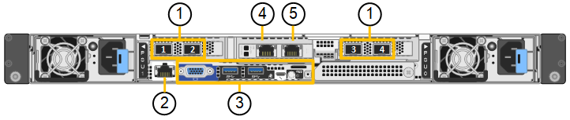
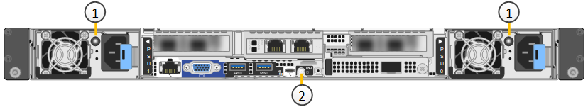
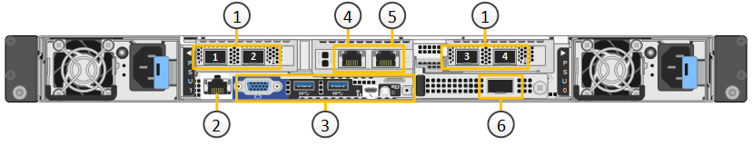

= Appliances SG6100 : présentation
:allow-uri-read: 
:icons: font
:imagesdir: ../media/

[role="lead"]
Les appliances StorageGRID SG6100 fonctionnent comme des nœuds de stockage dans un système StorageGRID.  Comme toutes les appliances StorageGRID, elles peuvent être librement mixtes avec d'autres modèles d'appliance et des nœuds exclusivement logiciels dans un déploiement unique.

L'appliance StorageGRID SG6160 comprend un contrôleur de calcul avec une paire de SSD NVMe fonctionnant comme un cache de lecture, ainsi qu'un tiroir de contrôleur de stockage contenant deux contrôleurs de stockage et 60 disques durs NL-SAS. Il peut être étendu jusqu'à 180 disques durs NL-SAS grâce à l'ajout de deux tiroirs d'extension en option. L'appliance StorageGRID SGF6112 est une appliance 100 % Flash dotée d'un format 1U compact et de 12 SSD NVMe.

Les appliances SGF6112 et SG6160 offrent les fonctionnalités suivantes :

* Intègre les éléments de calcul et de stockage d'un nœud de stockage StorageGRID.
* Inclut le programme d'installation de l'appliance StorageGRID pour simplifier le déploiement et la configuration des nœuds de stockage.
* Inclut un contrôleur BMC (Baseboard Management Controller) pour la surveillance et le diagnostic du matériel dans le contrôleur de calcul.

Le SGF6112 offre les fonctionnalités de protection des données suivantes :

* Fonctionnement après panne d'un disque SSD unique, sans impact sur la disponibilité des objets.
* Possibilité de fonctionner après plusieurs pannes SSD avec une réduction minimale de la disponibilité des objets (basée sur la conception du schéma RAID sous-jacent).
+

NOTE: Selon la règle ILM configurée, les demandes d'objets indisponibles localement peuvent être traitées par d'autres nœuds. La disponibilité n'est donc généralement pas réduite.

* Restauration complète, pendant la mise en service, suite à des pannes de disque SSD qui ne provoquent pas d'endommagement extrême du RAID hébergeant le volume racine du nœud (le système d'exploitation StorageGRID).
* Si plusieurs pannes de disques SSD entraînent une perte locale de données, les données d'objet peuvent être restaurées automatiquement à partir de copies ou de blocs de code d'effacement sur d'autres nœuds.

Le SG6160 offre les fonctionnalités de protection des données suivantes :

* Fonctionnement après panne de deux disques durs sans impact sur la disponibilité des objets.
* Évacuation et reconstruction rapides des disques durs en cas de panne ou de remplacement (lorsqu'ils sont configurés pour les pools de disques dynamiques ou DDP16 lors de l'installation), ce qui améliore la durabilité des données par rapport à RAID 6 standard.
* Récupération complète, pendant la maintenance, suite à la défaillance de deux disques durs.
* Si plusieurs pannes de disques durs entraînent une perte locale de données, les données d'objet peuvent être restaurées automatiquement à partir de copies ou de blocs de code d'effacement sur d'autres nœuds.

== Composants matériels du SG6100

=== Appliance SGF6112

L'appliance SGF6112 inclut les composants suivants :

Des plateformes de calcul et de stockage:: Un serveur à une unité de rack (1U) qui comprend :
+
--
* Deux processeurs 2.1/2.6 GHz 165 W fournissant 48 cœurs (96 threads)
* 256 GO DE RAM
* 2 ports GBase-T 1/10
* 4 ports Ethernet 10/25 GbE pour le trafic réseau Grid/client
* 1 lecteur de démarrage interne de 256 Go (logiciel StorageGRID inclus)
* Le contrôleur de gestion de la carte mère (BMC) simplifie la gestion du matériel
* Alimentations et ventilateurs redondants

--

=== Appliance SG6160

L'appliance SG6160 comprend les composants suivants :

Contrôleur de calcul:: Le contrôleur SG6100-CN est un serveur à une unité de rack (1U) qui comprend :
+
--
* 48 cœurs (96 threads)
* 256 GO DE RAM
* Jusqu'à 4 × 25 GbE de bande passante Ethernet agrégée (ou jusqu'à 4 x 100 GbE avec référence de carte réseau 100G en option)
* 1 interconnexion 100 GbE
* Deux SSD NVMe pour le cache de lecture
* Le contrôleur de gestion de la carte mère (BMC) simplifie la gestion du matériel
* Alimentations et ventilateurs redondants

--
Tiroir contrôleur de stockage:: Le tiroir contrôleur E-Series E4000 (baie de stockage) est un tiroir 4U qui inclut :
+
--
* Deux contrôleurs de la gamme E4000 (configuration duplex) pour fournir une prise en charge du basculement du contrôleur de stockage
* Tiroir de cinq tiroirs contenant soixante disques NL-SAS de 3.5 pouces
* Alimentations et ventilateurs redondants

--
Facultatif : tiroirs d'extension de stockage:: Chaque appliance SG6160 peut avoir un ou deux tiroirs d'extension pour un total de 180 disques.
+
--

NOTE: Vous pouvez installer des tiroirs d'extension lors du déploiement initial ou les ajouter ultérieurement.

Le boîtier E-Series DE460C est un tiroir 4U qui comprend :

* Deux modules d'entrée/sortie (IOM)
* Cinq tiroirs, chacun contenant 12 disques NL-SAS, pour un total de 60 disques
* Alimentations et ventilateurs redondants

--

== Schémas SGF6112 et SG6160

=== Vue avant du SGF6112

Cette figure illustre l'avant du SGF6112 sans le cadre. L'appliance inclut une plateforme de calcul et de stockage 1U qui contient 12 disques SSD.

image::../media/sgf6112_front_with_ssds.png[Vue avant du SGF6112]

=== Vue arrière du SGF6112

Cette figure illustre l'arrière du SGF6112, y compris les ports, les ventilateurs et les blocs d'alimentation.

[cols="1a,2a,2a,2a"]
|===
| Légende | Port | Type | Utiliser 

 a| 
1
 a| 
Ports réseau 1-4
 a| 
10/25-GbE, basé sur le type de câble ou d'émetteur-récepteur SFP (les modules SFP28 et SFP+ sont pris en charge), la vitesse du switch et la vitesse de liaison configurée.
 a| 
Connectez-vous au réseau Grid et au réseau client pour StorageGRID.

 a| 
2
 a| 
Port de gestion BMC
 a| 
1 GbE (RJ-45)
 a| 
Se connecte au contrôleur de gestion de la carte de base de l'appliance.

 a| 
3
 a| 
Ports de diagnostic et de support
 a| 
* VGA
* USB
* Port console micro-USB
* Module d'emplacement micro-SD

 a| 
Réservé au support technique.

 a| 
4
 a| 
Port réseau d'administration 1
 a| 
1/10-GbE (RJ-45)
 a| 
Connectez l'appliance au réseau d'administration pour StorageGRID.

 a| 
5
 a| 
Port réseau d'administration 2
 a| 
1/10-GbE (RJ-45)
 a| 
Options :

* Liaison avec le port 1 du réseau d'administration pour une connexion redondante au réseau d'administration pour StorageGRID.
* Laisser déconnecté et disponible pour l'accès local temporaire (IP 169.254.0.1).
* Lors de l'installation, utilisez le port 2 pour la configuration IP si les adresses IP attribuées par DHCP ne sont pas disponibles.

|===
Cette figure indique l'emplacement du bloc d'alimentation et les voyants d'identification à l'arrière du SGF6112. Des LED d'état et d'activité supplémentaires se trouvent sur les ports de l'appliance. Ces voyants peuvent varier en fonction du modèle de l'appareil.

[cols="1a,2a,3a"]
|===
| Légende | LED | État 

 a| 
1
 a| 
Voyant d'alimentation
 a| 
* Vert, fixe : l'appareil est sous tension, le bouton d'alimentation est sous tension.
* Vert, clignotant : l'appareil est sous tension, le bouton d'alimentation est hors tension.
* Éteint : l'appareil n'est pas alimenté.
* Orange : panne de l'alimentation.

 a| 
2
 a| 
Identifier la LED
 a| 
* Bleu clignotant : identifie l'appliance dans l'armoire ou le rack.
* Bleu, fixe : identifie l'appliance dans l'armoire ou le rack.
* Éteint : l'appareil n'est pas visuellement identifiable dans l'armoire ou le rack.

|===

=== Vue avant du SG6160

Cette figure présente la façade du modèle SG6160, qui comprend un contrôleur de calcul 1U et un tiroir 4U contenant deux contrôleurs de stockage et 60 disques dans cinq tiroirs.

image::../media/sg6160_front_view_without_bezels.png[Vue avant du SG6160]

[cols="1a,2a"]
|===
| Légende | Description 

 a| 
1
 a| 
Contrôleur de calcul SG6100-CN avec panneau avant retiré

 a| 
2
 a| 
Tiroir contrôleur E4000 avec panneau avant retiré (le tiroir d'extension en option semble identique)

|===

=== Vue arrière du SG6160

Cette figure représente l'arrière du SG6160, y compris les contrôleurs de calcul et de stockage, les ventilateurs et les blocs d'alimentation.

image::../media/sg6160_rear_view.png[Vue arrière du SG6160]

[cols="1a,2a"]
|===
| Légende | Description 

 a| 
1
 a| 
Alimentation (1 sur 2) du contrôleur de calcul SG6100-CN

 a| 
2
 a| 
Connecteurs pour contrôleur de calcul SG6100-CN

 a| 
3
 a| 
Ventilateur (1 sur 2) pour tiroir contrôleur E4000

 a| 
4
 a| 
Contrôleur de stockage E-Series E400 (1 sur 2) et connecteurs

 a| 
5
 a| 
Alimentation (1 sur 2) du tiroir contrôleur E4000

|===

== Contrôleurs SG6100

=== Contrôleur de calcul SG6100-CN

* Fournit des ressources de calcul pour l'appliance.
* Inclut le programme d'installation de l'appliance StorageGRID.
+

NOTE: Le logiciel StorageGRID n'est pas préinstallé sur l'appliance. Ce logiciel est extrait du noeud d'administration lorsque vous déployez l'appliance.

* Peut se connecter aux trois réseaux StorageGRID, y compris le réseau Grid, le réseau d'administration et le réseau client.
* Connexion aux contrôleurs de stockage E-Series et fonctionnement comme initiateur.

Cette figure présente les ports à l'arrière du contrôleur de calcul SG6100-CN.

[cols="1a,2a,2a,3a"]
|===
| Légende | Port | Type | Utiliser 

 a| 
1
 a| 
Ports réseau 1-4
 a| 
* 10/25-GbE en fonction du type de câble ou d'émetteur-récepteur SFP (les modules SFP28 et SFP+ sont pris en charge), de la vitesse du switch et de la vitesse de liaison configurée.
* Avec référence de carte réseau 100G en option (SG6160 uniquement), 10/25/40/100-GbE en fonction du type de câble ou d'émetteur-récepteur, de la vitesse du commutateur et de la vitesse de liaison configurée. QSFP56 (limité à 100 GbE/port), QSFP28 (100 GbE) et QSFP+ (40 GbE) sont pris en charge en natif. Les émetteurs-récepteurs SFP+ (10 GbE) ou SFP28 (25 GbE) en option peuvent être utilisés avec un QSA (vendu séparément).

 a| 
Connectez-vous au réseau Grid et au réseau client pour StorageGRID.

 a| 
2
 a| 
Port de gestion BMC
 a| 
1 GbE (RJ-45)
 a| 
Connectez-vous au contrôleur de gestion de la carte de base SG6100-CN.

 a| 
3
 a| 
Ports de diagnostic et de support
 a| 
* VGA
* USB
* Port console micro-USB
* Module d'emplacement micro-SD

 a| 
Réservé au support technique.

 a| 
4
 a| 
Port réseau d'administration 1
 a| 
1/10-GbE (RJ-45)
 a| 
Connectez le SG6100-CN au réseau d'administration pour StorageGRID.

 a| 
5
 a| 
Port réseau d'administration 2
 a| 
1/10-GbE (RJ-45)
 a| 
Options :

* Lien avec le port de gestion 1 pour une connexion redondante au réseau d'administration pour StorageGRID.
* Laissez sans fil et disponible pour l'accès local temporaire (IP 169.254.0.1).
* Lors de l'installation, utilisez le port 2 pour la configuration IP si les adresses IP attribuées par DHCP ne sont pas disponibles.

 a| 
6
 a| 
Port d'interconnexion
 a| 
100 GbE
 a| 
Connectez le contrôleur SG6100-CN aux contrôleurs E4000.

|===
Cette figure montre l'emplacement du bloc d'alimentation et les voyants d'identification à l'arrière du contrôleur de calcul SG6100-CN. Des LED d'état et d'activité supplémentaires se trouvent sur les ports de l'appliance. Ces voyants peuvent varier en fonction du modèle de l'appareil.

image::../media/q2023_rear_leds.png[LED arrière SG6100-CN]

[cols="1a,2a,3a"]
|===
| Légende | LED | État 

 a| 
1
 a| 
Voyant d'alimentation
 a| 
* Vert, fixe : l'appareil est sous tension, le bouton d'alimentation est sous tension.
* Vert, clignotant : l'appareil est sous tension, le bouton d'alimentation est hors tension.
* Éteint : l'appareil n'est pas alimenté.
* Orange : panne de l'alimentation.

 a| 
2
 a| 
Identifier la LED
 a| 
* Bleu clignotant : identifie l'appliance dans l'armoire ou le rack.
* Bleu, fixe : identifie l'appliance dans l'armoire ou le rack.
* Éteint : l'appareil n'est pas visuellement identifiable dans l'armoire ou le rack.

|===

=== SG6160 : contrôleur de stockage E4000

* Deux contrôleurs pour la prise en charge du basculement.
* Gérer le stockage des données sur les disques.
* Fonctionnement en tant que contrôleurs E-Series standard dans une configuration duplex.
* Incluez le logiciel SANtricity OS (firmware du contrôleur).
* Il comprend SANtricity System Manager pour la surveillance du matériel de stockage et la gestion des alertes, la fonction AutoSupport et la sécurité des disques.
* Se connecter au contrôleur SG6100-CN et fournir un accès au stockage.

image::../media/e4000_controller_with_callouts.png[Connecteurs sur le contrôleur E4000]

[cols="1a,2a,2a,3a"]
|===
| Légende | Port | Type | Utiliser 

 a| 
1
 a| 
Port de gestion 1
 a| 
Ethernet 1 Gbit (RJ-45)
 a| 
* Options du port 1 :
+
** Connectez-vous à un réseau de gestion pour activer l'accès TCP/IP direct à SANtricity System Manager
** Laissez le câble non câblé pour enregistrer un port de commutateur et une adresse IP.  Accédez au Gestionnaire système SANtricity à l'aide du Gestionnaire de grille ou du programme d'installation de l'appliance Storage Grid.

*Remarque* : certaines fonctionnalités SANtricity en option, telles que la synchronisation NTP pour des horodatages précis du journal, ne sont pas disponibles lorsque vous choisissez de laisser le port 1 non câblé.

 a| 
2
 a| 
Ports de diagnostic et de support
 a| 
* Port série RJ-45
* Port série micro USB
* Port USB

 a| 
Réservé au support technique.

 a| 
3
 a| 
Ports d'extension de lecteur 1 et 2
 a| 
12 Gb/s SAS
 a| 
Connectez les ports aux ports d'extension de disque sur les IOM du tiroir d'extension.

 a| 
4
 a| 
Ports d'interconnexion 1 et 2
 a| 
25 GbE iSCSI
 a| 
Connectez chacun des contrôleurs E4000 au contrôleur SG6100-CN.

Il existe quatre connexions au contrôleur SG6100-CN (deux de chaque E4000).

|===

=== SG6160 : modules d'E/S pour tiroirs d'extension en option

Le tiroir d'extension contient deux modules d'entrée/sortie qui se connectent aux contrôleurs de stockage ou à d'autres tiroirs d'extension.

==== Connecteurs IOM

image::../media/iom_connectors.gif[Arrière du module d'E/S.]

[cols="1a,2a,2a,3a"]
|===
| Légende | Port | Type | Utiliser 

 a| 
1
 a| 
Ports d'extension de lecteur 1-4
 a| 
12 Gb/s SAS
 a| 
Connectez chaque port aux contrôleurs de stockage ou au tiroir d'extension supplémentaire (le cas échéant).

|===