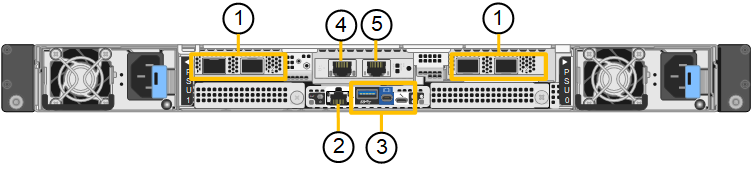
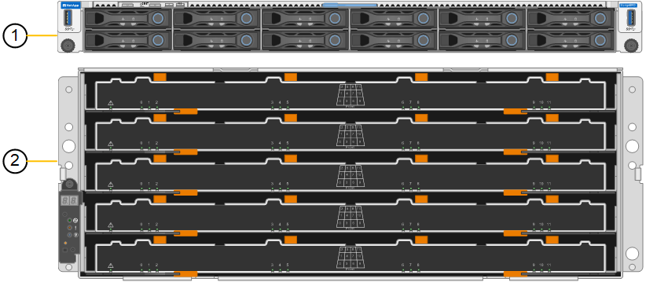
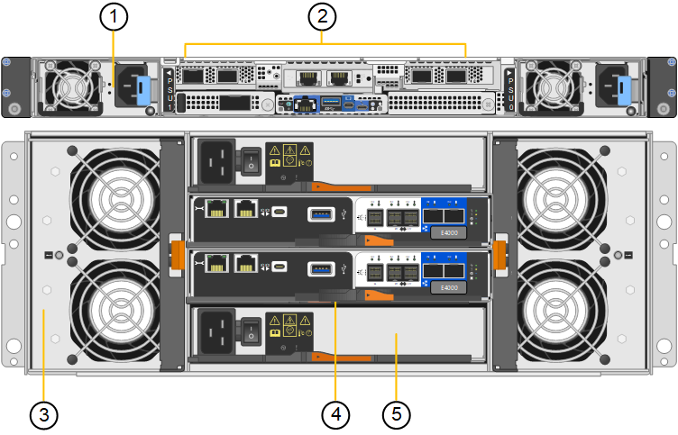
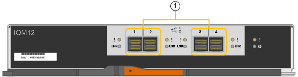

= Appliances StorageGRID SG6200
:allow-uri-read: 
:icons: font
:imagesdir: ../media/

[role="lead"]
Les appliances StorageGRID de la série SG6200 fonctionnent comme des nœuds de stockage dans un système StorageGRID. Comme toutes les appliances StorageGRID, elles peuvent être librement combinées avec d'autres modèles d'appliances et des nœuds logiciels uniquement dans un même déploiement.

L'appliance StorageGRID SG6260 comprend un contrôleur de calcul doté de deux SSD NVMe faisant office de cache de lecture, et une étagère de contrôleur de stockage contenant deux contrôleurs de stockage et 60 disques durs NL-SAS. Elle peut être étendue jusqu'à 180 disques durs NL-SAS grâce à l'ajout de jusqu'à deux étagères d'extension optionnelles. L'appliance StorageGRID SGF6212 est une appliance entièrement flash avec un format compact 1U, équipée de 12 SSD NVMe.

== Caractéristiques de l'appareil

=== Caractéristiques générales

Les appareils SGF6212 et SG6260 offrent les fonctionnalités suivantes :

* Intègre les éléments de calcul et de stockage d'un nœud de stockage StorageGRID.
* Inclut le programme d'installation de l'appliance StorageGRID pour simplifier le déploiement et la configuration des nœuds de stockage.
* Inclut un contrôleur BMC (Baseboard Management Controller) pour la surveillance et le diagnostic du matériel dans le contrôleur de calcul.

=== fonctionnalités de protection des données

Le SGF6212 offre les fonctionnalités de protection des données suivantes :

* Fonctionnement après panne d'un disque SSD unique, sans impact sur la disponibilité des objets.
* Possibilité de fonctionner après plusieurs pannes SSD avec une réduction minimale de la disponibilité des objets (basée sur la conception du schéma RAID sous-jacent).
+

NOTE: Selon la règle ILM configurée, les demandes d'objets indisponibles localement peuvent être traitées par d'autres nœuds. La disponibilité n'est donc généralement pas réduite.

* Restauration complète, pendant la mise en service, suite à des pannes de disque SSD qui ne provoquent pas d'endommagement extrême du RAID hébergeant le volume racine du nœud (le système d'exploitation StorageGRID).
* Si plusieurs pannes de disques SSD entraînent une perte locale de données, les données d'objet peuvent être restaurées automatiquement à partir de copies ou de blocs de code d'effacement sur d'autres nœuds.
* Capacité à fonctionner comme un https://docs.netapp.com/us-en/storagegrid/admin/managing-load-balancing.html["Nœud de passerelle avec mise en cache"^] .

Le SG6260 offre les fonctionnalités de protection des données suivantes :

* Fonctionnement après panne de deux disques durs sans impact sur la disponibilité des objets.
* Évacuation et reconstruction rapides des disques durs en cas de panne ou de remplacement (lorsqu'ils sont configurés pour les pools de disques dynamiques ou DDP16 lors de l'installation), ce qui améliore la durabilité des données par rapport à RAID 6 standard.
* Récupération complète, pendant la maintenance, suite à la défaillance de deux disques durs.
* Si plusieurs pannes de disques durs entraînent une perte locale de données, les données d'objet peuvent être restaurées automatiquement à partir de copies ou de blocs de code d'effacement sur d'autres nœuds.

== Composants matériels SG6200

=== Appareil SGF6212

L'appareil SGF6212 comprend les composants suivants :

Des plateformes de calcul et de stockage:: Un serveur à une unité de rack (1U) qui comprend :
+
--
* 256 GO DE RAM
* Disque de démarrage interne de 240 Go (inclut le logiciel StorageGRID)
* 2 ports GBase-T 1/10
* 4 ports Ethernet 10/25/40/100GbE pour le trafic réseau Grid/Client (ou 4 x 200GbE avec carte réseau 200GbE en option)
* 12 SSD NVMe pour stockage des données
* Le contrôleur de gestion de la carte mère (BMC) simplifie la gestion du matériel
* Alimentations et ventilateurs redondants

--

=== Appliance SG6260

L'appareil SG6260 comprend les composants suivants :

Contrôleur de calcul:: Le contrôleur SG6200-CN est un serveur au format 1U (unité de rack) qui comprend :
+
--
* 256 GO DE RAM
* Disque de démarrage interne de 240 Go (inclut le logiciel StorageGRID)
* 2 ports GBase-T 1/10
* 4 ports Ethernet 10/25/40/100GbE pour le trafic réseau Grid/Client (ou 4 x 200GbE avec carte réseau 200GbE en option)
* 1 port d'interconnexion de stockage 100 GbE
* Deux SSD NVMe pour le cache de lecture
* Le contrôleur de gestion de la carte mère (BMC) simplifie la gestion du matériel
* Alimentations et ventilateurs redondants

--
Tiroir contrôleur de stockage:: Le tiroir contrôleur E-Series E4000 (baie de stockage) est un tiroir 4U qui inclut :
+
--
* Deux contrôleurs de la gamme E4000 (configuration duplex) pour fournir une prise en charge du basculement du contrôleur de stockage
* Tiroir de cinq tiroirs contenant soixante disques NL-SAS de 3.5 pouces
* Alimentations et ventilateurs redondants

--
Facultatif : tiroirs d'extension de stockage:: Chaque appliance SG6260 peut accueillir une ou deux baies d'extension, pour un total de 180 disques. Les baies d'extension peuvent être installées lors du déploiement initial ou ajoutées ultérieurement.
+
--
Le boîtier E-Series DE460C est un tiroir 4U qui comprend :

* Deux modules d'entrée/sortie (IOM)
* Cinq tiroirs, chacun contenant 12 disques NL-SAS, pour un total de 60 disques
* Alimentations et ventilateurs redondants

--

== Schémas SGF6212 et SG6260

=== Vue de face du SGF6212

Cette figure montre la face avant du SGF6212 sans le panneau. L'appliance comprend une plateforme de calcul et de stockage 1U équipée de 12 disques SSD.

image::../media/s25_front_with_ssds.png[Vue de face du SGF6212]

=== Vue arrière du SGF6212

Cette figure montre l'arrière du SGF6212, y compris les ports, les ventilateurs et les alimentations.

[cols="1a,2a,2a,2a"]
|===
| Légende | Port | Type | Utiliser 

 a| 
1
 a| 
Ports réseau 1-4
 a| 
10/25/40/100/200-GbE, en fonction du type de câble ou d'émetteur-récepteur, de la vitesse du commutateur et de la vitesse de liaison configurée.

Les modules QSFP56 (jusqu'à 200GbE/port), QSFP28 (jusqu'à 100GbE/port) et QSFP+ (40GbE) sont pris en charge nativement (les vitesses 200GbE nécessitent l'option NIC 200GbE). Des émetteurs-récepteurs SFP+ (10GbE) ou SFP28 (25GbE) peuvent être utilisés avec un QSA (vendu séparément).
 a| 
Connectez-vous au réseau Grid et au réseau client pour StorageGRID.

 a| 
2
 a| 
Port de gestion BMC
 a| 
1 GbE (RJ-45)
 a| 
Se connecte au contrôleur de gestion de la carte de base de l'appliance.

 a| 
3
 a| 
Ports de diagnostic et de support
 a| 
* Mini DisplayPort
* Port USB 3.0
* Port console micro-USB

 a| 
Réservé au support technique.

 a| 
4
 a| 
Port réseau d'administration 1
 a| 
1/10-GbE (RJ-45)
 a| 
Connectez l'appliance au réseau d'administration pour StorageGRID.

 a| 
5
 a| 
Port réseau d'administration 2
 a| 
1/10-GbE (RJ-45)
 a| 
Options :

* Liaison avec le port 1 du réseau d'administration pour une connexion redondante au réseau d'administration pour StorageGRID.
* Laisser déconnecté et disponible pour l'accès local temporaire (IP 169.254.0.1).
* Lors de l'installation, utilisez le port 2 pour la configuration IP si les adresses IP attribuées par DHCP ne sont pas disponibles.

|===
Cette figure illustre l'emplacement de l'alimentation et des voyants d'identification à l'arrière du SGF6212. Des voyants supplémentaires d'état et d'activité sont présents sur les ports de l'appliance. Ces voyants peuvent varier selon le modèle de l'appliance.

image::../media/s25_rear_leds.png[LED arrière SGF6212]

[cols="1a,2a,3a"]
|===
| Légende | LED | État 

 a| 
1
 a| 
Voyant d'alimentation
 a| 
* Vert, fixe : l'appareil est sous tension, le bouton d'alimentation est sous tension.
* Vert, clignotant : l'appareil est sous tension, le bouton d'alimentation est hors tension.
* Éteint : l'appareil n'est pas alimenté.
* Orange : panne de l'alimentation.

 a| 
2
 a| 
Identifier la LED
 a| 
* Bleu clignotant : identifie l'appliance dans l'armoire ou le rack.
* Bleu, fixe : identifie l'appliance dans l'armoire ou le rack.
* Éteint : L'appareil n'est pas visuellement identifiable dans l'armoire ou le rack.

|===

=== Vue de face du SG6260

Cette figure montre la face avant du SG6260, qui comprend un contrôleur de calcul 1U et une étagère 4U contenant deux contrôleurs de stockage et 60 disques répartis dans cinq tiroirs.

[cols="1a,2a"]
|===
| Légende | Description 

 a| 
1
 a| 
Contrôleur informatique SG6200-CN sans panneau façade avant

 a| 
2
 a| 
Tiroir contrôleur E4000 avec panneau avant retiré (le tiroir d'extension en option semble identique)

|===

=== Vue arrière du SG6260

Cette figure montre l'arrière du SG6260, y compris les contrôleurs de calcul et de stockage, les ventilateurs et les alimentations.

[cols="1a,2a"]
|===
| Légende | Description 

 a| 
1
 a| 
Alimentation (1 sur 2) pour contrôleur de calcul SG6200-CN

 a| 
2
 a| 
Connecteurs pour contrôleur de calcul SG6200-CN

 a| 
3
 a| 
Ventilateur (1 sur 2) pour tiroir contrôleur E4000

 a| 
4
 a| 
Contrôleur de stockage E-Series E400 (1 sur 2) et connecteurs

 a| 
5
 a| 
Alimentation (1 sur 2) du tiroir contrôleur E4000

|===

== Contrôleurs SG6200

=== Contrôleur de calcul SG6200-CN

* Fournit des ressources de calcul pour l'appliance.
* Inclut le programme d'installation de l'appliance StorageGRID.
+

NOTE: Le logiciel StorageGRID n'est pas préinstallé sur l'appliance. Ce logiciel est extrait du noeud d'administration lorsque vous déployez l'appliance.

* Peut se connecter aux trois réseaux StorageGRID, y compris le réseau Grid, le réseau d'administration et le réseau client.
* Connexion aux contrôleurs de stockage E-Series et fonctionnement comme initiateur.

Cette figure montre les ports situés à l'arrière du contrôleur de calcul SG6200-CN.

image::../media/sg6200_cn_rear_connectors.png[Connecteurs arrière SG6200-CN]

[cols="1a,2a,2a,3a"]
|===
| Légende | Port | Type | Utiliser 

 a| 
1
 a| 
Ports réseau 1-4
 a| 
10/25/40/100/200 GbE, selon le type de câble ou d'émetteur-récepteur, la vitesse du commutateur et la vitesse de liaison configurée. QSFP56 (max 200GbE/port), QSFP28 (max 100GbE/port) et QSFP+ (40GbE) sont pris en charge nativement (les vitesses 200GbE nécessitent l'option NIC 200GbE). Des émetteurs-récepteurs SFP+ (10GbE) ou SFP28 (25GbE) optionnels peuvent être utilisés avec un QSA (vendu séparément).
 a| 
Connectez-vous au réseau Grid et au réseau client pour StorageGRID.

 a| 
2
 a| 
Port de gestion BMC
 a| 
1 GbE (RJ-45)
 a| 
Connectez-vous au contrôleur de gestion de la carte mère SG6200-CN.

 a| 
3
 a| 
Ports de diagnostic et de support
 a| 
* Mini DisplayPort
* Port USB 3.0
* Port console micro-USB

 a| 
Réservé au support technique.

 a| 
4
 a| 
Port réseau d'administration 1
 a| 
1/10-GbE (RJ-45)
 a| 
Connectez le SG6200-CN au réseau d'administration de StorageGRID.

 a| 
5
 a| 
Port réseau d'administration 2
 a| 
1/10-GbE (RJ-45)
 a| 
Options :

* Lien avec le port de gestion 1 pour une connexion redondante au réseau d'administration pour StorageGRID.
* Laissez sans fil et disponible pour l'accès local temporaire (IP 169.254.0.1).
* Lors de l'installation, utilisez le port 2 pour la configuration IP si les adresses IP attribuées par DHCP ne sont pas disponibles.

 a| 
6
 a| 
Port d'interconnexion
 a| 
100 GbE
 a| 
Connectez le contrôleur SG6200-CN aux contrôleurs E4000.

|===
Cette figure illustre l'emplacement de l'alimentation et des voyants d'identification à l'arrière du contrôleur informatique SG6200-CN. Des voyants supplémentaires d'état et d'activité sont présents sur les ports de l'appliance. Ces voyants peuvent varier selon le modèle d'appliance.

image::../media/s25_rear_leds.png[LED arrière SG6200-CN]

[cols="1a,2a,3a"]
|===
| Légende | LED | État 

 a| 
1
 a| 
Voyant d'alimentation
 a| 
* Vert, fixe : l'appareil est sous tension, le bouton d'alimentation est sous tension.
* Vert, clignotant : l'appareil est sous tension, le bouton d'alimentation est hors tension.
* Éteint : l'appareil n'est pas alimenté.
* Orange : panne de l'alimentation.

 a| 
2
 a| 
Identifier la LED
 a| 
* Bleu clignotant : identifie l'appliance dans l'armoire ou le rack.
* Bleu, fixe : identifie l'appliance dans l'armoire ou le rack.
* Éteint : L'appareil n'est pas visuellement identifiable dans l'armoire ou le rack.

|===

=== SG6260 : Contrôleur de stockage E4000

* Deux contrôleurs pour la prise en charge du basculement.
* Gérer le stockage des données sur les disques.
* Fonctionnement en tant que contrôleurs E-Series standard dans une configuration duplex.
* Incluez le logiciel SANtricity OS (firmware du contrôleur).
* Il comprend SANtricity System Manager pour la surveillance du matériel de stockage et la gestion des alertes, la fonction AutoSupport et la sécurité des disques.
* Connectez-vous au contrôleur SG6200-CN et autorisez l'accès au stockage.

image::../media/e4000_controller_with_callouts.png[Connecteurs sur le contrôleur E4000]

[cols="1a,2a,2a,3a"]
|===
| Légende | Port | Type | Utiliser 

 a| 
1
 a| 
Port de gestion 1
 a| 
Ethernet 1 Gbit (RJ-45)
 a| 
* Options du port 1 :
+
** Connectez-vous à un réseau de gestion pour activer l'accès TCP/IP direct à SANtricity System Manager
** Laissez le câble non câblé pour enregistrer un port de commutateur et une adresse IP.  Accédez au Gestionnaire système SANtricity à l'aide du Gestionnaire de grille ou du programme d'installation de l'appliance Storage Grid.

*Remarque* : certaines fonctionnalités SANtricity en option, telles que la synchronisation NTP pour des horodatages précis du journal, ne sont pas disponibles lorsque vous choisissez de laisser le port 1 non câblé.

 a| 
2
 a| 
Ports de diagnostic et de support
 a| 
* Port série RJ-45
* Port série micro USB
* Port USB

 a| 
Réservé au support technique.

 a| 
3
 a| 
Ports d'extension de lecteur 1 et 2
 a| 
12 Gb/s SAS
 a| 
Connectez les ports aux ports d'extension de disque sur les IOM du tiroir d'extension.

 a| 
4
 a| 
Ports d'interconnexion 1 et 2
 a| 
25 GbE iSCSI
 a| 
Connectez chacun des contrôleurs E4000 au contrôleur SG6200-CN.

Il existe quatre connexions au contrôleur SG6200-CN (deux de chaque E4000).

|===

=== SG6260 : Modules d’interface pour étagères d’extension optionnelles

Le tiroir d'extension contient deux modules d'entrée/sortie qui se connectent aux contrôleurs de stockage ou à d'autres tiroirs d'extension.

==== Connecteurs IOM

[cols="1a,2a,2a,3a"]
|===
| Légende | Port | Type | Utiliser 

 a| 
1
 a| 
Ports d'extension de lecteur 1-4
 a| 
12 Gb/s SAS
 a| 
Connectez chaque port aux contrôleurs de stockage ou au tiroir d'extension supplémentaire (le cas échéant).

|===