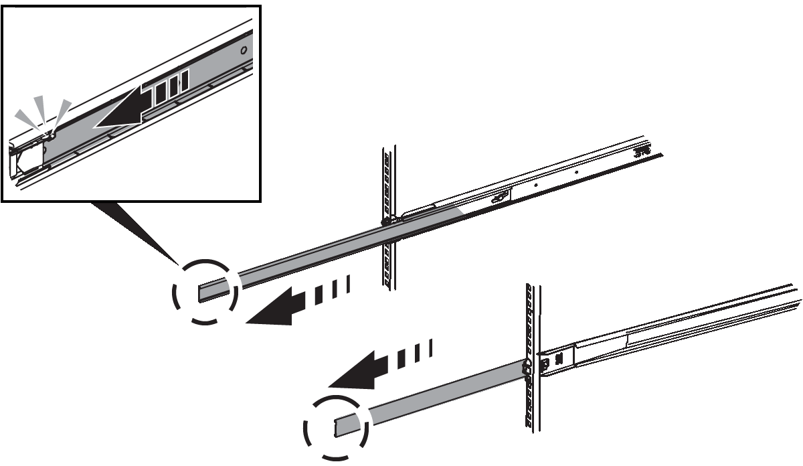

= Installation dans l'armoire ou le rack (SG100 et SG1000)
:allow-uri-read: 
:icons: font
:imagesdir: ../media/

[role="lead"]
Vous installez un ensemble de rails pour l'appareil dans votre armoire ou rack, puis faites glisser l'appareil sur les rails.

.Avant de commencer
* Vous avez passé en revue le document consignes de sécurité inclus dans la boîte et compris les précautions à prendre pour déplacer et installer le matériel.
* Les instructions sont fournies avec le kit de rails.

.Étapes
. Suivez attentivement les instructions du kit de rails pour installer les rails dans votre armoire ou rack.
. Sur les deux rails installés dans l'armoire ou le rack, étendez les pièces mobiles des rails jusqu'à ce que vous entendiez un clic.
+

. Insérez l'appareil dans les rails.
. Faites glisser l'appareil dans l'armoire ou le rack.
+
Lorsque vous ne pouvez plus déplacer l'appareil, tirez sur les loquets bleus des deux côtés du châssis pour faire glisser l'appareil complètement vers l'intérieur.

+
image::../media/sg6000_cn_rails_blue_button.gif[Rails coulissants SG 100 et SG1000]

+

NOTE: Ne fixez le cadre avant qu'après avoir mis l'appareil sous tension.

