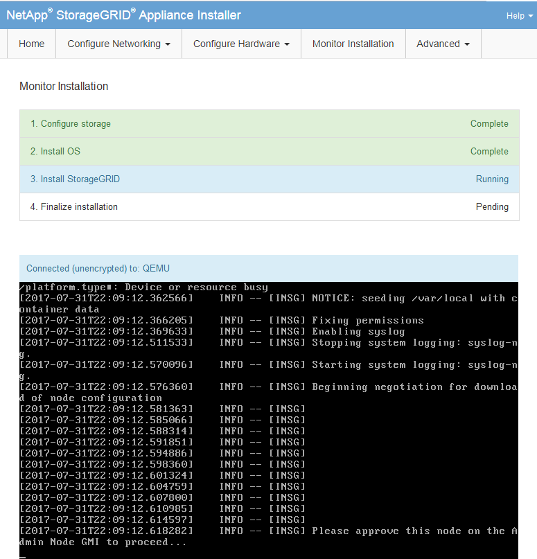

= Surveiller l'installation de l'appareil
:allow-uri-read: 
:icons: font
:imagesdir: ../media/

[role="lead"]
Le programme d'installation de l'appliance StorageGRID indique l'état jusqu'à ce que l'installation soit terminée. Une fois l'installation du logiciel terminée, l'appliance est redémarrée.

.Étapes
[role="tabbed-block"]
====
.Appliance de stockage
--
. Pour contrôler la progression de l'installation, cliquez sur *Monitor installation*.
+
La page installation du moniteur affiche la progression de l'installation.

+
image::../media/monitor_installation_configure_storage.gif[Cette image est expliquée par le texte qui l'entoure.]

+
La barre d'état bleue indique la tâche en cours. Les barres d'état vertes indiquent que les tâches ont été effectuées avec succès.

+

NOTE: Le programme d'installation s'assure que les tâches terminées lors d'une installation précédente ne sont pas réexécutées. Si vous exécutez à nouveau une installation, toutes les tâches qui n'ont pas besoin d'être réexécutées s'affichent avec une barre d'état verte et un état de « `barrét' ».

. Passez en revue la progression des deux premières étapes d'installation.
+
*1. Configurer le stockage*

+
Au cours de cette étape, le programme d'installation se connecte au contrôleur de stockage, efface toute configuration existante, crée des RAID en fonction du mode RAID configuré, alloue des volumes pour le logiciel StorageGRID et le stockage de données d'objet, et configure les paramètres de l'hôte.

+
*2. Installez OS*

+
Au cours de cette étape, le programme d'installation copie l'image du système d'exploitation de base pour StorageGRID sur l'appliance.

. Continuez à surveiller la progression de l'installation jusqu'à ce que l'étape *installer StorageGRID* s'arrête et qu'un message s'affiche sur la console intégrée, vous invitant à approuver ce nœud sur le nœud d'administration à l'aide du gestionnaire de grille. Passez à l'étape suivante.
+

. Accédez au Grid Manager du nœud administrateur principal, approuvez le nœud de stockage en attente et terminez le processus d'installation de StorageGRID.
+
Lorsque vous cliquez sur *Install* dans Grid Manager, l'étape 3 se termine et l'étape 4, *Finalisation installation*, commence. Une fois l'étape 4 terminée, le contrôleur est redémarré.

--
.Appliance de services
--
. Pour contrôler la progression de l'installation, cliquez sur *Monitor installation* dans la barre de menus.
+
La page installation du moniteur affiche la progression de l'installation.

+
image::../media/monitor_installation_services_appl.png[Installation du moniteur - Appliance des services]

+
La barre d'état bleue indique la tâche en cours. Les barres d'état vertes indiquent que les tâches ont été effectuées avec succès.

+

NOTE: Le programme d'installation s'assure que les tâches terminées lors d'une installation précédente ne sont pas réexécutées. Si vous exécutez à nouveau une installation, toutes les tâches qui n'ont pas besoin d'être réexécutées s'affichent avec une barre d'état verte et un état de « `barrét' ».

. Passez en revue l'état d'avancement des deux premières étapes d'installation.
+
** *1. Configurer le stockage*
+
Au cours de cette étape, le programme d'installation efface toute configuration existante des lecteurs de l'appliance et configure les paramètres de l'hôte.

** *2. Installez OS*
+
Au cours de cette étape, le programme d'installation copie l'image du système d'exploitation de base pour StorageGRID sur l'appliance.

. Continuez à surveiller la progression de l'installation jusqu'à ce que l'un des processus suivants se produise :
+
** Pour tous les nœuds d'appliance à l'exception du nœud d'administration principal, l'étape installer StorageGRID s'interrompt et un message s'affiche sur la console intégrée, vous invitant à approuver ce nœud sur le nœud d'administration à l'aide de Grid Manager. Passez à l'étape suivante.
** Pour l'installation du nœud d'administration principal de l'appliance, il n'est pas nécessaire d'approuver le nœud. L'appliance est redémarrée. Vous pouvez passer à l'étape suivante.
+

NOTE: Lors de l'installation d'un nœud d'administration principal de l'appliance, une cinquième phase s'affiche (voir l'exemple de capture d'écran montrant quatre phases). Si la cinquième phase est en cours pendant plus de 10 minutes, actualisez manuellement la page Web.

+

. Accédez au Grid Manager du nœud administrateur principal, approuvez le nœud de grille en attente et terminez le processus d'installation de StorageGRID.
+
Lorsque vous cliquez sur *Install* dans Grid Manager, l'étape 3 se termine et l'étape 4, *Finalisation installation*, commence. Une fois l'étape 4 terminée, l'appareil est redémarré.

--
====