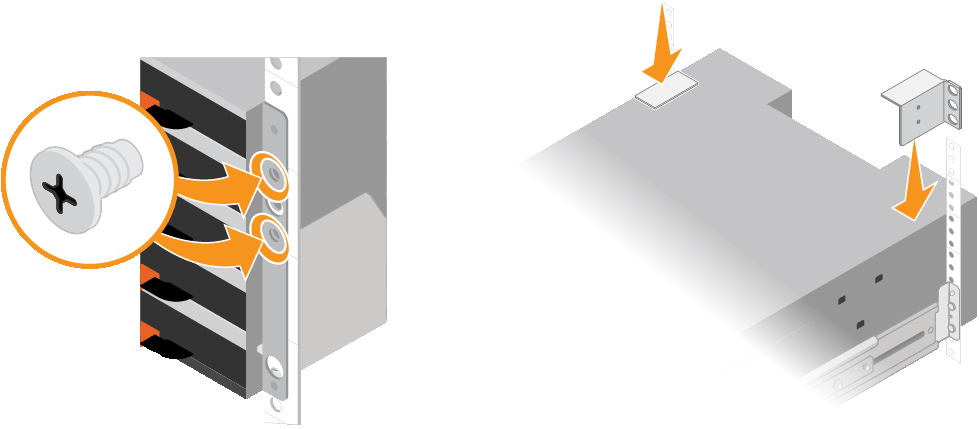

= Installation des tiroirs de 60 disques (SG6060)
:allow-uri-read: 
:icons: font
:imagesdir: ../media/

[role="lead"]
Vous installez un ensemble de rails pour le tiroir contrôleur E2860 dans votre armoire ou votre rack, puis faites glisser le tiroir contrôleur sur les rails. Si vous installez des tiroirs d'extension de 60 disques, la même procédure s'applique.

.Avant de commencer
* Vous avez passé en revue le https://library.netapp.com/ecm/ecm_download_file/ECMP12475945["Avis de sécurité"^] document inclus dans l'emballage et comprendre les précautions à prendre pour déplacer et installer le matériel.
* Les instructions sont fournies avec le kit de rails.

CAUTION: Chaque tiroir de 60 disques pèse environ 60 kg (132 lb) sans disque installé. Quatre personnes ou un dispositif de levage mécanisé sont nécessaires pour déplacer la tablette en toute sécurité.

CAUTION: Pour éviter d'endommager le matériel, ne déplacez jamais le tiroir si des disques sont installés. Vous devez retirer tous les disques avant de déplacer le tiroir.

CAUTION: Lors de l'installation du tiroir contrôleur E2860 ou des tiroirs d'extension en option, installez le matériel en bas jusqu'en haut du rack ou de l'armoire afin d'éviter tout basculement de l'équipement. Pour que l'équipement le plus lourd se trouve au bas de l'armoire ou du rack, installez le contrôleur SG6000-CN au-dessus du tiroir du contrôleur E2860 et des tiroirs d'extension.

NOTE: Avant de valider l'installation, vérifiez que les câbles optiques de 0,5 m fournis avec l'appliance ou les câbles que vous fournissez sont suffisamment longs pour la disposition prévue.

.Étapes
. Suivez attentivement les instructions du kit de rails pour installer les rails dans votre armoire ou rack.
+
Pour les armoires à trous carrés, installez d'abord les écrous cage fournis pour fixer l'avant et l'arrière du shelf à l'aide de vis.

. Retirez la boîte d'emballage extérieure de l'appareil. Pliez ensuite les rabats du boîtier intérieur.
. Si vous soulevez l'appareil à la main, fixez les quatre poignées sur les côtés du châssis.
+
Poussez sur chaque poignée jusqu'à ce qu'elle s'enclenche.

+
image::../media/lift_handles.gif[Soulevez les poignées]

. Placez l'arrière de la tablette (extrémité avec les connecteurs) sur les rails.
. En soutenant le shelf par le bas, faites-le glisser dans l'armoire. Si vous utilisez les poignées, utilisez les loquets du pouce pour détacher une poignée à la fois lorsque vous faites glisser la tablette vers l'intérieur.
+
Pour retirer les poignées, tirez le loquet de déverrouillage, poussez-le vers le bas, puis tirez-le hors de la tablette.

. Fixez le shelf à l'avant de l'armoire.
+
Insérez les vis dans les premier et troisième trous du haut de la tablette des deux côtés.

. Fixez le shelf à l'arrière de l'armoire.
+
Placez deux supports arrière de chaque côté de la section supérieure arrière de la tablette. Insérez les vis dans le premier et le troisième trous de chaque support.

+

. Répétez ces étapes pour tous les tiroirs d'extension.

