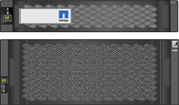
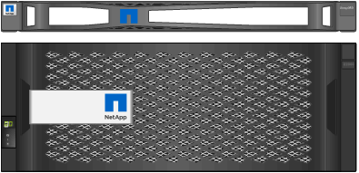

= Déballez les boîtes
:allow-uri-read: 
:icons: font
:imagesdir: ../media/

[role="lead"]
Avant d'installer votre appareil StorageGRID, déballez toutes les boîtes et comparez le contenu aux éléments figurant sur le bordereau d'expédition.

[role="tabbed-block"]
====
.SG100 et SG1000
--
* *Matériel*
+
SG100 ou SG1000::
+
--
image::../media/sg6000_cn_front_without_bezel.gif[Disques frontaux SG 100 ou appareil de services SG1000]

--
Kit de rails avec instructions::
+
--
image::../media/rail_kit.gif[Kit de rails]

--

* *Cordons d'alimentation*
+

TIP: Il se peut que votre armoire soit équipée de cordons d'alimentation spéciaux à la place des câbles d'alimentation fournis avec l'appliance.

+
Deux cordons d'alimentation pour votre pays::
+
--
image::../media/power_cords.gif[Cordons d'alimentation]

--

--
.SG110 et SG1100
--
* *Matériel*
+
SG110 ou SG1100::
+
--
image::../media/sgf6112_front_with_ssds.png[Disques frontaux, appliances SG110 et SG1100]

--
Kit de rails avec instructions::
+
--
image::../media/rail_kit.gif[Kit de rails]

--
Panneau avant::
+
--
image::../media/sgf_6112_front_bezel.png[Panneau avant]

--

* *Cordons d'alimentation*
+

TIP: Il se peut que votre armoire soit équipée de cordons d'alimentation spéciaux à la place des câbles d'alimentation fournis avec l'appliance.

+
Deux cordons d'alimentation pour votre pays::
+
--
image::../media/power_cords.gif[Cordons d'alimentation]

--

--
.SG5700
--
* *Matériel*
+
Appliance SG5712 avec 12 disques installés::
+
--
image::../media/de212c_table_size.gif[Appliance SG5712 2U]

--
Appliance SG5760 sans disque installé::
+
--
image::../media/de460c_table_size.gif[Appliance SG5760 4U]

--
Panneau avant de l'appareil::
+
--

--
Kit de rails avec instructions::
+
--
image::../media/rail_kit.gif[Kit de rails]

--
SG5760 : 60 disques::
+
--
image::../media/sg5760_drive.gif[Lecteur]

--
SG5760 : poignées::
+
--
image::../media/handles.gif[Poignées SG5760]

--
SG5760 : supports arrière et écrous cage pour une installation en rack à trous carrés::
+
--
image::../media/back_brackets_table_size.gif[Supports arrière et écrous de cage pour SG5760]

--

* *Câbles et connecteurs*
+

TIP: Il se peut que votre armoire soit équipée de cordons d'alimentation spéciaux à la place des câbles d'alimentation fournis avec l'appliance.

+
Deux cordons d'alimentation pour votre pays::
+
--
image::../media/power_cords.gif[Cordons d'alimentation]

--
Câbles optiques et émetteurs-récepteurs SFP::
+
--
image::../media/fc_cable_and_sfp.gif[Câbles optiques et SFP]

** Deux câbles optiques pour les ports d'interconnexion FC
** Huit émetteurs-récepteurs SFP+, compatibles avec les quatre ports d'interconnexion FC 16 Gbit/s et les quatre ports réseau 10 GbE

--

--
.SG6000
--
* *Matériel SG6060*
+
Contrôleur SG6000-CN::
+
--
image::../media/sg6000_cn_front_without_bezel.gif[Contrôleur SG6000-CN]

--
Tiroir contrôleur E2860 sans disque installé::
+
--
image::../media/de460c_table_size.gif[Appliance SG5760 4U]

--
Deux encadrements avant::
+
--

--
Deux kits de rails avec instructions::
+
--
image::../media/rail_kit.gif[Kit de rails]

--
60 disques (2 SSD et 58 NL-SAS)::
+
--
image::../media/sg5760_drive.gif[Lecteur]

--
Quatre poignées::
+
--
image::../media/handles.gif[Poignées SG5760]

--
Supports arrière et écrous à cage pour l'installation en rack à trous carrés::
+
--
image::../media/back_brackets_table_size.gif[Supports arrière et écrous de cage pour SG5760]

--

* *Étagère d'extension SG6060*
+
Tiroir d'extension sans disque installé::
+
--
image::../media/de460c_table_size.gif[Appliance SG5760 4U]

--
Panneau avant::
+
--
image::../media/front_bezel_for_table_de460c.gif[Panneau avant DE460C]

--
60 disques NL-SAS::
+
--
image::../media/sg5760_drive.gif[Lecteur]

--
Un kit de rails avec instructions::
+
--
image::../media/rail_kit.gif[Kit de rails]

--
Quatre poignées::
+
--
image::../media/handles.gif[Poignées SG5760]

--
Supports arrière et écrous à cage pour l'installation en rack à trous carrés::
+
--
image::../media/back_brackets_table_size.gif[Supports arrière et écrous de cage pour SG5760]

--

* *Matériel SGF6024*
+
Contrôleur SG6000-CN::
+
--
image::../media/sg6000_cn_front_without_bezel.gif[Contrôleur SG6000-CN]

--
Baie Flash EF570 installée avec 24 disques SSD (Flash::
+
--
image::../media/de224c_with_drives.gif[Tiroir contrôleur EF570]

--
Deux encadrements avant::
+
--
image::../media/sgf6024_front_bezels_for_table.png[Encadrements avant SG6024]

--
Deux kits de rails avec instructions::
+
--
image::../media/rail_kit.gif[Kit de rails]

--
Têtes de gondole des tablettes::
+
--
image::../media/endcaps.png[Têtes de gondole]

--

* *Câbles et connecteurs*
+

TIP: Il se peut que votre armoire soit équipée de cordons d'alimentation spéciaux à la place des câbles d'alimentation fournis avec l'appliance.

+
Quatre cordons d'alimentation pour votre pays::
+
--
image::../media/power_cords.gif[Cordons d'alimentation]

--
Câbles optiques et émetteurs-récepteurs SFP::
+
--
image::../media/fc_cable_and_sfp.gif[Câbles optiques et SFP]

** Quatre câbles optiques pour les ports d'interconnexion FC
** Quatre émetteurs-récepteurs SFP+ prenant en charge le protocole FC 16 Gbit/s.

--
En option : deux câbles SAS pour connecter chaque tiroir d'extension SG6060::
+
--
image::../media/sas_cable.gif[Câbles SAS]

--

--
.SG6100
--
* *Matériel*
+
SGF6112::
+
--
image::../media/sgf6112_front_with_ssds.png[Disques frontaux, appliance SGF6112]

--
Kit de rails avec instructions::
+
--
image::../media/rail_kit.gif[Kit de rails]

--
Panneau avant::
+
--
image::../media/sgf_6112_front_bezel.png[Panneau avant]

--

* *Cordons d'alimentation*
+

TIP: Il se peut que votre armoire soit équipée de cordons d'alimentation spéciaux à la place des câbles d'alimentation fournis avec l'appliance.

+
Deux cordons d'alimentation pour votre pays::
+
--
image::../media/power_cords.gif[Cordons d'alimentation]

--

--
====