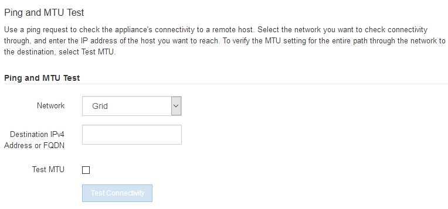

= Vérifiez les connexions réseau
:allow-uri-read: 
:icons: font
:imagesdir: ../media/

[role="lead"]
Vérifiez que vous pouvez accéder aux réseaux StorageGRID que vous utilisez à partir de l'appliance. Pour valider le routage via des passerelles réseau, vous devez tester la connectivité entre le programme d'installation de l'appliance StorageGRID et les adresses IP sur différents sous-réseaux. Vous pouvez également vérifier le paramètre MTU.

.Étapes
. Dans la barre de menus du programme d'installation de l'appliance StorageGRID, cliquez sur *configurer réseau* > *Test Ping et MTU*.
+
La page Test Ping et MTU s'affiche.

+

. Dans la liste déroulante *Network*, sélectionnez le réseau à tester : grid, Admin ou client.
. Saisissez l'adresse IPv4 ou le nom de domaine complet (FQDN) d'un hôte sur ce réseau.
+
Par exemple, vous pouvez envoyer une requête ping à la passerelle sur le réseau ou au nœud d'administration principal.

. Si vous le souhaitez, cochez la case *Test MTU* pour vérifier le paramètre MTU pour l'ensemble du chemin passant par le réseau jusqu'à la destination.
+
Par exemple, vous pouvez tester le chemin d'accès entre le nœud d'appliance et un nœud sur un autre site.

. Cliquez sur *Tester la connectivité*.
+
Si la connexion réseau est valide, le message « test Ping réussi » s'affiche, avec la sortie de la commande ping répertoriée.

+
image::../media/ping_test_passed.png[Capture d'écran des résultats du test ping dans le programme d'installation de l'appliance StorageGRID Webscale]

.Informations associées
* link:configuring-network-links.html["Configurer les liaisons réseau"]
* link:../commonhardware/changing-mtu-setting.html["Modifier le paramètre MTU"]

