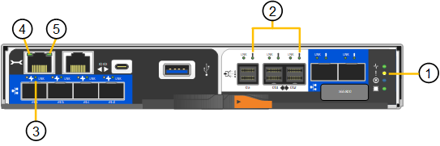

= Afficher les indicateurs d'état et les codes
:allow-uri-read: 
:icons: font
:imagesdir: ../media/

[role="lead"]
Les appareils et les contrôleurs comprennent des indicateurs qui vous aident à déterminer l'état des composants de l'appliance.

[role="tabbed-block"]
====
.SG100 et SG1000
--
L'appliance inclut des indicateurs qui vous permettent de déterminer l'état du contrôleur de l'appliance et des deux disques SSD :

* <<appliance_indicators_SG100_1000,Voyants et boutons de l'appareil>>
* <<general_boot_codes_SG100_1000,Codes de démarrage généraux>>
* <<ssd_indicators_SG100_1000,Indicateurs SSD>>

Utilisez ces informations pour vous aider link:troubleshooting-hardware-installation-sg100-and-sg1000.html["Dépanner l'installation matérielle des systèmes SG100 et SG1000"].

[[appliance_indicators_SG100_1000]]
Voyants et boutons de l'appareil::
+
--
La figure suivante montre les indicateurs d'état et les boutons sur les SG100 et SG1000.

image::../media/sg6000_cn_front_indicators.gif[Clignotants avant - SG1000]

[cols="1a,2a,2a"]
|===
| Légende | Afficher | État 

 a| 
1
 a| 
Bouton d'alimentation
 a| 
* Bleu : l'appareil est sous tension.
* Éteint : l'appareil est hors tension.

 a| 
2
 a| 
Bouton de réinitialisation
 a| 
Utilisez ce bouton pour effectuer une réinitialisation matérielle du contrôleur.

 a| 
3
 a| 
Bouton identifier
 a| 
Ce bouton peut être configuré pour clignoter, allumé (continu) ou éteint.

* Bleu clignotant : identifie l'appliance dans l'armoire ou le rack.
* Bleu, fixe : identifie l'appliance dans l'armoire ou le rack.
* Éteint : l'appareil n'est pas visuellement identifiable dans l'armoire ou le rack.

 a| 
4
 a| 
Voyant d'alarme
 a| 
* Orange, fixe : une erreur s'est produite.
+
*Note:* pour afficher les codes de démarrage et d'erreur, link:accessing-bmc-interface.html["Accédez à l'interface BMC"].

* OFF : aucune erreur n'est présente.

|===
--

[[general_boot_codes_SG100_1000]]
Codes de démarrage généraux::
+
--
Lors du démarrage ou après une réinitialisation matérielle de l'appareil, les événements suivants se produisent :

. Le contrôleur BMC (Baseboard Management Controller) consigne les codes de la séquence de démarrage, y compris les erreurs qui se produisent.
. Le bouton d'alimentation s'allume.
. Si des erreurs se produisent au démarrage, le voyant d'alarme s'allume.
+
Pour afficher les codes de démarrage et d'erreur, link:accessing-bmc-interface.html["Accédez à l'interface BMC"].

--

[[ssd_indicators_SG100_1000]]
Indicateurs SSD::
+
--
La figure suivante montre les voyants des disques SSD du SG100 et du SG1000.

image::../media/ssd_indicators.png[Indicateurs SSD]

[cols="1a,2a,2a"]
|===
| LED | Afficher | État 

 a| 
1
 a| 
État/défaut du lecteur
 a| 
* Bleu (continu) : le lecteur est en ligne
* Orange (fixe) : panne de disque
* Orange (clignotant) : le voyant de localisation du lecteur est allumé
* OFF : l'emplacement est vide

 a| 
2
 a| 
Entraînement actif
 a| 
Bleu (clignotant) : accès au lecteur

|===
--

--
.SG110 et SG1100
--
L'appliance inclut des indicateurs qui vous permettent de déterminer l'état du contrôleur de l'appliance et des disques SSD :

* <<appliance_indicators,Voyants et boutons de l'appareil>>
* <<general_boot_codes,Codes de démarrage généraux>>
* <<ssd_indicators,Indicateurs SSD>>

Utilisez ces informations pour vous aider link:troubleshooting-hardware-installation-sg110-and-sg1100.html["Dépanner l'installation matérielle des systèmes SG110 et SG1100"].

[[appliance_indicators]]
Voyants et boutons de l'appareil::
+
--
La figure suivante montre les voyants et les boutons des appareils SG110 et SG1100.

image::../media/sgf6112_front_indicators.png[Clignotants avant - SG110 et SG1100]

[cols="1a,2a,3a"]
|===
| Légende | Afficher | État 

 a| 
1
 a| 
Bouton d'alimentation
 a| 
* Bleu : l'appareil est sous tension.
* Éteint : l'appareil est hors tension.

 a| 
2
 a| 
Bouton de réinitialisation
 a| 
Utilisez ce bouton pour effectuer une réinitialisation matérielle du contrôleur.

 a| 
3
 a| 
Bouton identifier
 a| 
A l'aide du contrôleur BMC, ce bouton peut être défini sur clignotant, activé (fixe) ou Désactivé.

* Bleu clignotant : identifie l'appliance dans l'armoire ou le rack.
* Bleu, fixe : identifie l'appliance dans l'armoire ou le rack.
* Éteint : l'appareil n'est pas visuellement identifiable dans l'armoire ou le rack.

 a| 
4
 a| 
Voyant d'état
 a| 
* Orange, fixe : une erreur s'est produite.
+
*Note:* pour afficher les codes de démarrage et d'erreur, link:accessing-bmc-interface.html["Accédez à l'interface BMC"].

* OFF : aucune erreur n'est présente.

 a| 
5
 a| 
PFR
 a| 
Cette lampe n'est pas utilisée par les appareils SG110 et SG1100 et reste éteinte.

|===
--

[[general_boot_codes]]
Codes de démarrage généraux::
+
--
Lors du démarrage ou après une réinitialisation matérielle de l'appareil, les événements suivants se produisent :

. Le contrôleur BMC (Baseboard Management Controller) consigne les codes de la séquence de démarrage, y compris les erreurs qui se produisent.
. Le bouton d'alimentation s'allume.
. Si des erreurs se produisent au démarrage, le voyant d'alarme s'allume.
+
Pour afficher les codes de démarrage et d'erreur, link:accessing-bmc-interface.html["Accédez à l'interface BMC"].

--

[[ssd_indicators]]
Indicateurs SSD::
+
--
La figure suivante présente les voyants SSD des appliances SG110 et SG1100.

image::../media/ssd_indicators.png[Indicateurs SSD]

[cols="1a,2a,2a"]
|===
| LED | Afficher | État 

 a| 
1
 a| 
État/défaut du lecteur
 a| 
* Bleu (continu) : le lecteur est en ligne
* Orange (fixe) : panne de disque
* OFF : l'emplacement est vide

 a| 
2
 a| 
Entraînement actif
 a| 
Bleu (clignotant) : accès au lecteur

|===
--

--
.SG5700
--
Les contrôleurs de l'appareil incluent des indicateurs qui vous aident à déterminer l'état du contrôleur de l'appareil :

* <<boot_codes_sg5700,Codes d'état de démarrage de l'appliance SG5700>>
* <<status_indicators_e5700sg_controller,Voyants d'état sur le contrôleur E5700SG>>
* <<general_boot_codes_sg5700,Codes de démarrage généraux>>
* <<boot_codes_e5700sg_controller,Codes de démarrage du contrôleur E5700SG>>
* <<error_codes_e5700sg_controller,Codes d'erreur du contrôleur E5700SG>>

Utilisez ces informations pour vous aider link:troubleshooting-hardware-installation.html["Dépannez l'installation du matériel SG5700"].

[[boot_codes_sg5700]]
Codes d'état de démarrage de l'appliance SG5700::
+
--
Les affichages à sept segments de chaque contrôleur affichent les codes d'état et d'erreur lors de la mise sous tension de l'appareil.

Le contrôleur E2800 et le contrôleur E5700SG affichent des États et des codes d'erreur différents.

Pour comprendre la signification de ces codes, consultez les ressources suivantes :

[cols="1a,2a"]
|===
| Contrôleur | Référence 

 a| 
Contrôleur E2800
 a| 
_E5700 et E2800 System Monitoring Guide_

*Remarque :* les codes répertoriés pour le contrôleur E-Series E5700 ne s'appliquent pas au contrôleur E5700SG de l'appliance.

 a| 
Contrôleur E5700SG
 a| 
"Indicateurs d'état sur le contrôleur E5700SG"

|===
--

.Étapes
. Pendant le démarrage, surveillez la progression en affichant les codes affichés sur les affichages à sept segments.
+
** L'écran à sept segments du contrôleur E2800 affiche la séquence répétée *OS*, *SD*, `*_blank_*` pour indiquer qu'il effectue un traitement en début de journée.
** L'affichage à sept segments du contrôleur E5700SG montre une séquence de codes se terminant par *AA* et *FF*.

. Une fois les contrôleurs démarrés, vérifiez que les sept segments affichent la valeur suivante :
+
image::../media/seven_segment_display_codes.gif[Sept segments s'affichent une fois que les contrôleurs ont démarré.]

+
[cols="1a,2a"]
|===
| Contrôleur | Affichage à sept segments 

 a| 
Contrôleur E2800
 a| 
Indique 99, qui est l'ID par défaut d'un tiroir contrôleur E-Series.

 a| 
Contrôleur E5700SG
 a| 
Affiche *HO*, suivie d'une séquence répétée de deux nombres.

[listing]
----
HO -- IP address for Admin Network -- IP address for Grid Network HO
----
Dans la séquence, le premier jeu de chiffres est l'adresse IP attribuée par DHCP pour le port de gestion 1 du contrôleur. Cette adresse est utilisée pour connecter le contrôleur au réseau Admin pour StorageGRID. Le second jeu de chiffres est l'adresse IP attribuée par DHCP utilisée pour connecter l'appareil au réseau de grille pour StorageGRID.

*Remarque :* si une adresse IP n'a pas pu être attribuée à l'aide de DHCP, 0.0.0.0 s'affiche.

|===
. Si les affichages à sept segments affichent d'autres valeurs, voir link:troubleshooting-hardware-installation.html["Dépannage de l'installation matérielle (SG6000 ou SG5700)"] et confirmez que vous avez correctement effectué les étapes d'installation. Si vous ne parvenez pas à résoudre le problème, contactez le support technique.

[[status_indicators_e5700sg_controller]]
Voyants d'état sur le contrôleur E5700SG::
+
--
L'écran à sept segments et les voyants du contrôleur E5700SG indiquent les codes d'état et d'erreur pendant la mise sous tension et l'initialisation du matériel. Vous pouvez utiliser ces affichages pour déterminer l'état et résoudre les erreurs.

Une fois le programme d'installation de l'appliance StorageGRID démarré, il est conseillé de vérifier régulièrement les voyants d'état du contrôleur E5700SG.

La figure suivante présente les voyants d'état du contrôleur E5700SG.

image::../media/e5700sg_leds.gif[Voyants d'état sur le contrôleur E5700SG]

[cols="1a,2a,2a"]
|===
| Légende | Afficher | Description 

 a| 
1
 a| 
LED d'avertissement
 a| 
Orange : le contrôleur est défectueux et nécessite l'intervention de l'opérateur, ou le script d'installation est introuvable.

OFF : le contrôleur fonctionne normalement.

 a| 
2
 a| 
Affichage à sept segments
 a| 
Affiche un code de diagnostic

Les séquences d'affichage à sept segments permettent de comprendre les erreurs et l'état de fonctionnement de l'appareil.

 a| 
3
 a| 
Voyants d'avertissement du port d'extension
 a| 
Orange : ces voyants sont toujours orange (aucune liaison établie) car le dispositif n'utilise pas les ports d'extension.

 a| 
4
 a| 
Voyants d'état de la liaison du port hôte
 a| 
Vert : le lien fonctionne.

OFF : le lien ne fonctionne pas.

 a| 
5
 a| 
Voyants d'état de la liaison Ethernet
 a| 
Vert : un lien est établi.

Désactivé : aucun lien n'est établi.

 a| 
6
 a| 
LED d'activités Ethernet
 a| 
Vert : la liaison entre le port de gestion et le périphérique auquel il est connecté (par exemple, un commutateur Ethernet) est active.

Éteint : il n'y a pas de lien entre le contrôleur et le périphérique connecté.

Vert clignotant : activité Ethernet.

|===
--

[[general_boot_codes_sg5700]]
Codes de démarrage généraux::
+
--
Lors du démarrage ou après une réinitialisation matérielle de l'appareil, les événements suivants se produisent :

. L'affichage à sept segments sur le contrôleur E5700SG montre une séquence générale de codes qui n'est pas spécifique au contrôleur. La séquence générale se termine par les codes AA et FF.
. Les codes de démarrage spécifiques au contrôleur E5700SG apparaissent.

--

[[boot_codes_e5700sg_controller]]
Codes de démarrage du contrôleur E5700SG::
+
--
Lors d'un démarrage normal de l'appareil, l'écran à sept segments du contrôleur E5700SG affiche les codes suivants dans l'ordre indiqué :

[cols="1a,3a"]
|===
| Code | Indique 

 a| 
BONJOUR
 a| 
Le script de démarrage principal a démarré.

 a| 
PP
 a| 
Le système vérifie si le FPGA doit être mis à jour.

 a| 
HP
 a| 
Le système vérifie si le micrologiciel du contrôleur 10/25-GbE doit être mis à jour.

 a| 
RB
 a| 
Le système redémarre après l'application des mises à jour du firmware.

 a| 
FP
 a| 
Les vérifications de mise à jour du micrologiciel du sous-système matériel sont terminées. Les services de communication inter-contrôleurs sont en cours de démarrage.

 a| 
IL
 a| 
Le système attend la connectivité avec le contrôleur E2800 et la synchronisation avec le système d'exploitation SANtricity.

*Remarque :* si cette procédure de démarrage n'est pas en cours au-delà de cette étape, vérifier les connexions entre les deux contrôleurs.

 a| 
PC
 a| 
Le système recherche les données d'installation StorageGRID existantes.

 a| 
HO
 a| 
Le programme d'installation de l'appliance StorageGRID est en cours d'exécution.

 a| 
HAUTE DISPONIBILITÉ
 a| 
StorageGRID est en cours d'exécution.

|===
--

[[error_codes_e5700sg_controller]]
Codes d'erreur du contrôleur E5700SG::
+
--
Ces codes représentent des conditions d'erreur qui peuvent s'afficher sur le contrôleur E5700SG au démarrage de l'appareil. Des codes hexadécimaux supplémentaires à deux chiffres sont affichés si des erreurs matérielles spécifiques de bas niveau se produisent. Si l'un de ces codes persiste pendant plus d'une seconde ou deux, ou si vous ne parvenez pas à résoudre l'erreur en suivant l'une des procédures de dépannage prescrites, contactez le support technique.

[cols="1a,3a"]
|===
| Code | Indique 

 a| 
22
 a| 
Aucun enregistrement d'amorçage maître trouvé sur un périphérique d'amorçage.

 a| 
23
 a| 
Le disque flash interne n'est pas connecté.

 a| 
2A, 2B
 a| 
Bus bloqué, impossible de lire les données du démon DIMM.

 a| 
40
 a| 
Modules DIMM non valides.

 a| 
41
 a| 
Modules DIMM non valides.

 a| 
42
 a| 
Échec du test de la mémoire.

 a| 
51
 a| 
Échec de lecture du SPD.

 a| 
92 à 96
 a| 
Initialisation du bus PCI.

 a| 
A0 à A3
 a| 
Initialisation du lecteur SATA.

 a| 
AB
 a| 
Autre code d'amorçage.

 a| 
AE
 a| 
Démarrage du système d'exploitation.

 a| 
EA
 a| 
Échec de la formation DDR4.

 a| 
E8
 a| 
Aucune mémoire installée.

 a| 
UE
 a| 
Le script d'installation est introuvable.

 a| 
EP
 a| 
L'installation ou la communication avec le contrôleur E2800 est défectueuse.

|===
--

.Informations associées
* https://mysupport.netapp.com/site/global/dashboard["Support NetApp"^]
* https://library.netapp.com/ecmdocs/ECMLP2588751/html/frameset.html["Guide de surveillance des systèmes E5700 et E2800"^]

--
.SG5800
--
Les contrôleurs de l'appareil incluent des indicateurs qui vous aident à déterminer l'état du contrôleur de l'appareil :

* <<status_indicators_SG5800_controller,Voyants d'état sur le contrôleur SG5800>>
* <<general_boot_codes_sg5800,Codes de démarrage généraux>>
* <<boot_codes_SG5800_controller,Codes de démarrage du contrôleur SG5800>>
* <<error_codes_SG5800_controller,Codes d'erreur du contrôleur SG5800>>

Utilisez ces informations pour vous aider link:troubleshooting-hardware-installation.html["Dépanner l'installation matérielle du SG5800"].

[[status_indicators_SG5800_controller]]
Voyants d'état sur le contrôleur SG5800::
+
--
Une fois le programme d'installation de l'appliance StorageGRID lancé, vous devez vérifier régulièrement les indicateurs d'état du contrôleur SG5800.

La figure suivante montre les indicateurs d'état sur le contrôleur SG5800.

[cols="1a,2a,2a"]
|===
| Légende | Afficher | Description 

 a| 
1
 a| 
LED d'avertissement
 a| 
Orange : le contrôleur est défectueux et nécessite l'intervention de l'opérateur, ou le script d'installation est introuvable.

OFF : le contrôleur fonctionne normalement.

 a| 
2
 a| 
Voyants d'avertissement du port d'extension
 a| 
Orange : ces voyants sont toujours orange (aucune liaison établie) car le dispositif n'utilise pas les ports d'extension.

 a| 
3
 a| 
Voyants d'état de la liaison du port hôte
 a| 
Vert : le lien fonctionne.

OFF : le lien ne fonctionne pas.

 a| 
4
 a| 
Voyants d'état de la liaison Ethernet
 a| 
Vert : un lien est établi.

Désactivé : aucun lien n'est établi.

 a| 
5
 a| 
LED d'activités Ethernet
 a| 
Vert : la liaison entre le port de gestion et le périphérique auquel il est connecté (par exemple, un commutateur Ethernet) est active.

Éteint : il n'y a pas de lien entre le contrôleur et le périphérique connecté.

Vert clignotant : activité Ethernet.

|===
--

.Informations associées
* https://mysupport.netapp.com/site/global/dashboard["Support NetApp"^]

--
.SG6000
--
Les contrôleurs de l'appliance SG6000 comprennent des indicateurs qui vous aident à déterminer l'état du contrôleur de l'appliance :

* <<status_indicators_sg6000cn,Voyants et boutons d'état sur le contrôleur SG6000-CN>>
* <<general_boot_codes_sg6000,Codes de démarrage généraux>>
* <<boot_codes_sg6000_storage_controller,Codes d'état de démarrage pour les contrôleurs de stockage SG6000>>

Utilisez ces informations pour vous aider link:troubleshooting-hardware-installation.html["Dépannage de l'installation du SG6000"].

[[status_indicators_sg6000cn]]
Voyants et boutons d'état sur le contrôleur SG6000-CN::
+
--
Le contrôleur SG6000-CN comprend des indicateurs qui vous aident à déterminer l'état du contrôleur, y compris les voyants et boutons suivants.

La figure suivante montre les indicateurs d'état et les boutons du contrôleur SG6000-CN.

image::../media/sg6000_cn_front_indicators.gif[Clignotants avant - SG6000-CN]

[cols="1a,2a,3a"]
|===
| Légende | Afficher | Description 

 a| 
1
 a| 
Bouton d'alimentation
 a| 
* Bleu : le contrôleur est sous tension.
* OFF : le contrôleur est hors tension.

 a| 
2
 a| 
Bouton de réinitialisation
 a| 
_Aucun indicateur_

Utilisez ce bouton pour effectuer une réinitialisation matérielle du contrôleur.

 a| 
3
 a| 
Bouton identifier
 a| 
* Bleu clignotant ou fixe : identifie le contrôleur dans l'armoire ou le rack.
* OFF : le contrôleur n'est pas visuellement identifiable dans l'armoire ou le rack.

Ce bouton peut être configuré pour clignoter, allumé (continu) ou éteint.

 a| 
4
 a| 
Voyant d'alarme
 a| 
* Orange : une erreur s'est produite.
+
*Note:* pour afficher les codes de démarrage et d'erreur, link:accessing-bmc-interface.html["Accédez à l'interface BMC"].

* OFF : aucune erreur n'est présente.

|===
--

[[general_boot_codes_sg6000]]
Codes de démarrage généraux::
+
--
Lors du démarrage ou après une réinitialisation matérielle du contrôleur SG6000-CN, les événements suivants se produisent :

. Le contrôleur BMC (Baseboard Management Controller) consigne les codes de la séquence de démarrage, y compris les erreurs qui se produisent.
. Le bouton d'alimentation s'allume.
. Si des erreurs se produisent au démarrage, le voyant d'alarme s'allume.
+
Pour afficher les codes de démarrage et d'erreur, link:accessing-bmc-interface.html["Accédez à l'interface BMC"].

--

[[boot_codes_sg6000_storage_controller]]
Codes d'état de démarrage pour les contrôleurs de stockage SG6000::
+
--
Chaque contrôleur de stockage dispose d'un affichage à sept segments qui fournit des codes d'état lors de la mise sous tension du contrôleur. Les codes d'état sont identiques pour le contrôleur E2800 et le contrôleur EF570.

Pour obtenir une description de ces codes, consultez les informations de surveillance du système E-Series pour votre type de contrôleur de stockage.

--

.Étapes
. Pendant le démarrage, surveillez la progression en affichant les codes affichés sur l'affichage à sept segments pour chaque contrôleur de stockage.
+
L'affichage à sept segments sur chaque contrôleur de stockage indique la séquence répétée *OS*, *SD*, `*_blank_*` pour indiquer que le contrôleur exécute un traitement en début de journée.

. Une fois les contrôleurs démarrés, vérifiez que chaque contrôleur de stockage indique 99, qui est l'ID par défaut d'un tiroir contrôleur E-Series.
+
Vérifiez que cette valeur s'affiche sur les deux contrôleurs de stockage, comme illustré dans cet exemple.

+
image::../media/seven_segment_display_codes_for_e2800.gif[Codes d'affichage sept segments pour les systèmes E2800]

. Si l'un des contrôleurs ou les deux affichent d'autres valeurs, reportez-vous à la section link:troubleshooting-hardware-installation.html["Dépannage de l'installation matérielle (SG6000 ou SG5700)"] et confirmez que vous avez correctement effectué les étapes d'installation. Si vous ne parvenez pas à résoudre le problème, contactez le support technique.

.Informations associées
* https://mysupport.netapp.com/site/global/dashboard["Support NetApp"^]
* link:../sg6000/power-sg6000-cn-controller-off-on.html#power-on-sg6000-cn-controller-and-verify-operation["Mettez le contrôleur SG6000-CN sous tension et vérifiez son fonctionnement"]

--
.SG6100
--
L'appliance inclut des indicateurs qui vous permettent de déterminer l'état du contrôleur de l'appliance et des disques SSD :

* <<appliance_indicators_SG6100,Voyants et boutons de l'appareil>>
* <<general_boot_codes_SG6100,Codes de démarrage généraux>>
* <<ssd_indicators_SG6100,Indicateurs SSD>>

Utilisez ces informations pour vous aider link:troubleshooting-hardware-installation-sg6100.html["Dépanner l'installation du matériel SG6100"].

[[appliance_indicators_SG6100]]
Voyants et boutons de l'appareil::
+
--
La figure suivante présente les voyants et les boutons des appareils SG6100.

image::../media/sgf6112_front_indicators.png[Clignotants avant - SGF6112]

[cols="1a,2a,3a"]
|===
| Légende | Afficher | État 

 a| 
1
 a| 
Bouton d'alimentation
 a| 
* Bleu : l'appareil est sous tension.
* Éteint : l'appareil est hors tension.

 a| 
2
 a| 
Bouton de réinitialisation
 a| 
Utilisez ce bouton pour effectuer une réinitialisation matérielle du contrôleur.

 a| 
3
 a| 
Bouton identifier
 a| 
A l'aide du contrôleur BMC, ce bouton peut être défini sur clignotant, activé (fixe) ou Désactivé.

* Bleu clignotant : identifie l'appliance dans l'armoire ou le rack.
* Bleu, fixe : identifie l'appliance dans l'armoire ou le rack.
* Éteint : l'appareil n'est pas visuellement identifiable dans l'armoire ou le rack.

 a| 
4
 a| 
Voyant d'état
 a| 
* Orange, fixe : une erreur s'est produite.
+
*Note:* pour afficher les codes de démarrage et d'erreur, link:accessing-bmc-interface.html["Accédez à l'interface BMC"].

* OFF : aucune erreur n'est présente.

 a| 
5
 a| 
PFR
 a| 
Cette lampe n'est pas utilisée par les appareils SG6100 et reste éteinte.

|===
--

[[general_boot_codes_SG6100]]
Codes de démarrage généraux::
+
--
Lors du démarrage ou après une réinitialisation matérielle de l'appareil, les événements suivants se produisent :

. Le contrôleur BMC (Baseboard Management Controller) consigne les codes de la séquence de démarrage, y compris les erreurs qui se produisent.
. Le bouton d'alimentation s'allume.
. Si des erreurs se produisent au démarrage, le voyant d'alarme s'allume.
+
Pour afficher les codes de démarrage et d'erreur, link:accessing-bmc-interface.html["Accédez à l'interface BMC"].

--

[[ssd_indicators_SG6100]]
Indicateurs SSD::
+
--
La figure suivante montre les voyants des disques SSD sur l'appliance SGF6112 ou SG6160.

image::../media/ssd_indicators.png[Indicateurs SSD]

[cols="1a,2a,2a"]
|===
| LED | Afficher | État 

 a| 
1
 a| 
État/défaut du lecteur
 a| 
* Bleu (continu) : le lecteur est en ligne
* Orange (fixe) : panne de disque
* OFF : l'emplacement est vide

*Remarque :* si un nouveau disque SSD en fonctionnement est inséré dans un nœud StorageGRID SGF6112 ou SG6160 en fonctionnement, les voyants du disque SSD doivent d'abord clignoter, mais cessent de clignoter dès que le système détermine que le disque dur a une capacité suffisante et qu'il est fonctionnel.

 a| 
2
 a| 
Entraînement actif
 a| 
Bleu (clignotant) : accès au lecteur

|===
--

.Informations associées
* https://mysupport.netapp.com/site/global/dashboard["Support NetApp"^]

--
====