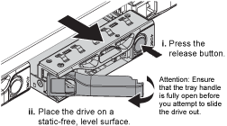

= Remplacer un disque dans un SG100 ou un SG1000
:allow-uri-read: 
:icons: font
:imagesdir: ../media/

[role="lead"]
Les disques SSD de l'appliance de services contiennent le système d'exploitation StorageGRID. En outre, lorsque l'appliance est configurée en tant que nœud d'administration, les disques SSD contiennent également des journaux d'audit, des mesures et des tables de base de données. Les disques sont mis en miroir à l'aide de RAID1 pour la redondance. Si l'un des lecteurs tombe en panne, vous devez le remplacer dès que possible pour assurer la redondance.

.Avant de commencer
* Vous avez link:locating-controller-in-data-center.html["l'appareil se trouve physiquement"].
* Vous avez vérifié quel lecteur est défectueux en notant que le voyant de gauche est orange clignotant.
+
Les deux disques SSD sont placés dans les emplacements comme illustré dans le schéma ci-dessous :

+
image::../media/drive_locations_sg1000_front_with_ssds.png[Emplacements des disques]

+

CAUTION: Si vous retirez le disque en fonctionnement, le nœud de l'appliance est arrêté. Reportez-vous aux informations sur l'affichage des indicateurs d'état pour vérifier l'échec.

* Vous avez obtenu le disque de remplacement.
* Vous avez obtenu une protection ESD appropriée.

.Étapes
. Vérifiez que le voyant de gauche du lecteur à remplacer clignote en orange. Si un problème de lecteur a été signalé dans l'interface utilisateur Grid Manager ou BMC, HDD02 ou HDD2 reportez-vous au lecteur dans le logement supérieur et HDD03 ou HDD3 reportez-vous au lecteur dans le logement inférieur.
+
Vous pouvez également utiliser le Gestionnaire de grille pour surveiller l'état des SSD. Sélectionnez *Nœuds*. Puis sélectionnez  `*Appliance Node*` > *Matériel*. Si un disque a échoué, le champ Mode RAID de stockage contient un message indiquant quel disque a échoué.

. Enroulez l'extrémité du bracelet antistatique autour de votre poignet et fixez l'extrémité du clip à une masse métallique afin d'éviter toute décharge statique.
. Déballez le lecteur de remplacement et placez-le sur une surface plane et sans électricité statique près de l'appareil.
+
Conservez tous les matériaux d'emballage.

. Appuyez sur le bouton de déverrouillage du disque défectueux.
+

+
La poignée des ressorts d'entraînement s'ouvre partiellement et l'entraînement se relâche de la fente.

. Ouvrez la poignée, faites glisser l'entraînement vers l'extérieur et placez-le sur une surface plane et non statique.
. Appuyez sur le bouton de dégagement du disque de remplacement avant de l'insérer dans le slot.
+
Les ressorts de verrouillage s'ouvrent.

+
image::../media/h600s_driveinstall.gif[Installation du lecteur]

. Insérez le lecteur de remplacement dans son logement, puis fermez la poignée du lecteur.
+

CAUTION: Ne forcez pas trop lorsque vous fermez la poignée.

+
Lorsque le lecteur est complètement inséré, vous entendez un clic.

+
Le disque est automatiquement reconstruit à partir des données du disque fonctionnel. Vous pouvez vérifier l'état de la reconstruction à l'aide du Grid Manager. Sélectionnez *Nœuds*. Puis sélectionnez  `*Appliance Node*` > *Matériel*. Le champ Storage RAID Mode contient le message « rebuilding » jusqu'à ce que le disque soit complètement reconstruit.

Après avoir remplacé la pièce, retournez la pièce défectueuse à NetApp, comme indiqué dans les instructions RMA fournies avec le kit. Consultez la page  https://mysupport.netapp.com/site/info/rma["Retours et remplacements de pièces"^] pour plus d'informations.
