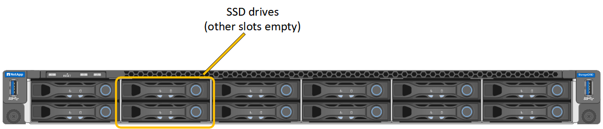

= Remplacez un SG100 ou un SG1000
:allow-uri-read: 
:icons: font
:imagesdir: ../media/

[role="lead"]
Vous devrez peut-être remplacer l'appareil s'il ne fonctionne pas de manière optimale ou s'il est défectueux.

.Avant de commencer
* Vous disposez d'un appareil de remplacement avec le même numéro de pièce que l'appareil que vous remplacez.
* Vous disposez d'étiquettes pour identifier chaque câble connecté à l'appareil.
* Vous avez link:locating-controller-in-data-center.html["l'appareil se trouve physiquement"].

.Description de la tâche
Le nœud StorageGRID ne sera pas accessible lors du remplacement de l'appliance. Si l'appareil fonctionne correctement, vous pouvez procéder à un arrêt contrôlé au début de cette procédure.

NOTE: Si vous remplacez l'appliance avant d'installer le logiciel StorageGRID, il se peut que vous ne puissiez pas accéder immédiatement au programme d'installation de l'appliance StorageGRID après avoir terminé cette procédure. Bien que vous puissiez accéder au programme d'installation de l'appliance StorageGRID à partir d'autres hôtes situés sur le même sous-réseau que l'appliance, vous ne pouvez pas y accéder à partir d'hôtes situés sur d'autres sous-réseaux. Cette condition doit se résoudre dans les 15 minutes (lorsque les entrées du cache ARP pour l'appliance d'origine sont écoulées), ou vous pouvez effacer immédiatement la condition en éliminant manuellement les anciennes entrées du cache ARP à partir du routeur ou de la passerelle local.

.Étapes
. Affichez les configurations actuelles de l'appareil et enregistrez-les.
+
.. Connectez-vous à l'appliance à remplacer :
+
... Saisissez la commande suivante : `ssh admin@_grid_node_IP_`
... Entrez le mot de passe indiqué dans le `Passwords.txt` fichier.
... Entrez la commande suivante pour passer à la racine : `su -`
... Entrez le mot de passe indiqué dans le `Passwords.txt` fichier.
+
Lorsque vous êtes connecté en tant que root, l'invite passe de `$` à `#`.

.. Entrez : `*run-host-command ipmitool lan print*` Pour afficher les configurations BMC actuelles de l'appliance.

. Éteignez l'appareil : `shutdown -h now`
. Si l'une des interfaces réseau de cette appliance StorageGRID est configurée pour DHCP, vous devrez peut-être mettre à jour les attributions de bail DHCP permanentes sur les serveurs DHCP pour référencer les adresses MAC de l'appliance de remplacement. Cette mise à jour garantit que l'appliance se voit attribuer les adresses IP attendues. Voir link:../commonhardware/locate-mac-address.html["Mettre à jour les références d'adresse MAC"].
. Retirez et remplacez l'appareil :
+
.. Etiqueter les câbles, puis débrancher les câbles et les émetteurs-récepteurs réseau.
+

NOTE: Pour éviter toute dégradation des performances, ne tordez pas, ne pliez pas, ne pincez pas ou ne montez pas sur les câbles.

.. Retirez l'appliance défectueuse de l'armoire ou du rack.
.. Transférez les deux blocs d'alimentation, les huit ventilateurs et les deux disques SSD de l'appliance défectueuse vers l'appliance de remplacement.
+
Les deux disques SSD sont placés dans les emplacements comme illustré dans le schéma ci-dessous :

+

+
HDD02 ou HDD2 désigne le lecteur dans le logement supérieur et HDD03 ou HDD3 désigne le lecteur dans le logement inférieur.

+
Suivez les instructions fournies pour le remplacement de ces composants.

.. Installez l'appliance de remplacement dans l'armoire ou le rack.
.. Remplacez les câbles et les émetteurs-récepteurs optiques.
.. Mettez l'appareil sous tension et attendez qu'il rejoigne à nouveau la grille.
.. Vérifiez que le nœud de l'appliance s'affiche dans Grid Manager et qu'aucune alerte n'apparaît.

. Connectez-vous à l'appliance remplacée :
+
.. Saisissez la commande suivante : `ssh admin@_grid_node_IP_`
.. Entrez le mot de passe indiqué dans le `Passwords.txt` fichier.
.. Entrez la commande suivante pour passer à la racine : `su -`
.. Entrez le mot de passe indiqué dans le `Passwords.txt` fichier.

. Restaurez la connectivité réseau du contrôleur BMC pour l'appliance remplacée. Deux options sont disponibles :
+
** Utilisez une adresse IP statique, un masque de réseau et une passerelle
** Utilisez DHCP pour obtenir une adresse IP, un masque de réseau et une passerelle
+
... Pour restaurer la configuration du contrôleur BMC afin d'utiliser une adresse IP statique, un masque de réseau et une passerelle, entrez les commandes suivantes :
+
`*run-host-command ipmitool lan set 1 ipsrc static*`

+
`*run-host-command ipmitool lan set 1 ipaddr _Appliance_IP_*`

+
`*run-host-command ipmitool lan set 1 netmask _Netmask_IP_*`

+
`*run-host-command ipmitool lan set 1 defgw ipaddr _Default_gateway_*`

... Pour restaurer la configuration du contrôleur BMC afin d'utiliser DHCP pour obtenir une adresse IP, un masque de réseau et une passerelle, entrez la commande suivante :
+
`*run-host-command ipmitool lan set 1 ipsrc dhcp*`

. Après avoir restauré la connectivité réseau du contrôleur BMC, connectez-vous à l'interface du contrôleur BMC pour vérifier et restaurer toute configuration BMC personnalisée supplémentaire que vous avez éventuellement appliquée. Par exemple, vous devez confirmer les paramètres des destinations d'interruption SNMP et des notifications par e-mail. Voir link:../installconfig/configuring-bmc-interface.html["Configurer l'interface BMC"].
. Vérifiez que le nœud de l'appliance s'affiche dans Grid Manager et qu'aucune alerte n'apparaît.

Après le remplacement de la pièce, renvoyez la pièce défectueuse à NetApp, en suivant les instructions RMA (retour de matériel) livrées avec le kit. Voir la https://mysupport.netapp.com/site/info/rma["Retour de pièce et amp ; remplacements"^] pour plus d'informations.

.Informations associées
link:../installconfig/viewing-status-indicators.html["Afficher les indicateurs d'état"]

link:../installconfig/troubleshooting-hardware-installation-sg100-and-sg1000.html#view-boot-codes["Afficher les codes de démarrage de l'appareil"]
