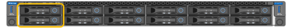

= Remplacez les lecteurs du SG110 ou du SG1100
:allow-uri-read: 
:icons: font
:imagesdir: ../media/

[role="lead"]
Les appliances de services SG110 et SG1100 contiennent deux disques SSD. Les disques sont mis en miroir à l'aide de RAID1 pour la redondance. Si l'un des lecteurs tombe en panne, vous devez le remplacer dès que possible pour assurer la redondance.

.Avant de commencer
* Vous avez link:locating-sg110-and-sg1100-in-data-center.html["l'appareil se trouve physiquement"].
* Vous avez vérifié quel disque est défaillant en notant que le voyant de gauche du disque est orange fixe ou en utilisant Grid Manager pour link:verify-component-to-replace.html["afficher l'alerte causée par le disque défectueux"].
+

IMPORTANT: Reportez-vous aux informations sur l'affichage des indicateurs d'état pour vérifier l'échec.

* Vous avez obtenu le disque de remplacement.
* Vous avez obtenu une protection ESD appropriée.

.Étapes
. Vérifiez que le voyant de panne gauche du disque est orange ou utilisez l'ID de logement de disque de l'alerte pour localiser le disque.
+
Les disques sont aux emplacements suivants dans le châssis (avant du châssis avec le panneau retiré) :

+

. Enroulez l'extrémité du bracelet antistatique autour de votre poignet et fixez l'extrémité du clip à une masse métallique afin d'éviter toute décharge statique.
. Déballez le lecteur de remplacement et placez-le sur une surface plane et sans électricité statique près de l'appareil.
+
Conservez tous les matériaux d'emballage.

. Appuyez sur le bouton de déverrouillage du disque défectueux.
+
image::../media/h600s_driveremoval.gif[Dépose de l'entraînement]

+
La poignée des ressorts d'entraînement s'ouvre partiellement et l'entraînement se relâche de la fente.

. Ouvrez la poignée, faites glisser l'entraînement vers l'extérieur et placez-le sur une surface plane et non statique.
. Appuyez sur le bouton de dégagement du disque de remplacement avant de l'insérer dans le slot.
+
Les ressorts de verrouillage s'ouvrent.

+
image::../media/h600s_driveinstall.gif[Installation du lecteur]

. Insérez le lecteur de remplacement dans son logement, puis fermez la poignée du lecteur.
+

IMPORTANT: Ne forcez pas trop lorsque vous fermez la poignée.

+
Lorsque le lecteur est complètement inséré, vous entendez un clic.

+
Le disque remplacé est automatiquement reconstruit à partir des données du disque fonctionnel. Vous pouvez vérifier l'état de la reconstruction à l'aide du Grid Manager. Accédez à *Nodes* > `*Appliance Node*` > *Hardware*. Le champ Storage RAID Mode contient un message « rebuilding » jusqu'à ce que le disque soit complètement reconstruit.

Après avoir remplacé la pièce, retournez la pièce défectueuse à NetApp, comme indiqué dans les instructions RMA fournies avec le kit. Consultez la page  https://mysupport.netapp.com/site/info/rma["Retours et remplacements de pièces"^] pour plus d'informations.
