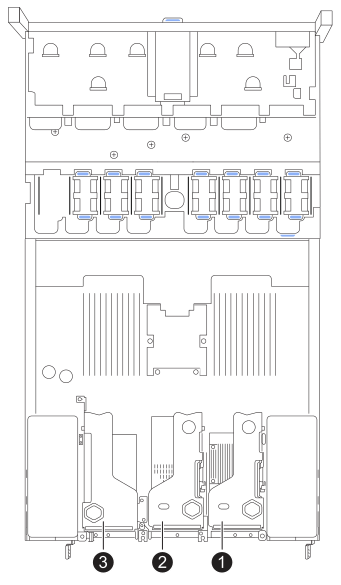

= Remplacer la carte réseau dans un SG120 ou SG1200
:allow-uri-read: 
:icons: font
:imagesdir: ../media/

[role="lead"]
Vous devrez peut-être remplacer la carte d'interface réseau (NIC) dans le SG120 ou le SG1200 si elle ne fonctionne pas de manière optimale ou si elle est défectueuse.

.Description de la tâche
Pour éviter toute interruption de service, vérifiez que tous les autres nœuds de stockage sont connectés à la grille avant de commencer le remplacement de la carte d'interface réseau (NIC) ou remplacez la carte réseau pendant une fenêtre de maintenance planifiée lorsque les périodes d'interruption de service sont acceptables. Voir les informations sur https://docs.netapp.com/us-en/storagegrid/monitor/monitoring-system-health.html#monitor-node-connection-states["contrôle de l'état de connexion du nœud"^].

.Avant de commencer
* Vous avez la carte réseau de remplacement correcte.
* Vous avez link:locating-sg120-and-sg1200-in-data-center.html["l'appareil SG120 ou SG1200 situé physiquement"]où vous remplacez la carte réseau dans le centre de données.
+

NOTE: A link:power-sg120-and-sg1200-off-on.html#shut-down-the-sg120-or-sg1200-appliance["arrêt contrôlé de l'appareil"] est requis avant de retirer l'appareil du rack.

* Vous avez débranché tous les câbles et link:reinstalling-sg120-and-sg1200-cover.html["retirez le capot de l'appareil - effectué"].
* Vous avez déterminé le link:verify-component-to-replace.html["Emplacement de la carte réseau à remplacer"].
+
Les trois cartes réseau de l'appareil sont réparties dans trois ensembles de cartes d'extension situés aux emplacements suivants dans le châssis (vue arrière de l'appareil, capot supérieur retiré) :

+

== Étape 1 : Retirez la carte réseau

[role="tabbed-block"]
====
.NIC 1/NIC 2
--
.Étapes
. Enroulez l'extrémité du bracelet antistatique autour de votre poignet et fixez l'extrémité du clip à une masse métallique afin d'éviter toute décharge statique.
. Repérez le dispositif de montage contenant la carte réseau à l'arrière de l'appareil.
. Faites pivoter le loquet de verrouillage bleu sur la colonne montante avec la carte réseau défectueuse vers le haut et ouvrez-la.
+
image:../media/drw_s2025_io_1_2_replace_ieops-2555.svg["Retrait de la carte réseau 1 ou 2 de l'ensemble de la colonne montante"]

. Soulevez délicatement le bloc d'extension portant la carte réseau défectueuse en vous aidant des trous marqués en bleu. Déplacez le bloc d'extension vers l'avant du châssis tout en le soulevant afin de permettre aux connecteurs externes de la carte réseau installée de dégager le châssis.
. Placez le support sur une surface plane antistatique, le côté du cadre métallique vers le bas, pour accéder au NIC.
. Ouvrez le loquet bleu de la carte réseau défectueuse et retirez-la délicatement de la carte d'extension. Faites légèrement basculer la carte réseau pour faciliter son retrait de son connecteur. N'utilisez pas une force excessive.
+
image:../media/drw_s2025_IO_card_replace_ieops-2557.svg["Retrait d'une carte d'E/S de l'ensemble de la carte d'extension"]

. Placez la colonne montante et le NIC sur une surface plane antistatique.

--
.NIC 3
--
.Étapes
. Enroulez l'extrémité du bracelet antistatique autour de votre poignet et fixez l'extrémité du clip à une masse métallique afin d'éviter toute décharge statique.
. Tournez le verrou bleu sur la colonne montante avec la carte réseau défectueuse en position ouverte.
+
image:../media/drw_s2025_io_3_replace_ieops-2556.svg["Retrait de la carte réseau 3 de l'ensemble riser"]

. Soulevez délicatement le bloc d'extension en vous servant du trou marqué en bleu et du bord du bloc. Déplacez le bloc d'extension vers l'avant du châssis tout en le soulevant afin de permettre aux connecteurs externes de la carte réseau installée de dégager le châssis.
. Placez le support sur une surface plane antistatique, le côté du cadre métallique vers le bas, pour accéder au NIC.
. Ouvrez le loquet bleu de la carte réseau défectueuse et retirez-la délicatement de la carte d'extension. Faites légèrement basculer la carte réseau pour faciliter son retrait de son connecteur. N'utilisez pas une force excessive.
+
image:../media/drw_s2025_IO_card_replace_ieops-2557.svg["Retrait d'une carte d'E/S de l'ensemble de la carte d'extension"]

. Placez la colonne montante et le NIC sur une surface plane antistatique.

--
====

== Étape 2 : Réinstaller la carte réseau interne

Installez la carte réseau de remplacement au même emplacement que celui qui a été retiré.

[role="tabbed-block"]
====
.NIC 1/NIC 2
--
.Étapes
. Enroulez l'extrémité du bracelet antistatique autour de votre poignet et fixez l'extrémité du clip à une masse métallique afin d'éviter toute décharge statique.
. Retirez la carte réseau de remplacement de son emballage.
. Installez la carte réseau de remplacement dans l'ensemble de la colonne montante.
+
.. Assurez-vous que le loquet bleu est en position ouverte.
+
image:../media/drw_s2025_IO_card_replace_ieops-2557.svg["Installation d'une carte d'E/S dans l'ensemble de la carte d'extension"]

.. Alignez la carte réseau avec son connecteur sur la carte d'extension. Enfoncez délicatement la carte réseau dans le connecteur jusqu'à ce qu'elle soit complètement enclenchée, puis fermez le loquet bleu.

. Réinstallez le bloc de rehausse dans le châssis.
+
.. Repérez le trou d'alignement sur l'ensemble de la colonne montante qui s'aligne avec une broche de guidage sur la carte mère afin d'assurer un positionnement correct de l'ensemble de la colonne montante.
+
image:../media/drw_s2025_io_1_2_reinstall_ieops-2685.svg["Remplacement de NIC 1 ou NIC 2 dans l'ensemble de la colonne montante"]

.. Positionnez l'ensemble de carte de montage dans le châssis, en vous assurant qu'il est aligné avec le connecteur de la carte système et la broche de guidage.
.. Appuyez avec précaution sur l'ensemble de montage pour le mettre en place le long de sa ligne centrale, à côté des trous marqués en bleu, jusqu'à ce qu'il soit bien en place.

. Si vous n'avez aucune autre procédure de maintenance à effectuer dans l'appareil, réinstallez le capot de l'appareil, replacez l'appareil sur le rack, branchez les câbles et mettez l'appareil sous tension.

Après avoir remplacé la pièce, retournez la pièce défectueuse à NetApp, comme indiqué dans les instructions RMA fournies avec le kit. Consultez la page  https://mysupport.netapp.com/site/info/rma["Retours et remplacements de pièces"^] pour plus d'informations.

--
.NIC 3
--
.Étapes
. Enroulez l'extrémité du bracelet antistatique autour de votre poignet et fixez l'extrémité du clip à une masse métallique afin d'éviter toute décharge statique.
. Retirez la carte réseau de remplacement de son emballage.
. Installez la carte réseau de remplacement dans l'ensemble de la colonne montante.
+
.. Assurez-vous que le loquet bleu est en position ouverte.
+
image:../media/drw_s2025_IO_card_replace_ieops-2557.svg["Installation d'une carte d'E/S dans l'ensemble de la carte d'extension"]

.. Alignez la carte réseau avec son connecteur sur la carte d'extension. Enfoncez délicatement la carte réseau dans le connecteur jusqu'à ce qu'elle soit complètement enclenchée, puis fermez le loquet bleu.

. Réinstallez le bloc de rehausse dans le châssis.
+
.. Positionnez l'ensemble de rehausse dans le châssis en veillant à ce que les bords de l'ensemble de rehausse soient correctement alignés avec les bords du châssis.
+
image:../media/drw_s2025_IO_3_replace_ieops-2686.svg["Remplacement de la carte NIC 3 dans l'ensemble de la colonne montante"]

.. Enfoncez soigneusement l'ensemble de la colonne montante le long de sa ligne centrale, à côté du trou marqué en bleu, jusqu'à ce qu'il soit complètement en place.
.. Tournez le verrou bleu situé sur la colonne montante en position fermée.

. Retirez les caches de protection des ports de carte réseau sur lesquels vous allez réinstaller les câbles.
. Si vous n'avez aucune autre procédure de maintenance à effectuer dans l'appareil, réinstallez le capot de l'appareil, replacez l'appareil sur le rack, branchez les câbles et mettez l'appareil sous tension.

Après avoir remplacé la pièce, retournez la pièce défectueuse à NetApp, comme indiqué dans les instructions RMA fournies avec le kit. Consultez la page  https://mysupport.netapp.com/site/info/rma["Retours et remplacements de pièces"^] pour plus d'informations.

--
====