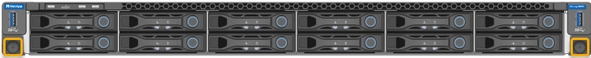

= Déplacer le contrôleur SG6000-CN dans l'armoire ou le rack
:allow-uri-read: 
:icons: font
:imagesdir: ../media/

[role="lead"]
Retirez le contrôleur SG6000-CN d'une armoire ou d'un rack pour accéder au capot supérieur ou pour déplacer l'appliance vers un autre emplacement, puis réinstallez le contrôleur dans une armoire ou un rack une fois la maintenance matérielle terminée.

== Retirez le contrôleur SG6000-CN de l'armoire ou du rack

Retirez le contrôleur SG6000-CN d'une armoire ou d'un rack pour accéder au capot supérieur ou pour déplacer le contrôleur à un autre emplacement.

.Avant de commencer
* Vous disposez d'étiquettes pour identifier chaque câble connecté au contrôleur SG6000-CN.
* Vous avez installé physiquement le contrôleur SG6000-CN où vous effectuez des opérations de maintenance dans le centre de données.
+
link:locating-controller-in-data-center.html["Localiser le contrôleur dans le data Center"]

* Vous avez link:power-sg6000-cn-controller-off-on.html#shut-down-sg6000-cn-controller["Arrêtez le contrôleur SG6000-CN"].
+

CAUTION: N'arrêtez pas le contrôleur à l'aide de l'interrupteur d'alimentation.

.Étapes
. Etiqueter puis débrancher les câbles d'alimentation du contrôleur.
. Enroulez l'extrémité du bracelet antistatique autour de votre poignet et fixez l'extrémité du clip à une masse métallique afin d'éviter toute décharge statique.
. Etiqueter puis débrancher les câbles de données du contrôleur et les émetteurs-récepteurs SFP+ ou SFP28.
+

NOTE: Pour éviter toute dégradation des performances, ne tordez pas, ne pliez pas, ne pincez pas ou ne montez pas sur les câbles.

. Desserrez les deux vis imperdables du panneau avant du contrôleur.
+

. Faites glisser le contrôleur SG6000-CN vers l'avant pour le sortir du rack jusqu'à ce que les rails de montage soient complètement étendus et que vous entendiez les loquets des deux côtés cliquent.
+
Le capot supérieur du contrôleur est accessible.

. Facultatif : si vous retirez complètement le contrôleur de l'armoire ou du rack, suivez les instructions du kit de rails pour retirer le contrôleur des rails.

Après le remplacement de la pièce, renvoyez la pièce défectueuse à NetApp, en suivant les instructions RMA (retour de matériel) livrées avec le kit. Voir la https://mysupport.netapp.com/site/info/rma["Retour de pièce et amp ; remplacements"^] pour plus d'informations.

== Réinstallez le contrôleur SG6000-CN dans l'armoire ou le rack

Une fois la maintenance matérielle terminée, réinstallez le contrôleur dans une armoire ou un rack.

.Avant de commencer
Vous avez réinstallé le capot du contrôleur.

link:reinstalling-sg6000-cn-controller-cover.html["Réinstallez le couvercle du contrôleur SG6000-CN"]

.Étapes
. Appuyez sur le rail bleu pour libérer les deux rails de rack en même temps et faites glisser le contrôleur SG6000-CN dans le rack jusqu'à ce qu'il soit bien en place.
+
Lorsque vous ne pouvez plus déplacer le contrôleur, tirez sur les loquets bleus des deux côtés du châssis pour faire glisser le contrôleur complètement vers l'intérieur.

+
image::../media/sg6000_cn_rails_blue_button.gif[Rails coulissants SG6000]

+

NOTE: Ne fixez le panneau avant qu'après la mise sous tension du contrôleur.

. Serrez les vis imperdables du panneau avant du contrôleur pour fixer le contrôleur dans le rack.
+

. Enroulez l'extrémité du bracelet antistatique autour de votre poignet et fixez l'extrémité du clip à une masse métallique afin d'éviter toute décharge statique.
. Reconnectez les câbles de données du contrôleur et les émetteurs-récepteurs SFP+ ou SFP28.
+

NOTE: Pour éviter toute dégradation des performances, ne tordez pas, ne pliez pas, ne pincez pas ou ne montez pas sur les câbles.

+
link:../installconfig/cabling-appliance.html["Appareil câblé"]

. Reconnectez les câbles d'alimentation du contrôleur.
+
link:../installconfig/connecting-power-cords-and-applying-power.html["Branchement des câbles d'alimentation et alimentation (SG6000)"]

.Une fois que vous avez terminé
Le contrôleur peut être redémarré link:power-sg6000-cn-controller-off-on.html#power-on-sg6000-cn-controller-and-verify-operation["redémarré"].
