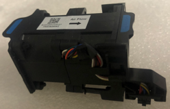
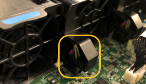

= Remplacer le ventilateur du contrôleur de calcul SG6000-CN
:allow-uri-read: 
:icons: font
:imagesdir: ../media/

[role="lead"]
Le contrôleur de calcul SG6000-CN dispose de huit ventilateurs de refroidissement.  Si l’un des ventilateurs tombe en panne, vous devez le remplacer dès que possible pour garantir un refroidissement adéquat du contrôleur.

.Avant de commencer
* Vous avez déballé le ventilateur de remplacement.
* Vous avez link:locating-controller-in-data-center.html["l'appareil se trouve physiquement"].
* Vous avez confirmé que les autres ventilateurs sont installés et en cours d'exécution.

.Description de la tâche
Le nœud de stockage ne sera pas accessible pendant que vous remplacez le ventilateur.

La photographie montre un ventilateur pour le contrôleur de calcul SG6000-CN.  Les ventilateurs de refroidissement sont accessibles après avoir retiré le capot supérieur du contrôleur.

NOTE: Chacun des deux blocs d'alimentation contient également un ventilateur. Ces ventilateurs ne sont pas inclus dans cette procédure.

.Étapes
. link:power-sg6000-cn-controller-off-on.html["Arrêtez le contrôleur SG6000-CN"] .
. Soulevez le loquet du capot supérieur et retirez le capot de l'appareil.
. Localisez le ventilateur défectueux.
+
image::../media/fan_location.png[Emplacement des ventilateurs]

. Soulevez le ventilateur défectueux pour le sortir du châssis.
+
image::../media/fan_removal.png[Retrait du ventilateur]

. Faites glisser le ventilateur de remplacement dans le logement ouvert du châssis.
+
Alignez le bord du ventilateur avec la goupille de guidage. La goupille est entourée dans la photo.

+
image::../media/fan_guide_pin.png[Goupille de guidage du ventilateur]

. Enfoncer fermement le connecteur du ventilateur dans la carte de circuit imprimé.
+

. Replacez le capot supérieur sur l'appareil et appuyez sur le loquet pour fixer le capot en place.
. link:power-sg6000-cn-controller-off-on.html#poweron["Allumez le contrôleur SG6000-CN"] .
. Vérifiez que le nœud de l'appliance s'affiche dans Grid Manager et qu'aucune alerte n'apparaît.

Après le remplacement de la pièce, renvoyez la pièce défectueuse à NetApp, en suivant les instructions RMA (retour de matériel) livrées avec le kit. Voir la https://mysupport.netapp.com/site/info/rma["Retour de pièce et amp ; remplacements"^] pour plus d'informations.
