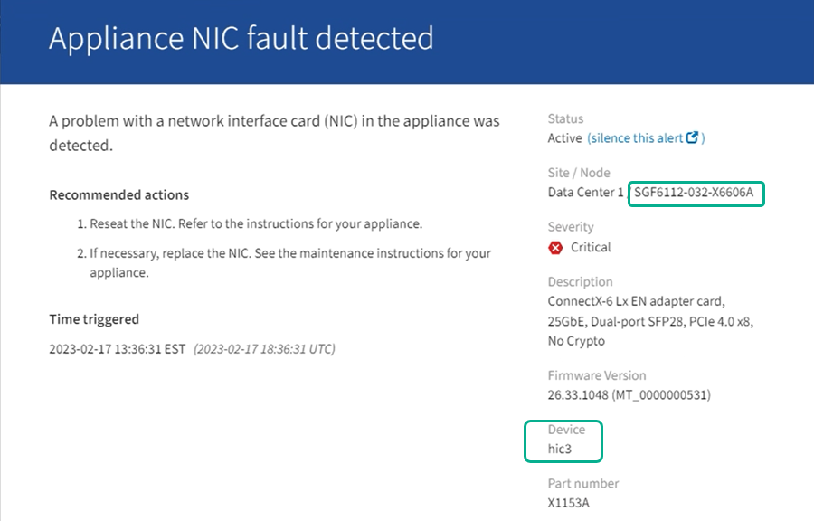

= Vérifiez le composant à remplacer dans le SG6000-CN
:allow-uri-read: 
:icons: font
:imagesdir: ../media/

[role="lead"]
Si vous n'êtes pas sûr du composant matériel à remplacer dans votre appareil, suivez cette procédure pour identifier le composant et l'emplacement de l'appareil dans le centre de données.

.Avant de commencer
* Vous disposez du numéro de série de l'appareil dont la pièce doit être remplacée.
* Vous êtes connecté au Gestionnaire de grille à l'aide d'un https://docs.netapp.com/us-en/storagegrid/admin/web-browser-requirements.html["navigateur web pris en charge"^].

.Description de la tâche
Utilisez cette procédure pour identifier l'appareil présentant une défaillance matérielle et déterminer quel composant remplaçable ne fonctionne pas correctement. Les composants susceptibles d'être remplacés peuvent inclure :

* Blocs d'alimentation
* Ventilateurs
* Disques SSD
* Cartes d'interface réseau (NIC)
* Pile CMOS

.Étapes
. Identifiez le composant défectueux et le nom de l'appliance dans laquelle il est installé.
+
.. Dans Grid Manager, sélectionnez *ALERTES* > *Current*.
+
La page alertes s'affiche.

.. Sélectionnez l'alerte pour afficher les détails de l'alerte.
+

NOTE: Sélectionnez l'alerte, et non l'en-tête d'un groupe d'alertes.

.. Notez le nom du nœud et l'étiquette d'identification unique du composant qui a échoué.
+

. Identifiez le châssis avec le composant qui doit être remplacé.
+
.. Dans le Gestionnaire de grille, sélectionnez *Nœuds*.
.. Dans le tableau de la page Nœuds, sélectionnez le nom de l'appliance StorageGRID dont le composant est défaillant.
.. Sélectionnez l'onglet *matériel*.
+
Vérifiez le *numéro de série du contrôleur de calcul* dans la section appareil StorageGRID. Vérifiez si le numéro de série correspond au numéro de série du dispositif de stockage sur lequel vous remplacez le composant. Si le numéro de série correspond, vous avez trouvé l'appareil approprié.

+
*** Si la section Appliance StorageGRID dans Grid Manager ne s'affiche pas, le nœud sélectionné n'est pas une appliance StorageGRID. Sélectionnez un nœud différent dans l'arborescence.
*** Si les numéros de série ne correspondent pas, sélectionnez un autre nœud dans l'arborescence.

. Après avoir localisé le nœud sur lequel le composant doit être remplacé, notez l'adresse IP du contrôleur BMC de l'appliance indiquée dans la section appareil StorageGRID.
+
Pour vous aider à localiser l'appliance dans le centre de données, vous pouvez utiliser l'adresse IP du contrôleur BMC pour allumer le voyant d'identification de l'appliance.

.Informations associées
link:turning-controller-identify-led-on-and-off.html["Allumez le voyant d'identification de l'appareil"]
