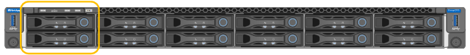

= Remplacez l'entraînement dans SG6100-CN
:allow-uri-read: 
:icons: font
:imagesdir: ../media/

[role="lead"]
L'appliance SG6160 contient deux disques SSD dans le contrôleur SG6100-CN qui fonctionnent comme un cache de lecture. En cas de panne de l'un de ces disques, vous devez le remplacer dans les plus brefs délais afin de minimiser l'impact potentiel sur les performances.

.Avant de commencer
* Vous avez link:locating-sgf6112-in-data-center.html["l'appareil se trouve physiquement"].
* Vous avez vérifié quel disque est défaillant en notant que son voyant de gauche est orange fixe ou en utilisant Grid Manager pour link:verify-component-to-replace.html["afficher l'alerte causée par le disque défectueux"].
* Vous avez obtenu le disque de remplacement.
* Vous avez obtenu une protection ESD appropriée.

.Étapes
. Vérifiez que le voyant de panne gauche du disque est orange ou utilisez l'ID de logement de disque de l'alerte pour localiser le disque.
+
Les lecteurs sont dans les positions suivantes dans le châssis (avant du châssis avec le panneau retiré).

+

. Enroulez l'extrémité du bracelet antistatique autour de votre poignet et fixez l'extrémité du clip à une masse métallique afin d'éviter toute décharge statique.
. Déballez le lecteur de remplacement et placez-le sur une surface plane et sans électricité statique près de l'appareil.
+
Conservez tous les matériaux d'emballage.

. Appuyez sur le bouton de déverrouillage du disque défectueux.
+
image::../media/h600s_driveremoval.gif[Dépose de l'entraînement]

+
La poignée des ressorts d'entraînement s'ouvre partiellement et l'entraînement se relâche de la fente.

. Ouvrez la poignée, faites glisser l'entraînement vers l'extérieur et placez-le sur une surface plane et non statique.
. Appuyez sur le bouton de dégagement du disque de remplacement avant de l'insérer dans le slot.
+
Les ressorts de verrouillage s'ouvrent.

+
image::../media/h600s_driveinstall.gif[Installation du lecteur]

. Insérez le lecteur de remplacement dans son logement, puis fermez la poignée du lecteur.
+

CAUTION: Ne forcez pas trop lorsque vous fermez la poignée.

+
Lorsque le lecteur est complètement inséré, vous entendez un clic.

+
Lorsque les deux disques SSD fonctionnent normalement, le système restaure automatiquement la fonctionnalité de cache de lecture. Vous pouvez https://docs.netapp.com/us-en/storagegrid/monitor/running-diagnostics.html["exécuter les diagnostics"^] contrôler le taux d'accès au cache de lecture. Comme le cache vient d'être reconstruit, le taux d'accès peut être faible au départ, mais il devrait augmenter au fil du temps lorsque le cache est rerempli par les clients accédant aux données d'objet.

Après le remplacement de la pièce, renvoyez la pièce défectueuse à NetApp, en suivant les instructions RMA (retour de matériel) livrées avec le kit. Voir la https://mysupport.netapp.com/site/info/rma["Retour de pièce et amp ; remplacements"^] pour plus d'informations.
