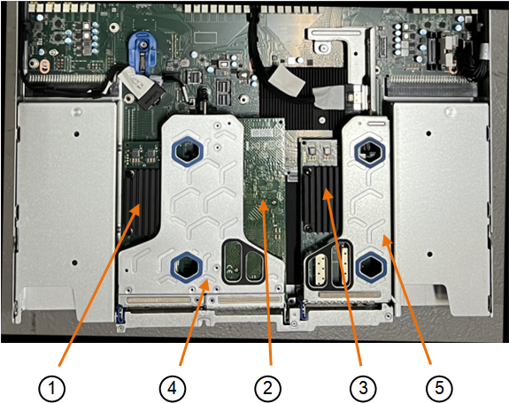
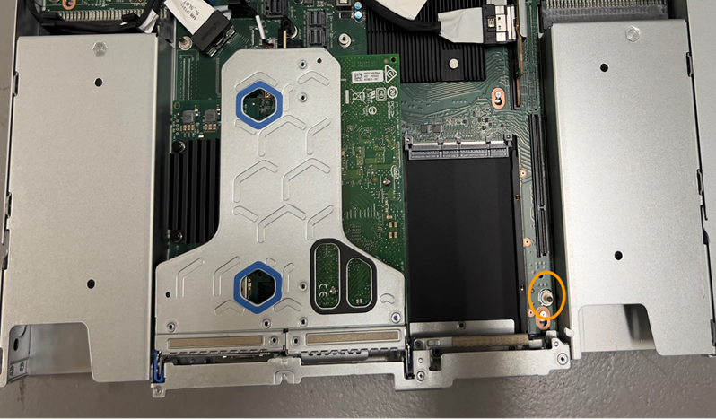

= Remplacez la carte réseau interne dans le SGF6112 ou le SG6100-CN
:allow-uri-read: 
:icons: font
:imagesdir: ../media/

[role="lead"]
Vous devrez peut-être remplacer une carte d'interface réseau (NIC) interne dans le SGF6112 ou le SG6100-CN s'il ne fonctionne pas de manière optimale ou s'il est défectueux.

Suivez ces procédures pour :

* Retirez la carte réseau
* Réinstallez la carte réseau

== Retirez la carte réseau interne

.Avant de commencer
* Vous avez la carte réseau de remplacement correcte.
* Vous avez déterminé le link:verify-component-to-replace.html["Emplacement de la carte réseau à remplacer"].
* Vous avez link:locating-sgf6112-in-data-center.html["Emplacement physique de l'appliance SGF6112 ou du contrôleur SG6100-CN"] Emplacement de remplacement de la carte réseau dans le centre de données.
+

NOTE: Un link:power-sgf6112-off-on.html#shut-down-the-sgf6112-appliance-or-sg6100-cn-controller["arrêt contrôlé de l'appareil"] est nécessaire avant de retirer l'appareil du rack.

* Vous avez déconnecté tous les câbles et link:reinstalling-sgf6112-cover.html["retirez le capot de l'appareil - effectué"].

.Description de la tâche
Pour éviter toute interruption de service, vérifiez que tous les autres nœuds de stockage sont connectés à la grille avant de commencer le remplacement de la carte d'interface réseau (NIC) ou remplacez la carte réseau pendant une fenêtre de maintenance planifiée lorsque les périodes d'interruption de service sont acceptables. Voir les informations sur https://docs.netapp.com/us-en/storagegrid/monitor/monitoring-system-health.html#monitor-node-connection-states["contrôle de l'état de connexion du nœud"^].

CAUTION: Si vous avez déjà utilisé une règle ILM qui ne crée qu'une seule copie d'un objet, vous devez remplacer la carte réseau au cours d'une fenêtre de maintenance planifiée, car vous risquez de perdre temporairement l'accès à ces objets au cours de cette procédure. Voir les informations sur https://docs.netapp.com/us-en/storagegrid/ilm/why-you-should-not-use-single-copy-replication.html["pourquoi ne pas utiliser la réplication à copie unique"^].

.Étapes
. Enroulez l'extrémité du bracelet antistatique autour de votre poignet et fixez l'extrémité du clip à une masse métallique afin d'éviter toute décharge statique.
. Repérez le dispositif de montage contenant la carte réseau à l'arrière de l'appareil.
+
Les trois cartes réseau de l'appareil sont dans deux ensembles de montage dans les positions du châssis indiquées sur la photo (arrière de l'appareil avec le capot supérieur retiré) :

+

+
[cols="1a,2a,4a"]
|===
|  | Nom du périphérique ou de la pièce | Description 

 a| 
1
 a| 
hic1/hic2
 a| 
Ports réseau Ethernet 10/25-GbE dans l'ensemble de carte de montage à deux ports

 a| 
2
 a| 
mtc1/mtc2
 a| 
Ports de gestion 1/10GBase-T dans l'ensemble de montage à deux ports

 a| 
3
 a| 
hic3/hic4
 a| 
Ports réseau Ethernet 10/25-GbE dans l'ensemble de carte de montage à un port

 a| 
4
 a| 
Assemblage de la carte de montage à deux emplacements
 a| 
Prise en charge de l'une des cartes réseau 10/25-GbE et de la carte réseau 1/10GBase-T.

 a| 
5
 a| 
Assemblage de la carte de montage à une position
 a| 
Prise en charge de l'une des cartes réseau 10/25 GbE

|===
. Saisissez l'ensemble de la carte de montage avec la carte réseau défectueuse dans les trous marqués en bleu et soulevez-le avec précaution vers le haut. Déplacez l'ensemble de carte de montage vers l'avant du châssis tout en le soulevant pour permettre aux connecteurs externes de ses cartes réseau installées de se dégager du châssis.
. Placez la carte de montage sur une surface antistatique plane, avec le cadre métallique vers le bas pour accéder aux cartes réseau.
+
** *Assemblage de carte de montage à deux emplacements avec deux cartes réseau*
+
image::../media/two-slot-assembly-sgf6112.png[Deux cartes réseau dans un assemblage de carte de montage à deux emplacements]

** *Assemblage de carte de montage à un emplacement avec une carte d'interface réseau*
+
image::../media/one-slot-assembly-sgf6112.png[Carte réseau dans le dispositif de montage à un emplacement]

. Ouvrez le loquet bleu (entouré) de la carte réseau à remplacer et retirez avec précaution la carte réseau de l'ensemble de carte de montage. Secouez légèrement la carte réseau pour la retirer de son connecteur. N'utilisez pas de force excessive.
. Placez la carte réseau sur une surface antistatique plane.

== Réinstallez la carte réseau interne

Installez la carte réseau de remplacement au même emplacement que celui qui a été retiré.

.Avant de commencer
* Vous avez la carte réseau de remplacement correcte.
* Vous avez supprimé la carte réseau défectueuse existante.

.Étapes
. Enroulez l'extrémité du bracelet antistatique autour de votre poignet et fixez l'extrémité du clip à une masse métallique afin d'éviter toute décharge statique.
. Retirez la carte réseau de remplacement de son emballage.
. Si vous remplacez l'une des cartes réseau de l'ensemble de carte de montage à deux emplacements, procédez comme suit :
+
.. Assurez-vous que le loquet bleu est en position ouverte.
.. Alignez la carte réseau avec son connecteur sur l'ensemble de carte de montage. Appuyez avec précaution sur la carte réseau dans le connecteur jusqu'à ce qu'elle soit bien en place, comme illustré sur la photo, puis fermez le loquet bleu.
+
image::../media/two-slot-assembly-sgf6112.png[Deux cartes réseau dans un assemblage de carte de montage à deux emplacements]

.. Repérez le trou d'alignement de l'ensemble de carte de montage à deux emplacements (encerclé) qui s'aligne sur une broche de guidage de la carte système afin de garantir un positionnement correct de l'ensemble de carte de montage.
+
image::../media/sgf6112_two-slot-riser_alignment_hole.png[Trou d'alignement sur le grand dispositif de levage]

.. Repérez la broche de guidage sur la carte système
+
image::../media/sgf6112_two-slot-riser_guide-pin.png[Goupille de guidage pour montage à deux fentes]

.. Positionnez l'ensemble de carte de montage dans le châssis, en vous assurant qu'il est aligné avec le connecteur de la carte système et la broche de guidage.
.. Appuyez avec précaution sur l'ensemble de montage à deux fentes le long de sa ligne centrale, près des trous marqués en bleu, jusqu'à ce qu'il soit bien en place.

. Si vous remplacez la carte réseau dans le dispositif de montage à un emplacement, procédez comme suit :
+
.. Assurez-vous que le loquet bleu est en position ouverte.
.. Alignez la carte réseau avec son connecteur sur l'ensemble de carte de montage. Appuyez avec précaution sur la carte réseau dans le connecteur jusqu'à ce qu'elle soit bien en place, comme indiqué sur la photo, puis fermez le loquet bleu.
+
image::../media/one-slot-assembly-sgf6112.png[Carte réseau dans le dispositif de montage à un emplacement]

.. Repérez le trou d'alignement de l'assemblage de la carte de montage à un emplacement (encerclé) qui s'aligne sur une broche de guidage de la carte système afin de garantir un positionnement correct de l'assemblage de la carte de montage.
+
image::../media/sgf6112_one-slot-riser_alignment_hole.png[Trou d'alignement sur le dispositif de montage à une fente]

.. Repérez la broche de guidage sur la carte système
+

.. Positionnez l'ensemble de carte de montage à un emplacement dans le châssis, en vous assurant qu'il est aligné avec le connecteur de la carte système et la broche de guidage.
.. Appuyez avec précaution sur le dispositif de montage à une fente le long de sa ligne centrale, à côté des trous marqués en bleu, jusqu'à ce qu'il soit bien en place.

. Retirez les caches de protection des ports de carte réseau sur lesquels vous allez réinstaller les câbles.

.Une fois que vous avez terminé
Si vous n'avez aucune autre procédure de maintenance à effectuer dans l'appareil, réinstallez le capot de l'appareil, replacez l'appareil sur le rack, branchez les câbles et mettez l'appareil sous tension.

Après le remplacement de la pièce, renvoyez la pièce défectueuse à NetApp, en suivant les instructions RMA (retour de matériel) livrées avec le kit. Voir la https://mysupport.netapp.com/site/info/rma["Retour de pièce et amp ; remplacements"^] pour plus d'informations.
